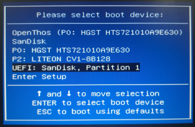
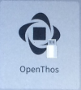

# 第一章 安装OPENTHOS

## 1.1 在物理机上安装OPENTHOS

### 1.1.1 安装条件

**注意：安装前请务必确认您的电脑符合安装条件，否则可能会影响到电脑里的其它系统**

要安装使用OPENTHOS，您的计算机应满足如下的基本要求：  

- 基于Intel X86_64平台
- Intel集显或核心显卡(目前支持部分amd显卡，但不支持nvidia显卡)
- 基于UEFI，并能按UEFI的模式启动操作系统
- **磁盘格式为GPT（不兼容MBR格式磁盘，手动安装时会自动将磁盘格式转为GPT，如果之前已经以MBR格式安装其它系统会无法启动）**
- 2GB以上的内存
- 8GB以上的硬盘或SSD
- 1920x1080或1366x768分辨率的显示器
- 以太网络接口卡或是Wifi无线网卡

**另注：**

```
1. 同时对于以太网络接口卡及Wifi无线网卡，我们亦不能保证驱动全部型号的设备工作。我们会专门发布一个关于以太网络接口卡及Wifi无线网卡的兼容性列表。
2. 如果您的计算机是基于传统BIOS，或是虽基于UEFI但不能按UEFI的方式启动操作系统，那么您将仅能通过下面的“Windows用户制作OPENTHOS启动U盘”一节的方法来制作一个OPENTHOS的U盘体验版本，基于U盘来进行OPENTHOS的体验操作。此时您的用户数据存储空间将会受限在4GB以下，且没有图形化的启动引导环境。
```

### 1.1.2 镜像下载

- 方式一：访问[tuna清华大学开源软件镜像站](https://mirrors.tuna.tsinghua.edu.cn/openthos/Release/)获取OPENTHOS镜像。
- 方式二：访问http://www.openthos.com/OPENTHOS/Release/ 获取OPENTHOS镜像。
- 方式三：访问[FOSSHUB](https://www.fosshub.com/OPENTHOS.html)获取OPENTHOS镜像。
- 方式四：从我们百度网盘共享上下载OPENTHOS的U盘镜像文件。

```
网盘地址: https://pan.baidu.com/s/1GkRzp3hROcPC6CxnRCbYXw
提取码: unx6
```

### 1.1.3 创建启动U盘

创建OPENTHOS启动U盘，共有分两种情况，分别是：在Windows环境下制作OPENTHOS启动U盘，和在Linux环境下制作启动U盘。  
这两种方法制作出来的U盘有些许的差异:

- Windows版本制作出来的U盘体验版支持在传统BIOS下启动并体验OPENTHOS，但生成工具只支持8GB以上的U盘，且安装模式和体验模式是分别制作的。
- Linux版本的U盘，制作出来的可以通过开机时的选择来选择是安装还是体验，但Linux版本制作出来的U盘，仅能工作于UEFI环境。

#### Windows用户制作启动U盘

**最新版UltraISO不支持打开img文件，如果找不到旧版，也可以用rufus来替代，操作方式类似：http://rufus.ie/**

1. 下载UltraISO(软碟通)并安装，最新版可能不支持img文件，可以下载旧版，比如9.5.3.2900
2. 连接上U盘并运行UltraISO，找到已下载的img镜像，双击选中它  
3. 选择菜单栏中的"启动"，点击"写入硬盘映像…"  
4. 如果运行程序之前，您的U盘尚未连接到计算机上，您可以现在将其连接。一旦连接，相应的U盘将会出现可用的U盘列表中。  
5. 查看硬盘驱动器和映像文件是否正确，然后点击"写入"
6. 写入完成后，启动盘创建成功。 

#### Linux用户制作启动U盘

理论上您可以使用任意一个Linux发行版来制作OPENTHOS启动U盘。但是我们建议您使用Ubuntu 16.04版本，这能保证本部分内容对您完全适用，而不会有发行版本差异带来的诸如设备路径等相关方面带来的困扰。

1. 下载OPENTHOS镜像

2. 可以使用命令行工具来完成U盘的制作，具体的命令如下：

   ```bash
   # 假定镜像文件的路径为/home/openthos/openthos.img
   # 假定U盘的设备路径为/dev/sdc
   # 通过dd命令拷贝镜像文件到U盘
   sudo dd if=/home/openthos/openthos.img of=/dev/sdc
   sync	# 执行同步
   ```


如果不能确认U盘的设备路径，可以通过运行两次blkid命令的方式来确认U盘的设备文件。即在插上U盘之前运行一次 `sudo blkid | cut -f1 -d:` ，插上U盘后再运行一次 `sudo blkid | cut -f1 -d:` ，则第二次命令输出比第一次命令输出多出来的设备路径去掉最后的数字即是U盘的设备路径。    

### 1.1.4 通过U盘来安装

在启动的时候选择启动顺序，电脑的快捷键可能不同，我这里是F10。看到如下界面，并请选择你的UEFI U盘选项：    
  

切换到U盘启动的图标下，按F2键进入选择安装模式的菜单，U盘启动的图标如下所示:         

可以选择如下的安装模式：

- OpenThos Live  
  无需安装即可启动，而且用户的数据可以保存在U盘上(要求:对U盘的安装要求比较高，否则容易出现卡顿现象）  
- OpenThos Live (DEBUG)  
  针对极客的一种模式，可以暂停系统的启动来观察系统行为  
- OpenThos Installation(**如果要安装系统到硬盘里，请选择此项**)  
  普通安装模式，包括[自动安装](#自动安装)和[手动安装](#手动安装)。如果你想把OPENTHOS安装到一块完整的硬盘上，推荐选择[自动安装](#自动安装)。如果您想在一块硬盘里同时装多个系统，请选择[手动安装](#手动安装)。

#### 自动安装

1. 选择"Auto Install"
2. 询问"will ERASE whole hard drive， Continue?"，选择"Yes"  
3. 指定要安装Openthos的空闲磁盘，这会移除该磁盘上的所有内容，请仔细确认！
4. 安装完成后，系统自动重启进入OPENTHOS启动界面。

#### 手动安装

手动安装方式适用范围：  

- 同一块硬盘上安装多个系统
- 对系统默认的分区大小有其他需求
- **如果想安装OPENTHOS+win10双系统**  

手动安装的核心是为Openthos分配三个分区，建议的分区大小如下表所示：

| 大小    | 文件系统格式 | 用途                |
| ------- | ------------ | ------------------- |
| 200M    | FAT32        | OPENTHOS EFI分区    |
| 4G      | ext4         | OPENTHOS system分区 |
| 大于40G | ext4         | OPENTHOS data 分区  |

手动安装的步骤如下所示：

1. 选择"Manual Install"
2. 创建分区入口。光标移动到"Create/Modify partitions"，选择"Yes"。
3. 系统会询问是否使用GPT格式，选Yes (**注意：不兼容MBR格式磁盘，此操作会自动将磁盘格式转为GPT，如果之前已经以MBR格式安装其它系统会无法启动**)
4. OPENTHOS下的分区是基于cgdisk，它是一个基于光标的工具，用户可以使用方向键进行分区操作。
5.  分区完成后，光标移动到刚才创建的EFI分区，选择"OK"，格式化EFI分区（**如果还有其它系统，且引导安装在该分区可以选择第一项不格式化**）
6. 光标移动到刚才创建的system分区，选择"OK"，格式化system分区。
7. 光标移动到刚才创建的data分区，选择"OK"，格式化data分区。
8. 安装完成后系统会自动重启，选择相应的boot选项可进入OPENTHOS启动界面。 

## 1.2 在虚拟机上安装OPENTHOS

### 1.2.1 vmware

1. 下载img镜像
2. 转换镜像格式
   ```qemu-img  convert  -f raw -O vmdk  ./（镜像名字）.img  ./（镜像名字）.img.vmdk```
3. 创建一个虚拟机，向导界面的部分选择如下：
   - 配置类型：典型   
   - 安装来源：稍后安装操作系统   
   - 客户机操作系统：其他   
   - 版本：其他64位   
4. 创建完成后，打开“编辑虚拟机设置”，修改内存大小为4096MB，处理器数量为4。  
5. Display选项，勾选“Accelerate 3D graphic”  
   (若vmware出现“No 3D graphic ...” 错误，可编辑虚拟机文件vmx，加入一行： mks.gl.allowBlacklistedDrivers = "TRUE")  
6. VMware机器设置中，选择“Options“ --> "Advanced"， 勾选"Boot with EFI instead of BIOS";  
   （如没有该选项，可编辑虚拟机文件vmx，加入一行：firmware = "efi" ）  
7. 点击设置界面的“添加”按钮，添加一个硬盘挂载vmdk  
   硬件类型选择“磁盘”  
   虚拟磁盘类型选择“IDE”，磁盘选择“使用现有虚拟磁盘”   
   磁盘文件选择之前转换的vmdk文件，点击完成   
   如果弹出是否保留现有格式的选项，选择“保留现有格式”  
8. 启动后在boto界面按F2键  
   选择“Openthos installation”  
   选择 自动安装 
   选择一开始创建的那个硬盘  
9. 等待，虚拟机重启pan再次进入boto界面，选择左边的Openthos图标进入系统（右边的相当于U盘启动），之后进入OPENTHOS启动界面。  

调整分辨率，默认为1280x720，如果要调到1920x1080修改如下：  
按Alt+F1进入终端，输入```vi /system/build.prop```  
添加```debug.drm.mode.force=1920x1080@60```  
保存后重启虚拟机

### 1.2.2 qemu

1. 下载iso或img镜像

2. 创建虚拟磁盘：  
   `qemu-img create a.raw +20G`

3. 手动格式化磁盘：  

   ```
   parted a.raw
   mklabel msdos
   mkpart p ext4 1 20G
   quit
   ```
4. 启动虚拟机

   ```
   sudo apt install ovmf   # 安装efi bios
   qemu-system-x86_64 -enable-kvm -m 4G -smp 4 -bios OVMF.fd -hda a.raw -hdb xposed_x86_64_oto.img -net nic -net user
       # 其中，-smp是处理器个数，推荐设置为4个
   ```

5. 启动后在下图的界面按f2进入选项菜单，安装过程同vmware。

### 1.2.3 virtualbox

1. 下载img镜像，转换镜像格式为vmdk，可通过命令行转换：  
   `qemu-img  convert  -f raw -O vmdk  ./（镜像名字）.img  ./（镜像名字）.img.vmdk`
2. 启动virtualbox后新建虚拟电脑，类型选Linux，版本选Other Linux(64-bit)，内存４G，之后创建虚拟硬盘(硬盘大小建议>20G)  
3. 之后点击上方的设置按钮，进入系统选项，勾选“启用EFI”。上方有处理器标签，点进去可以设置处理器，我们是设置的四个，不然会比较慢  
4. 进入存储选项，点击“控制器：IDE“边上的”添加虚拟磁盘“按钮，选择”使用现有的虚拟盘“，选择之前转换的vmdk文件  
5. 删掉光盘那项，设置新建虚拟磁盘在”第一IDE控制器主通道“，vmdk文件在”第二IDE控制器主通道“  
6. 完成设置，点击上方”启动“按钮
7. 进入boto界面，安装过程同vmware
8. 正在安装，需要一些时间，这时可以进入上方菜单的”视图“，选择”自动缩放模式“，将界面调整到合适大小  
9. 安装完成后会自动重启，重启后在boto界面选择虚拟磁盘的那个启动项，一般左边是sda，右边是sdb，不确定的话可以按f2看菜单，没有安装项的就是虚拟硬盘。之后进入OPENTHOS系统  
10. 正在启动，之后进入首次配置，如果进来后发现无法操作鼠标，可以通过”右ctrl + c“键唤出菜单，在”热键“选项卡下关掉”鼠标集成“。  


