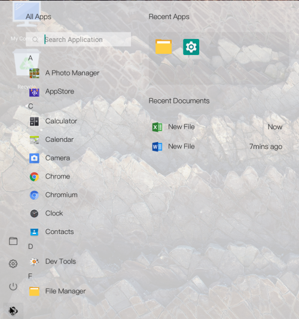

# 第三章 桌面

桌面效果图：  

## 3.1 开始菜单

开始菜单效果图  

- 搜索框：查找符合关键字的应用
- A-Z：所有应用根据A-Z的字母表顺序进行排序展示
- 所有应用
  - 鼠标左键：直接打开此应用
  - 鼠标右键：打开右键菜单，选项包括
    - 打开：直接打开此应用
    - 固定到任务栏/解除固定：将此应用图标固定到任务栏;若已固定，则解除固定
    - 卸载：进入此应用的卸载页面
- 最近应用
  - 鼠标左键：直接打开此应用
  - 鼠标右键：打开右键菜单，菜单选项包括
    - 打开：直接打开此应用
    - 从此列表中删除：删除此选项
- 最近文档
  - 鼠标左键：直接打开此文档   
- 文件管理：进入文件管理器应用
- 设置：进入设置应用
- 电源：打开电源菜单，选项包括
  
  - 关机：关闭计算机
  - 睡眠：进入睡眠模式
  - 锁定：进入锁定页面
    - 锁屏页面:输入设置的锁屏密码
    - 锁屏密码设置
      - 1.首次配置中设置锁屏密码
      - 2.点击设置进入安全模块，再进入屏幕锁定方式选择密码，设置密码
    - 修改锁屏密码
      - 点击设置进入系统账户管理，再进入主机用户名设置的修改锁屏密码
  - 重新启动：重启计算机
  - 关闭:关闭电源菜单

## 3.2 任务栏

- 在没有应用图标处，右键可以选择固定任务栏和自动隐藏任务栏。
- 在应用图标处，单击鼠标右键，打开菜单
  - 打开应用(关闭应用)：选中单击，打开/关闭应用
  - 解除固定(固定到任务栏)：选中单击，可解除固定/固定应用到任务栏
  - 手机模式：选中单击，以类似手机屏幕的竖向窗口打开应用
  - 桌面模式：选中单击，以类似windows的横向窗口打开应用
- 开始菜单：鼠标左键／右键，打开开始菜单页面
- 文件管理器：选中单击，打开文件管理器界面
- Internet浏览器：选中单击，打开Internet浏览器界面
- [键盘映射](soft/键盘映射.md)
- 输入法：选中点击，直接打开输入法列表
  - "√"表示当前正在使用的输入法
  - 切换输入法：直接点击想要切换的输入法，在弹出的列表中，点击想要切换的输入法，即可切换输入法
- 电量：选中点击，显示当前电池剩余电量百分比、剩余时间
  - 设置节能模式：点击打开设置界面，选择节能模式
- 网络：选中点击，直接打开WiFi列表
  - "√"表示当前连接的WiFi
  - 无线网已开启：点击可打开/关闭WiFi
  - 配置以太网：点击打开有线网络设置界面，打开/关闭有线网络
- 音量：选中点击，显示当前音量大小
  - 点击喇叭图标，设置静音,再次点击，恢复音量
  - 上下拖动圆球可改变音量大小
- 通知中心：选中点击，打开通知中心界面
- 日历：选中点击，显示时间、日期
  - 点击“<“、“>“切换月份
  - 设置日期与时间：打开"日期和时间"的设置界面
- 返回桌面
  - 鼠标左键：选中点击,返回到桌面

## 3.3 通知中心

整体效果图  

- 通知管理 --（屏蔽和优先）
  - 点击通知管理：显示所有发送通知的应用，然后你点击列表中的应用，进行屏蔽操作和优先操作
- 清除所有 --（清除通知）
  - 点击清除所有：将所有显示的通知管理信息进行清除
- 通知消息 --（显示应用）
  - 点击一个通知消息，将显示该应用的界面
- 打印任务管理 --（暂停和开始 取消打印）
  - 点击打印任务管理： 将显示打印管理的列表，根据自己的需求进行操作
- 打印消息 --（关闭）
  - 点击右侧的"x"号：对正在进行的打印进行关闭
- 截屏 --（截取全屏）
  - 点击截屏：将截取整个屏幕
- 隔离模式  --（切断连接）
  - 点击隔离： 将切断有线网和无线网和蓝牙
- 投影 --（即插即用）
- 设置 --（系统的设置）
  - 点击设置： 进入设置的界面

## 3.4 更换壁纸

- 右键空白区域，选择更改壁纸  
  
- 跳转到文件管理器的图片目录下,可以选择预装壁纸wallpaper，也可自主选择图片  
- 选择一张合适的图片（最好与当前屏幕分辨率对应或成比例）  
- 点击图片上方的设置壁纸按钮，即完成壁纸的设置。 
  

## 3.5 桌面图标

   - 桌面图标
      - 图标是是具有可操作性的图形标识符号，根据不同的项目，分为不同的类型，Openthos中主要分为五类，每一类都有独自的选项菜单（右键触发）
         - [我的电脑](#我的电脑)   通过我的电脑可以快速访问文件管理系统，是一个特殊的图标
         - [回收站](#回收站)    用于存放用户删除的文件或文件夹（不包括U盘），当用户删除文件或文件夹，默认不会物理删除，而是转存到回收站统一管理。
         - [文件/文件夹](#文件夹和文件)   个人的文件或文件夹，快捷方便。
         - [空白区域](#空白处)    没有任何图标的区域
   - 图标的基本操作
      - 打开: 打开对应的内容，可以双击打开，右键打开
      - 更名: 给个人文件/文件夹重命名，可以右键选择重命名，也可以选中后按F2进行重命名
      - 删除: 删除个人文件/文件夹，可以右键选择删除，也可以选中后按delete删除到回收站，或者直接按Shift + Delete键可以快速呼出直接删除
      - 排列: 将桌面乱序的图标进行排序，恢复默认的顺序。可以邮件空白位置选择排序，也可以直接按F5来进行排序

### 我的电脑

- 鼠标左键单击：反白
- 鼠标左键双击：打开文件管理器首页
- 鼠标右键：打开选项菜单
  - 打开：打开文件管理器首页
  - 关于本机：打开设置-关于设备

### 回收站

- 鼠标左键单击：反白
- 鼠标左键双击：打开文件管理器且显示回收站
- 鼠标右键：打开选项菜单
  - 打开：打开文件管理器且显示回收站
  - 清空回收站：将回收站内容全部删除

### 文件夹和文件

- 鼠标左键单击：反白
- 鼠标左键双击文件夹：打开文件管理器且显示相应的文件夹
- 鼠标左键双击文件：以系统已有的应用打开文件
- 鼠标右键：打开选项菜单
  - 打开

  - 打开方式 --（列出可打开该文件格式的应用）

  - 压缩：弹出压缩格式选择窗口

    > 默认压缩为zip格式，文件可以压缩成zip、7z和tar三种格式，tar可以再次压缩成tar.gz和tar.bz2格式，zip,7z格式不允许再次压缩

  - 解压缩：快速解压缩

    > 也可以通过双击压缩包打开压缩软件的方式编辑和解压文件，具体操作请见[压缩软件](../soft/压缩软件.md)  

  - 剪切：将该文件记录，以便之后用于粘贴，支持去文件管理器粘贴

  - 复制：将该文件记录，以便之后用于粘贴，支持去文件管理器粘贴

  - 删除：弹出删除到回收站的弹窗

  - 重命名：文件名获得焦点，可以输入文字，按回车键或者点击桌面其他位置确定重命名

    > 如果不能重命名，可能是因为有应用在前台可见，需要点击右下角回到桌面或者直接win+d回到桌面后点击方可生效

  - 属性 --（弹出属性弹窗）

## 3.6 桌面操作

### 3.6.1 空白处
   - 鼠标左键：反白已选中的图标
   - 鼠标右键：打开选项菜单
      - 粘贴：将之前剪贴或复制的内容粘贴到桌面，支持从文件管理器剪贴或复制
      - 排序：将桌面图标排序
      - 新建文件夹：在桌面快速新建文件夹
      - 显示设置：快速打开设置--显示  
      - 更改壁纸：快速打开设置--壁纸选择

### 3.6.2 桌面功能点
- 鼠标基本操作 
     - 支持 鼠标左键点选 选中文件反白
     - 支持 鼠标左键点空白位置，已选中的文件背景变透明
     - 支持 鼠标右键 弹出选项菜单
     - 支持 鼠标左键快速双击 打开指定的文件
     - 支持 快捷键"ctrl" + 鼠标左键点选 多个文件
     - 支持 按住Shift键,鼠标点击文件和文件夹,可选中第一次点击目标和最末次目标之间的所有目标
     - 支持 按住鼠标左键拖动,可框选多个文件
     - 支持 在任何界面，鼠标点击右下角可快速回到桌面
     
- 快捷键操作
     - 支持 快捷键"ctrl" + "a" 选择全部文件
     - 支持 快捷键"ctrl" + "c" 复制文件
     - 支持 快捷键"ctrl" + "v" 粘贴文件
     - 支持 快捷键"ctrl" + "x" 剪切文件
     - 支持 快捷键"F2" 快速重命名功能
     - 支持 快捷键"F5" 刷新桌面功能
     - 支持 快捷键"delete" 删除选中的文件到回收站功能
     - 支持 快捷键"shift" + "delete" 永久删除选中的文件
     - 支持 快捷键"Enter" 快速进入选中的条目
     - 支持 快捷键"Alt" + "Tab" 快速切换桌面和打开的应用
     - 支持 快捷键"Win" + "D" 快速切换到桌面
  
- 右键菜单
     - 支持 右键菜单 打开文件；
     - 支持 右键菜单 选择特定的应用来打开该文件（打开方式）
     - 支持 右键菜单 支持快速压缩选中的文件
     - 支持 右键菜单 支持快速解压缩选中的压缩包
     - 支持 右键菜单 支持复制选中的文件
     - 支持 右键菜单 支持剪贴选中的文件
     - 支持 右键菜单 支持删除选中的文件
     - 支持 右键菜单 支持重命名选中的文件
     - 支持 右键菜单 支持粘贴之前复制剪贴的文件
     - 支持 右键菜单 支持排序功能
     - 支持 右键菜单 支持查看选中文件的详情功能
     - 支持 右键菜单 支持新建文件夹
     - 支持 右键菜单 支持新建文件
     - 支持 右键菜单 支持跳转到显示设置界面
     - 支持 右键菜单 支持更改桌面壁纸
	
- 显示
     - 支持 文件复制信息弹窗显示
     - 支持 文件剪贴信息弹窗显示
     - 支持 文件删除信息弹窗显示
     - 支持 文件压缩信息弹窗显示
     - 支持 文件解压缩信息弹窗显示
     - 支持 文件详情显示：文件位置，文件大小，创建时间，修改时间，访问时间，用户权限，群组权限，其他权限
     - 支持 根据不同的后缀显示不同的图标，表示不同的文件类型
