## 5.2 网上邻居
OPENTHOS的网上邻居可以[查看其他用户的共享文件](#查看其他用户的共享文件)，也可以[共享自己的文件](#共享文件)

#### 查看其他用户的共享文件
##### 如何查看
      1. 点击文件管理器左侧网上邻居按钮  
  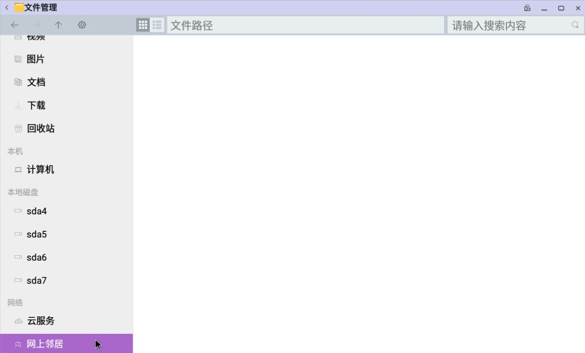

      2. 右键空白处，点击扫描选项  
  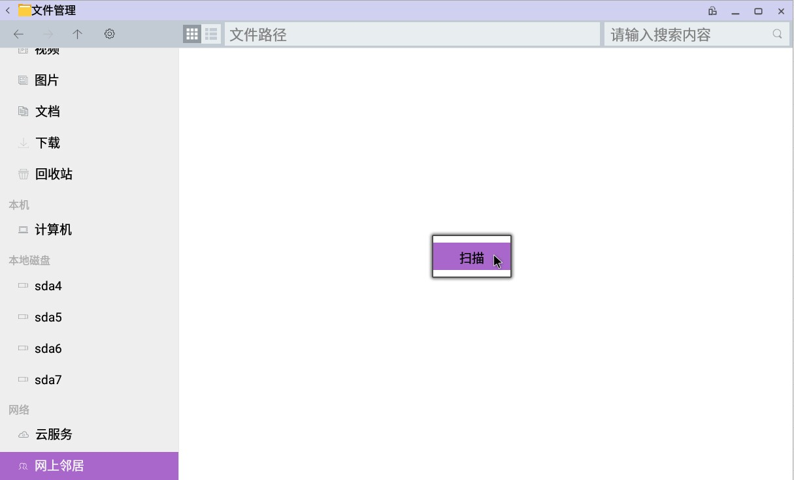   
  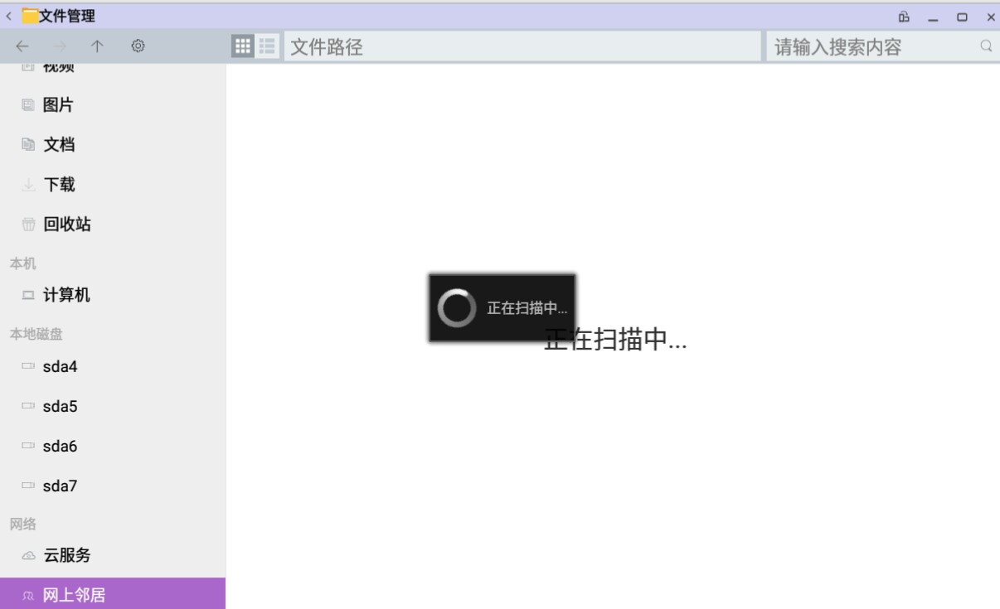

      3. 点击要查看的设备，如果该设备禁止匿名查看会弹出帐号密码窗口  
  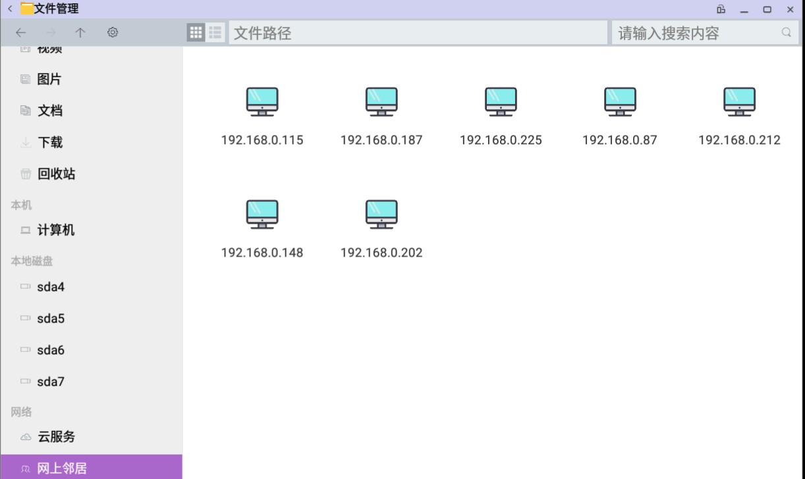   
  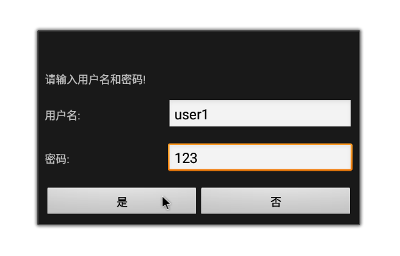

      4. 之后进入share文件夹即可查看共享文件   
  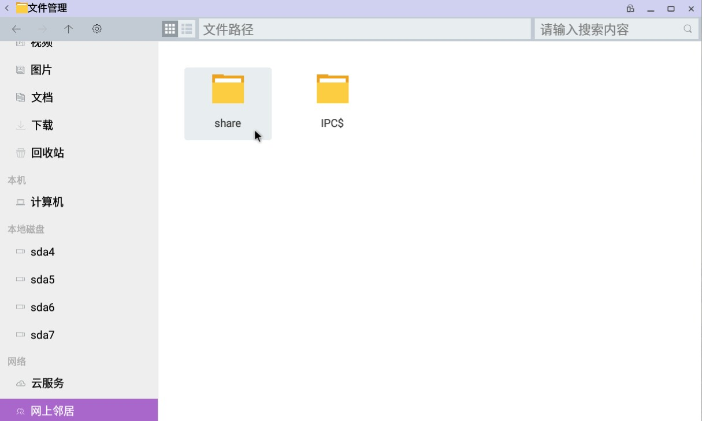   

##### 功能点
   - 扫描  
      - 扫描局域网内开启共享功能的设备
   - 输入用户名和密码
      - 对于没有设置允许匿名访问的设备，需要输入用户名和密码才可以继续查看
      - 点击确定提交输入信息
      - 点击取消关闭窗口
      
#### 共享文件
##### 如何共享
      1. 点击文件管理器上方的齿轮打开下拉菜单，选择开启共享  
  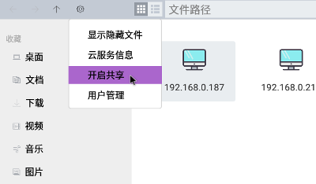

      2. 点击文件管理器上方的齿轮打开下拉菜单，选择用户管理  
  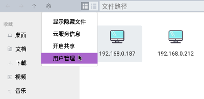  
  添加共享用户  
  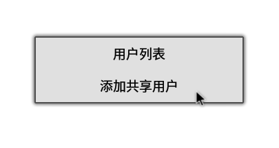   
  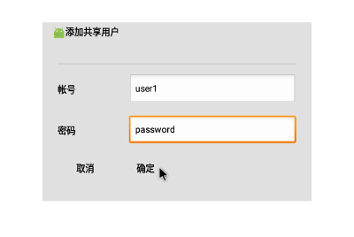

      3. 右键需要共享的文件夹，选择共享  
  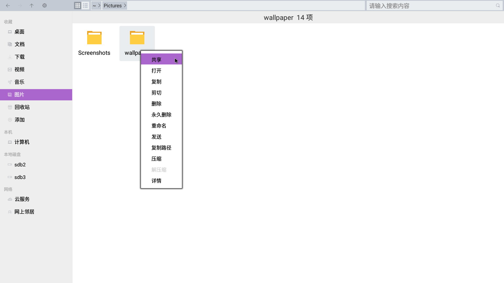

      4. 如果允许其他用户匿名访问可以勾选相关选项  
  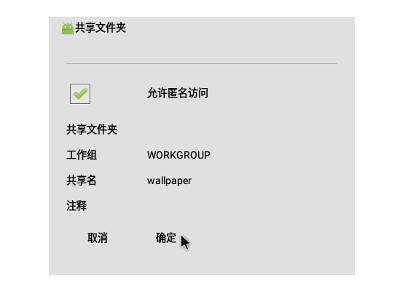

      5. 此时其他用户可以访问共享的文件夹，如果不再需要共享，可以关闭共享功能  
  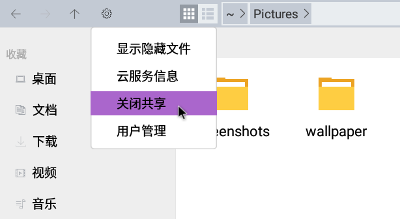

##### 功能点
   - 开启/关闭共享
      - 打开或关闭共享功能，打开共享后，其他用户可以扫描到此设备
   - 添加共享用户
      - 设置访问此设备时需要输入的用户名和密码
   - 共享单个文件夹
      - 共享某个文件夹
