## 5.4 应用商店

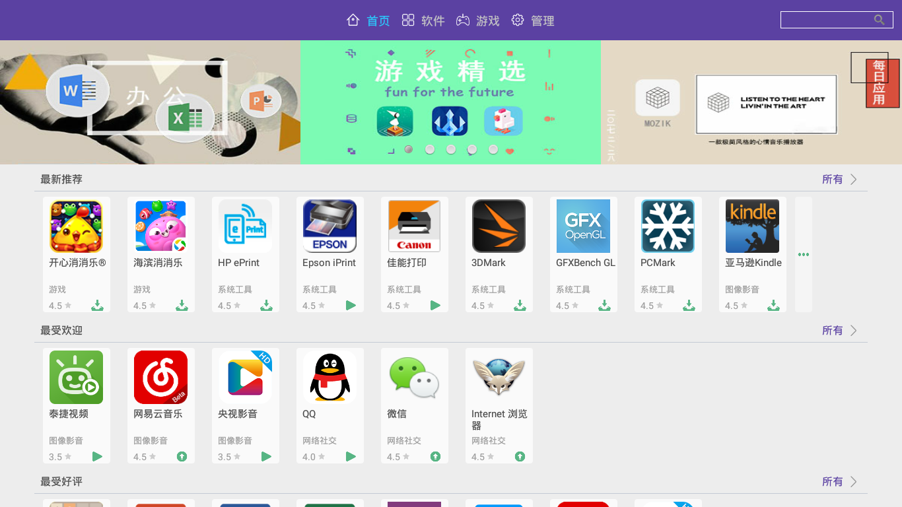
     
### 5.4.1 操作说明
   - 首页，软件，游戏这三个页面中点击单个软件可进入软件详情，在这里可以查看这些个软件的具体内容，左上部分的应用图标下面有下载按钮，也可以点击这个按钮进行软件的下载等一系列操作。点击单个软件的右半部分的按钮，根据按钮显示的内容可以进行下载，暂停，更新等操作
   - 回退 --（返回历史加载过的界面）
   - 首页 --（按指定的条件展示软件。每一个条件下按游戏和软件分别展示）
      - 编辑推荐 --（自定义展示）
      - 最受欢迎 --（按下载量展示）
      - 最受好评 --（按评分展示）
      - 常用软件
      - more --（点击可以查看更多软件内容）
   - 软件 --（展示属于非游戏类的软件）  
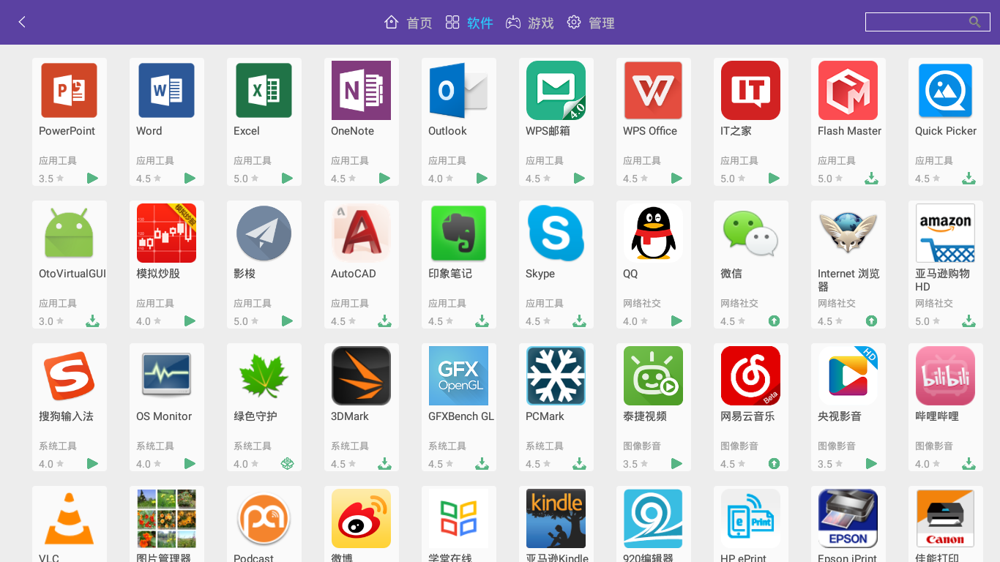

   - 游戏 --（展示属于游戏类的软件）  
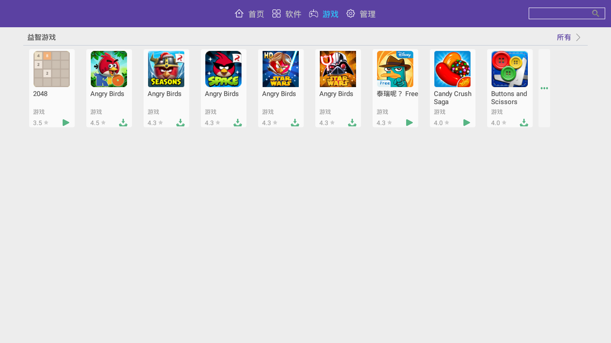

   - 管理 --（查看软件的下载情况）  
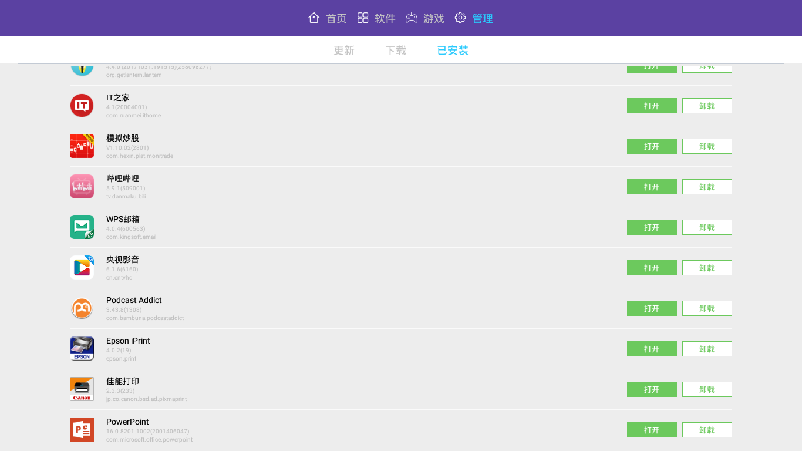

      - 更新 --（本机已经安装的软件）
         - 点击内容项会弹出应用信息框，可进行卸载，清除缓存等操作
         - 更新所有 --（更新所有需要更新的软件）
      - 下载 --（添加进下载列表的软件）
         - 点击内容会弹出安装和移除任务选项
         - 安装 --（进入安装页面，安装app）
         - 移除任务 --（移除当前下载项）
         - 开始所有 --（开始或暂停所有软件）
         - 下载中显示下载的基本信息，右侧的按钮可以控制暂停和继续
      - 已安装
         - 点击内容会弹出打开和卸载任务选项
         - 打开 --（运行相应的app）
         - 卸载 --（从系统中卸载相应的app，此操作不会删除安装包）
   - 搜索
      - 按关键字搜索所需应用

### 5.4.2 应用商店功能
#### 查询应用
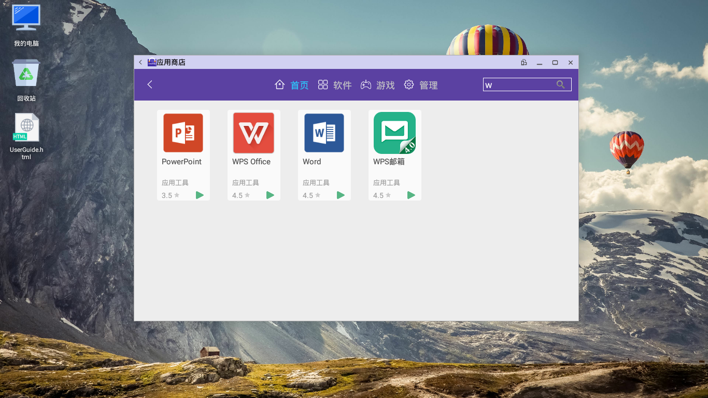
     
   - 每一个页面都可以进行搜索操作
   - 搜索操作在页面的右上角，本应用做的是关键字匹配
   - 例如，我输入w，就会提示出所有包含w的应用

#### 下载应用
   - 在应用列表中点击应用右下角的绿色图标按钮，即可下载应用。图标按钮含义如下：
      - 下载  
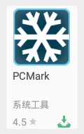

      - 下载中  
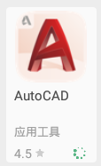

      - 暂停下载  
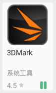

      - 更新  

      - 安装  

      - 运行  

   - 在应用详情页面找到下载按钮，点击进行应用下载  
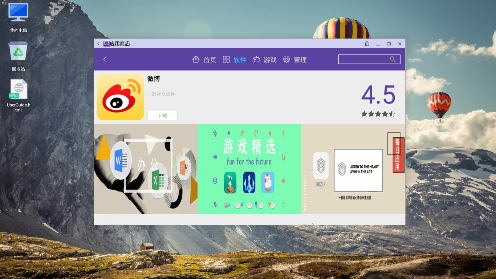

#### 安装应用
   - 如果这个应用没有下载，需要先进行下载
   - 每个应用一下载完成就会自动提示安装
   - 所用通过AppStore下载的应用默认的存储路径是（/storage/emulated/0/Download/app），快捷路径（文件管理器->个人空间->下载->app），可以进入这个目录找到你所下载的应用，双击可进行安装
   - 可以点击应用列表中的下载图标进行安装
   - 也可以选择AppStore的管理页面，在下面的下载中有已下载的应用，点击可弹出一个菜单，点击上面的“安装”选项就可以进行安装  
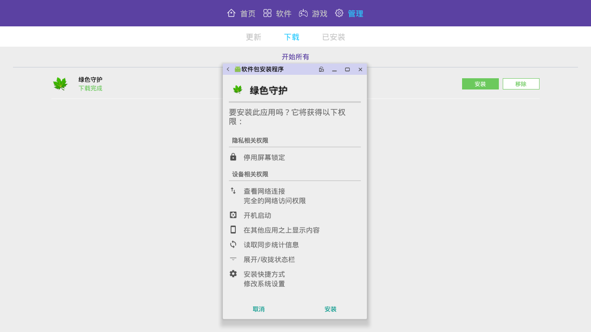
   
   - 进入应用详情页面，如果下载完成会有“安装”提示，点击可以进行安装

#### 卸载应用
   - 点击管理页面，查看上面的已安装选项，点击会弹出卸载的设置框，在上面可进行应用操作  
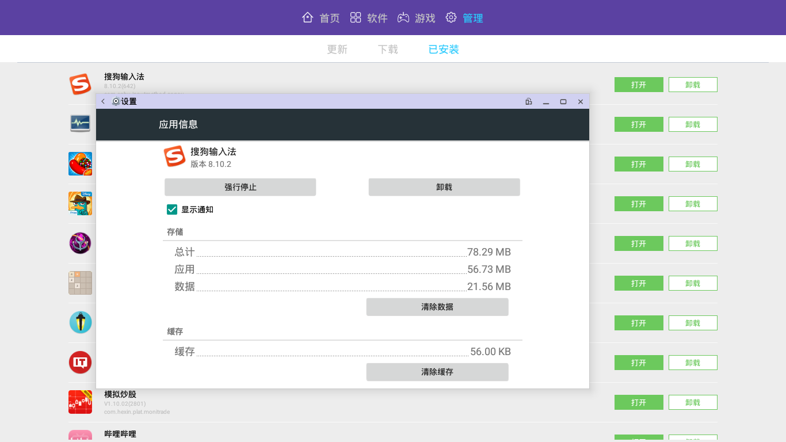

#### 查看详情

   - 通过点击每一个软件的列表项，皆可以进入软件详情页面，这时可以查看软件的具体信息，同样，软件页面也有一定的操作
   - 点击icon下面的按钮可以进行软件下载的操作（暂停，继续，安装）

#### 应用管理
   - 打开管理页面，上面的主要显示已安装的应用，可以进行应用卸载操作。
   - 管理页面下载主要显示正在下载的任务和可以安装的应用  

### 5.4.3 功能点
   - 通过关键字查找应用
   - 可下载qq，微信等常用聊天软件
   - 可以暂停或继续应用的下载
   - 按类别查看非游戏类的软件
   - 按类别查看游戏类的软件
   - 可安装下载的应用
   - 可卸载已安装的应用
   - 快速方便查找应用
   - 可清除已安装应用的缓存
   - 显示当前正在下载的应用
   - 可移除当前应用的下载
   - 开始下载所有已暂停的任务
   - 停止所有正在下载的任务
   - 可查看软件详细信息
   - 更新已安装的应用

### 5.4.4 Input
   - 通过关键字搜索应用

### 5.4.5 可能问题
   - 第一次下载安装应用的时候需要选择允许安装未知来源
   - 如果appstore打不开清空缓存试一试
