# Internet浏览器说明书

## Internet浏览器效果图
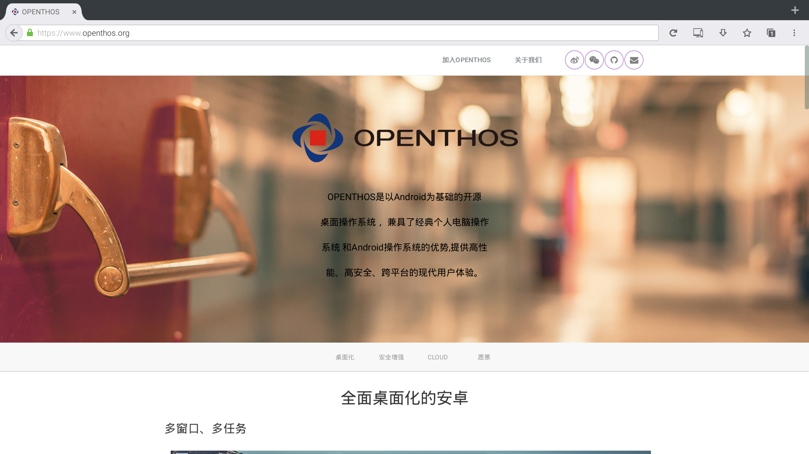   

***
## Internet浏览器 功能点
  - 001 支持 触摸板放大缩小功能;
  - 002 支持 打开网页记忆保存功能;
  - 003 支持 页面内容片选功能;
    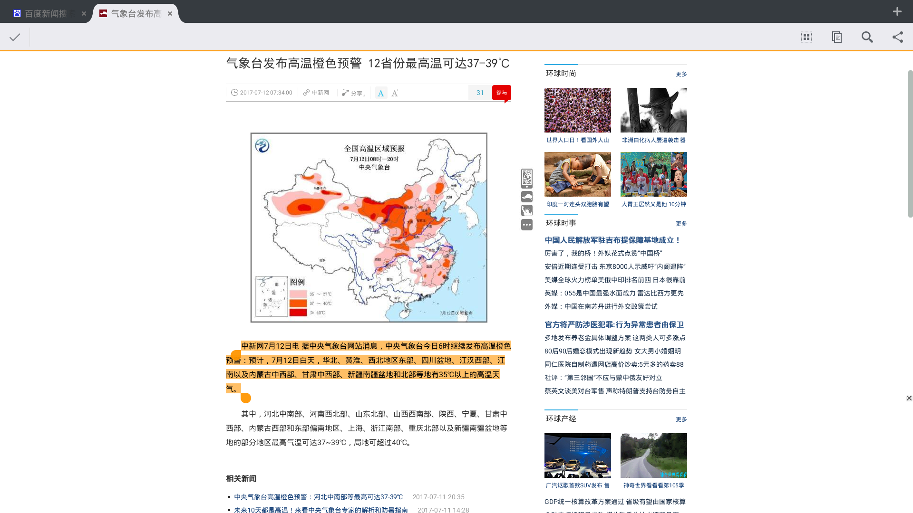
  - 004 支持 快捷键'ctrl' + "a"  选择全部内容功能;
  - 005 支持 快捷键"ctrl" + "c"  复制功能;
  - 006 支持 快捷键"ctrl" + "v"  粘贴功能;
  - 007 支持 快捷键"ctrl" + "x"  剪切功能;
  - 008 支持 快捷键"alt" + "F4"  关闭浏览器功能;
  - 009 支持 双击页面顶部缩小功能;
    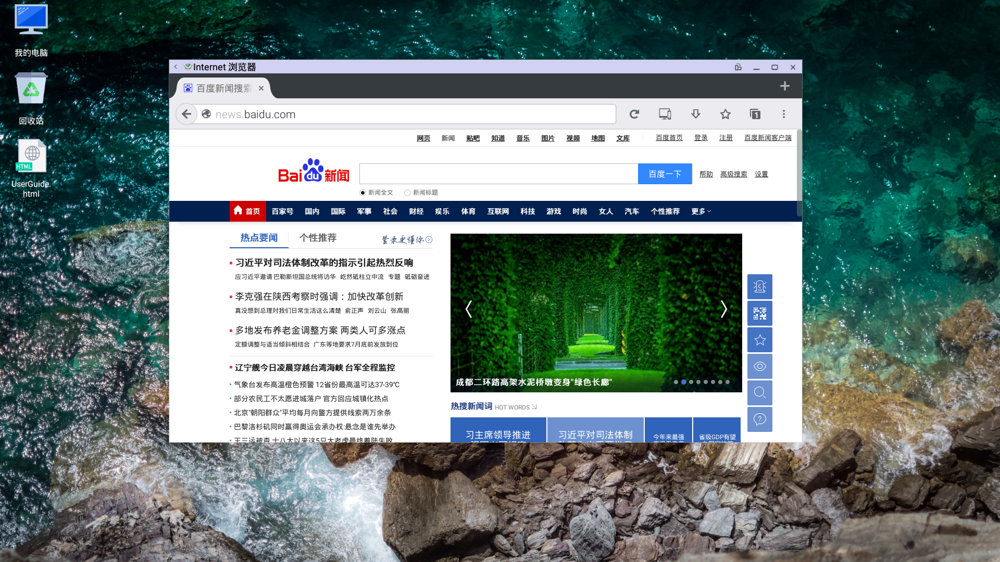
  - 010 支持 双击页面顶部放大页面功能
    
  - 011 支持 网页新增窗口功能;
  - 012 支持 网页应用下载功能;
  - 013 支持 页面收藏功能;
  - 014 支持 安装firefox第三方插件
  - 015 支持 鼠标滚轮上下滑动功能
  - 016 支持 编辑框搜索历史记录
  - 017 支持 图片分享功能
  - 018 支持 页面手机 ＆ pc切换模式 (请点击下图所示按钮)
    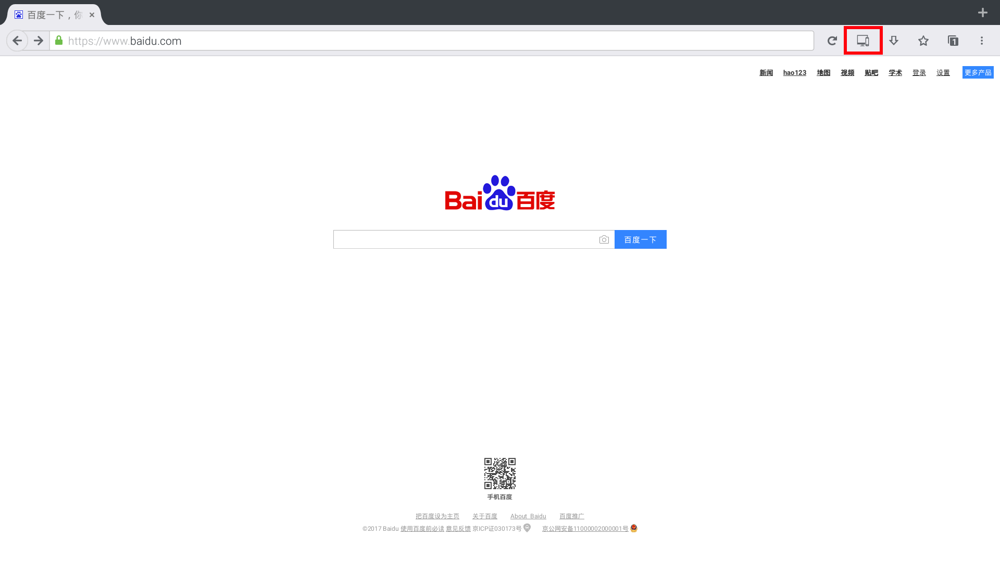
    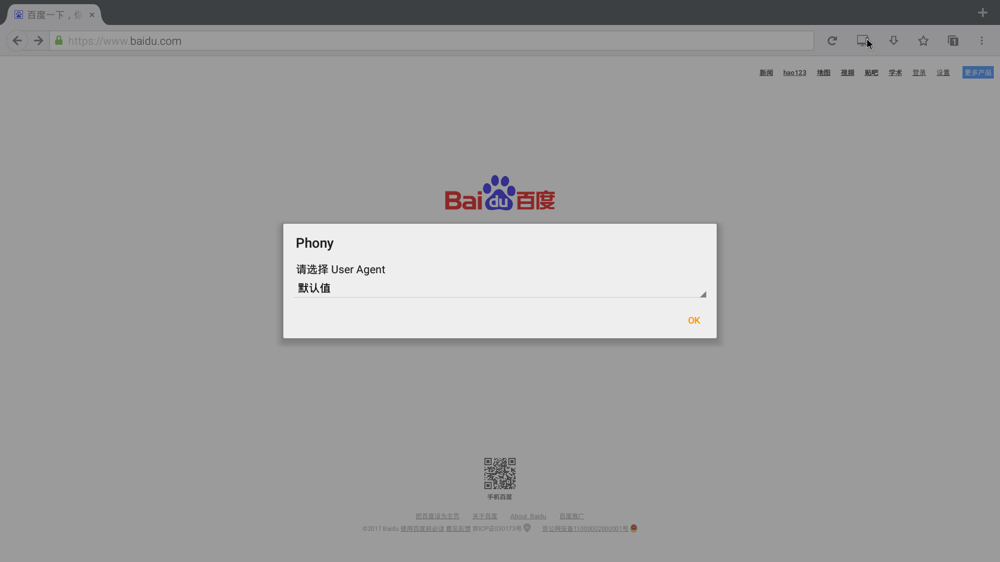
    
  - 019 支持 常用邮箱登录功能 (网易，QQ，新浪，阿里);
  - 020 支持 视频播放功能;
    
  - 021 支持 音乐在线播放功能;
    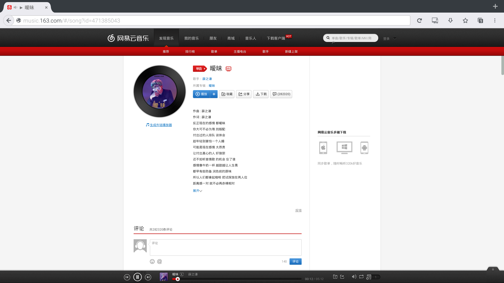
  - 022 支持 网页版微信扫码登录功能;
    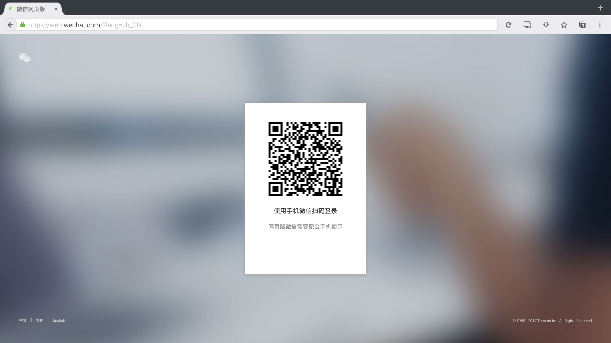
  - 023 支持 百度搜索功能;
    
  - 024 支持 登录百度帐号功能
  - 025 支持 网页版百度云盘存取数据功能;
  - 026 支持 查看新闻功能;
  - 027 支持 地图功能
  - 028 支持 贴吧功能
  - 029 支持 知道问题提问
  - 030 支持 百度编辑框提示信息
    
  - 031 支持 天气查看功能
  - 032 支持 百度图片上传搜索功能
    
  - 033 支持 百度百科
  - 034 支持 百度文库
  - 035 支持 百度今日热搜词
  - 036 支持 github 登录
    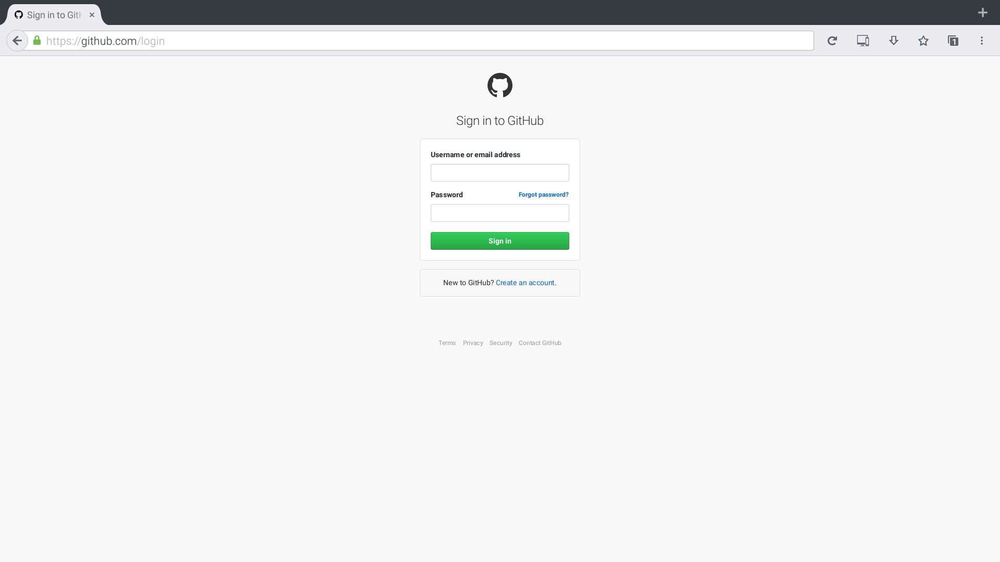
  - 037 支持 一铭邮箱登录
    
  - 038 支持 禅道登录功能
    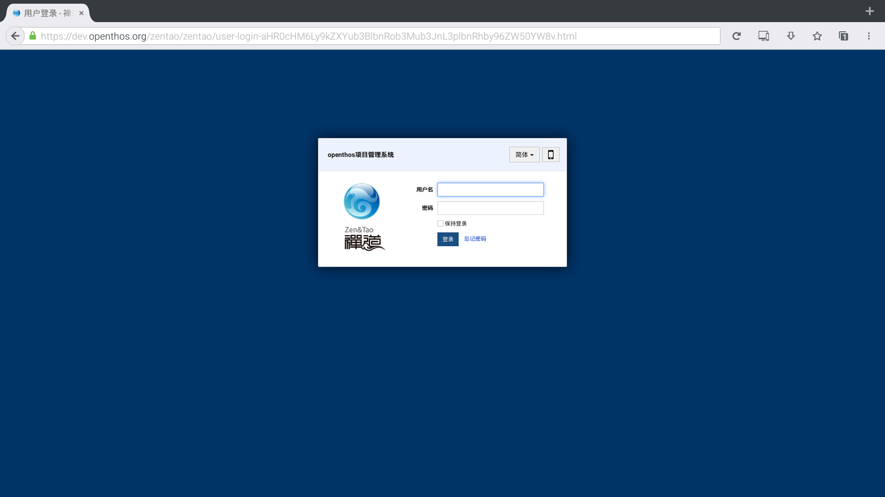   

***
## Internet浏览器 input

  - 新闻类

     - 新浪新闻：http://news.sina.com.cn/
        

     - 搜狐新闻：http://news.sohu.com/
     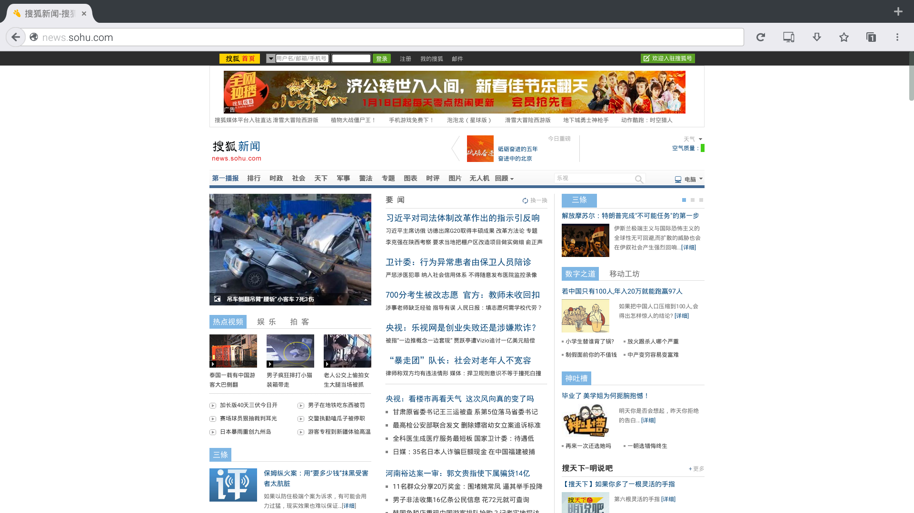   

     - 腾讯新闻：http://news.qq.com/
     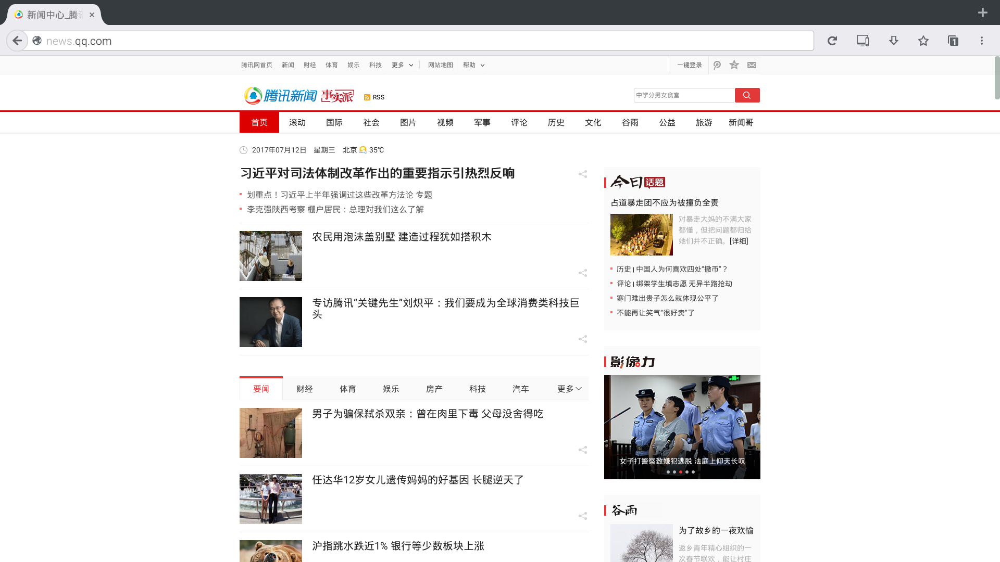   

     - 央视新闻：http://news.cctv.com/
     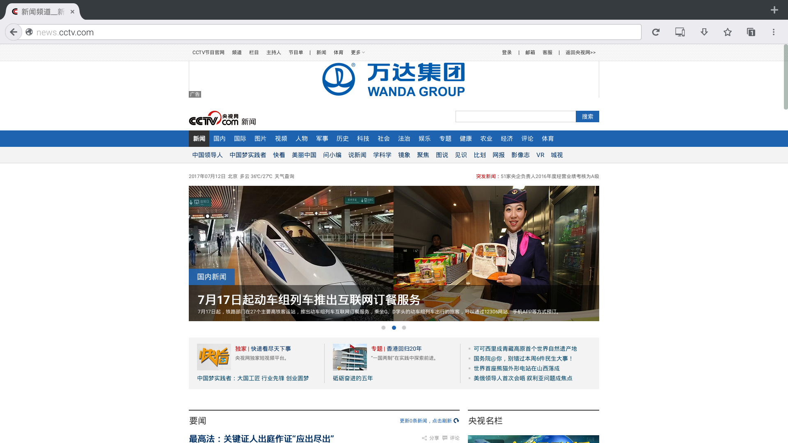   

     - 网易新闻：http://news.163.com/
        

  - 购物类

     - 淘宝网：https://www.taobao.com/
       

     - 天猫精选：https://www.tmall.com
     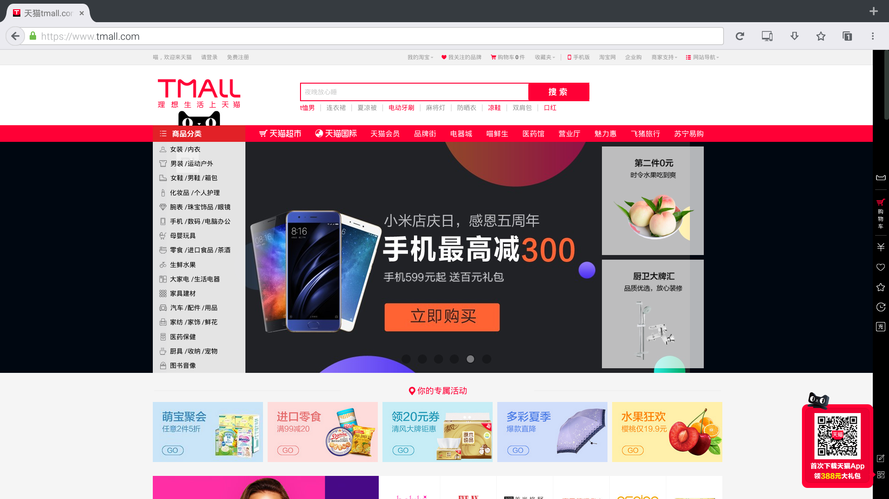   

     - 京东商城： https://www.jd.com/
        

     - 唯品会：http://vip.com/
       

     - 亚马逊：https://www.amazon.cn/
     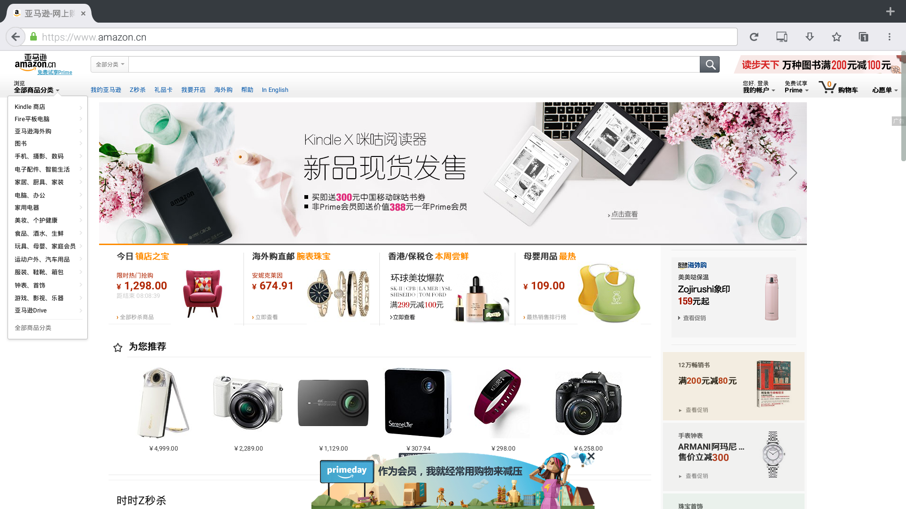   

  - 视频类

     - 优酷：http://www.youku.com/
        

     - 爱奇艺：http://www.iqiyi.com/
        

     - 百度视频：http://v.baidu.com/live/
     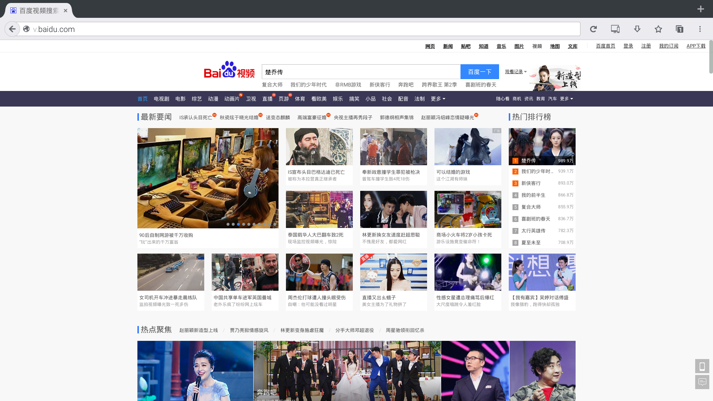   

     - 土豆视频：http://www.tudou.com/
     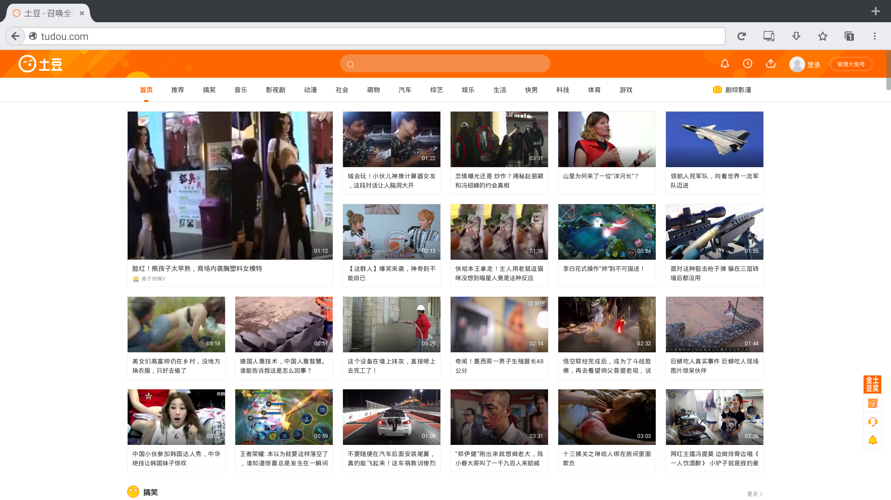   

     - 搜狐视频：http://tv.sohu.com/
        

  - 体育类

     - 新浪体育：http://sports.sina.com.cn/
        

     - 搜狐体育：http://sports.sohu.com/
     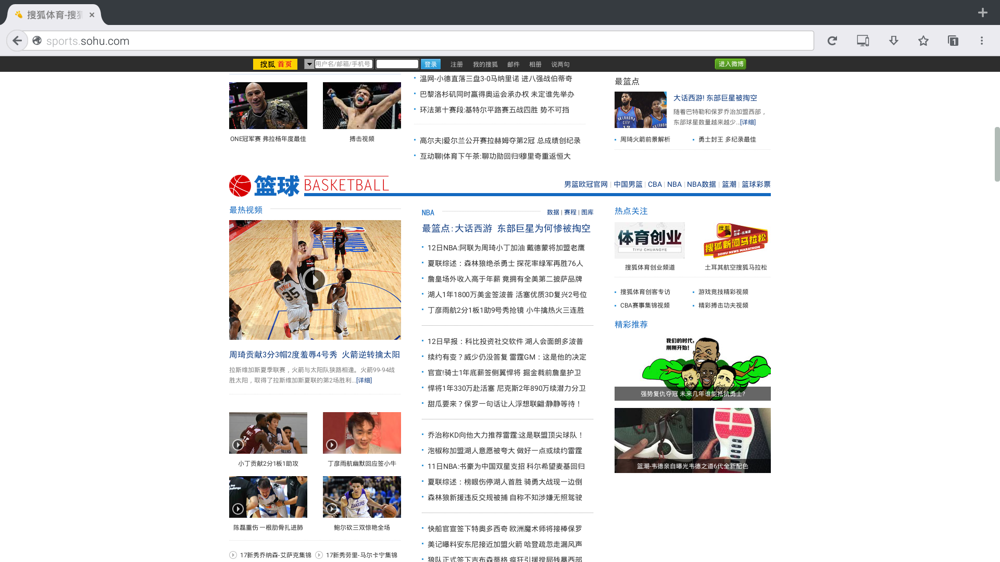   

     - 腾讯体育：http://sports.qq.com/
        

     - CCTV5：http://tv.cctv.com/cctv5/
        

     - NBA 官网：http://china.nba.com/
        

  - 办公类

     - 清华info：http://info.tsinghua.edu.cn/
     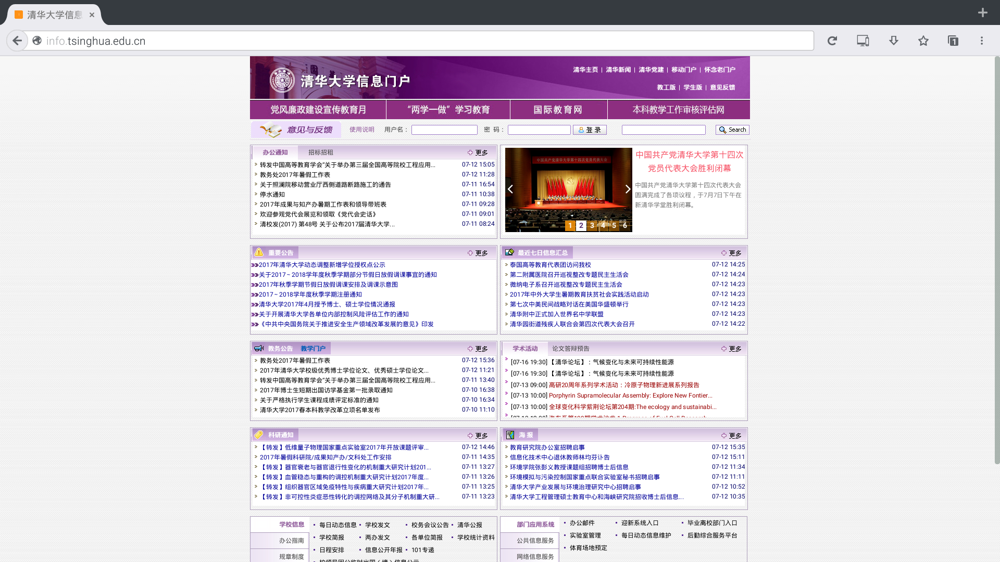

## 注意事项
  -  文件上传操作（注意不要在上传文件时，同时操作文件管理器，可能会出现冲突）  
      - 选择上传文件时，会直接打开文件管理器
      - 若您打开文件管理器后不想要选择文件上传，则按esc键返回Internet浏览器（请不要点击右上角关闭按钮，那会导致Internet浏览器同时关闭）
