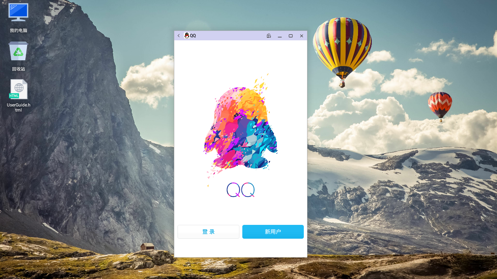
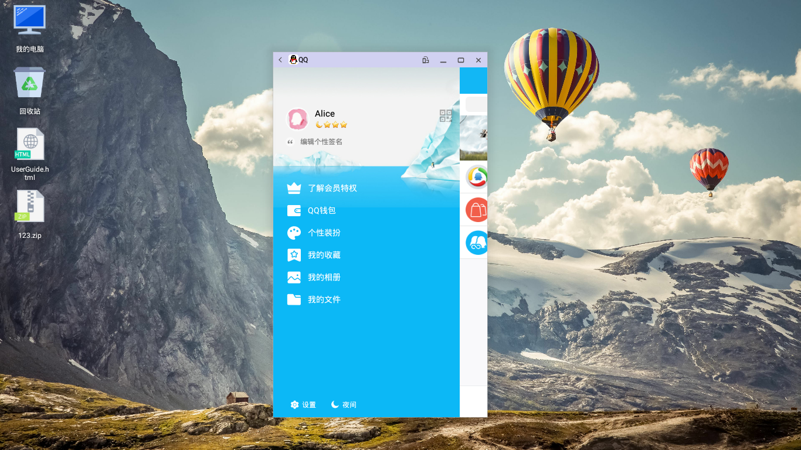
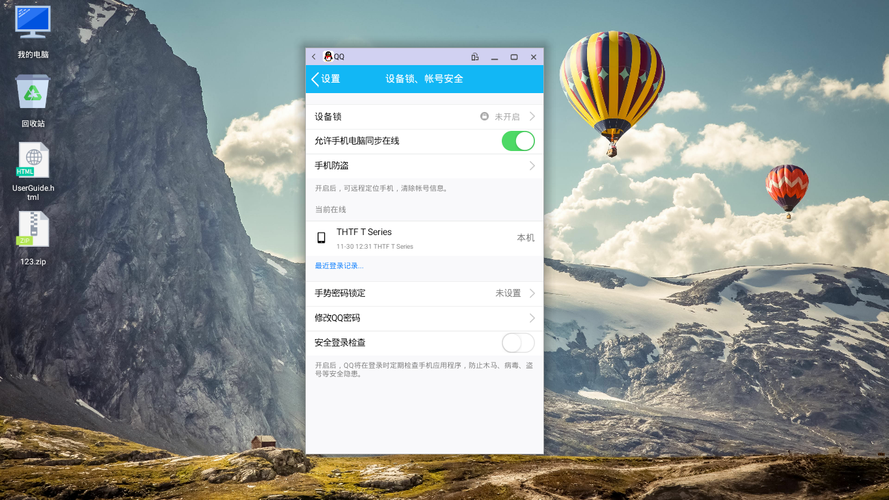
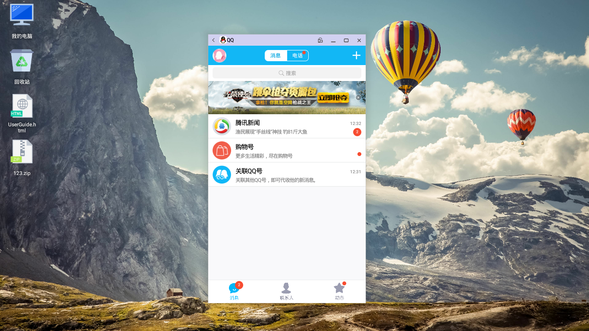
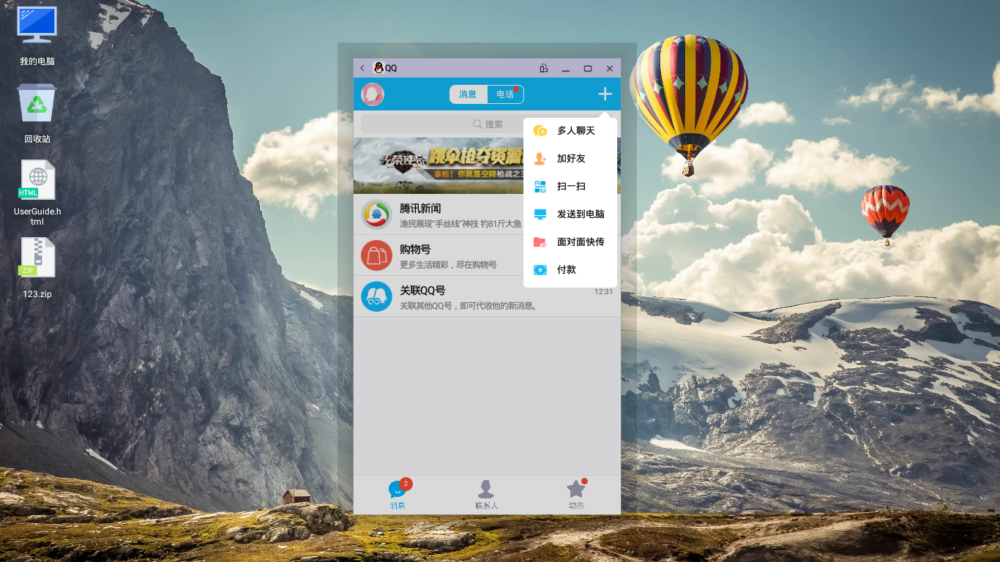

## QQ

### QQ登陆
   - 打开应用输入用户名、密码登陆QQ

### 主菜单
登录后在界面中间按住鼠标向右滑动，可以看到主菜单  

   - 二维码
      - 点击二维码图标(在主菜单的右上方)
   - 个性签名
      - 点击"编辑个性签名"
   - 了解会员特权
   - QQ钱包
   - 个性装扮
   - 我的收藏
   - 我的相册
   - 我的文件（传文件/照片到我的电脑，面对面快传，备份相册到微云）
   - 设置
      - 帐号管理
         - 添加帐号
         - 在线/隐身
         - 退出当前帐号
      - 手机号码
         - 绑定手机
      - 聊天记录
         - 点击"设置"-> "聊天记录"
      - 联系人、隐私
      - 设备锁、帐号安全  

      
      - 安全检测  

   - 辅助功能
   - 关于QQ与帮助
   - 夜间
      - 进入夜间模式

### 消息
点击下方“消息”按钮，进入消息页面  

   - 多人聊天、加好友、扫一扫、发送到电脑、面对面快传、付款
      - 点击右上方加号可以显示菜单  

   - 使用回车发送消息
      - 进入主菜单 -> "设置" -> "辅助功能" -> "回车键发送消息"
   - QQ电话/视频电话
      - 点击页面最上方的"电话"按钮 -> 选择联系人 -> 选择电话类型
   - 发送文件、短视频、视频对讲、红包、转账、音乐、位置、推荐好友、悄悄话
      - 点击聊天窗口右下角的加号
   - 保存
      - 在好友发送的图片上点击右键保存，显示保存到手机，保存在storage/emulated/0/tencent/QQ_Image下

### 联系人
点击下方“联系人”按钮，进入联系人页面  

   - 找人，找群，找公众号，面对面添加，添加手机联系人，查看附近的人
      - 点击右上方"添加"按钮
   - 新朋友
   - 特别关心
   - 群聊
   - 公众号

### 动态
点击下方“动态”按钮，进入动态页面  

   - 好友动态
   - 附近
   - 兴趣部落
