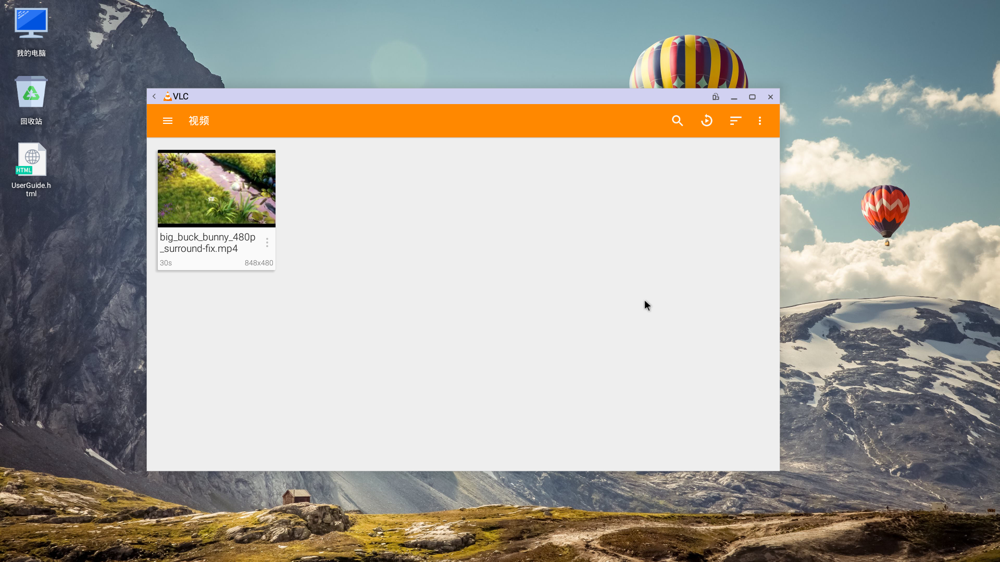
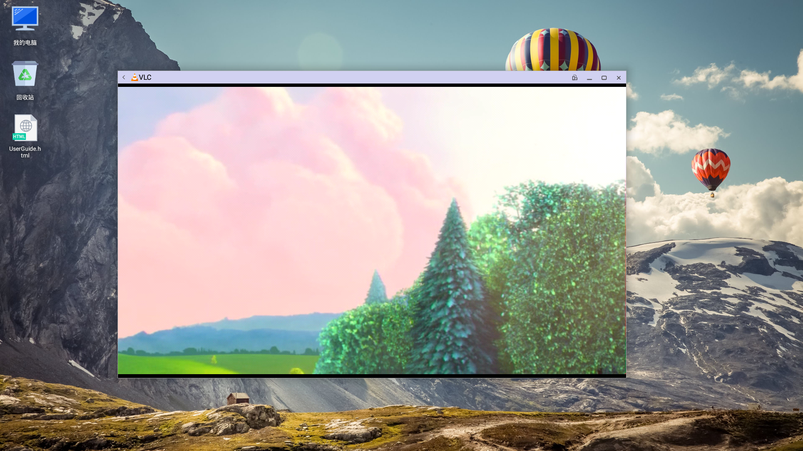
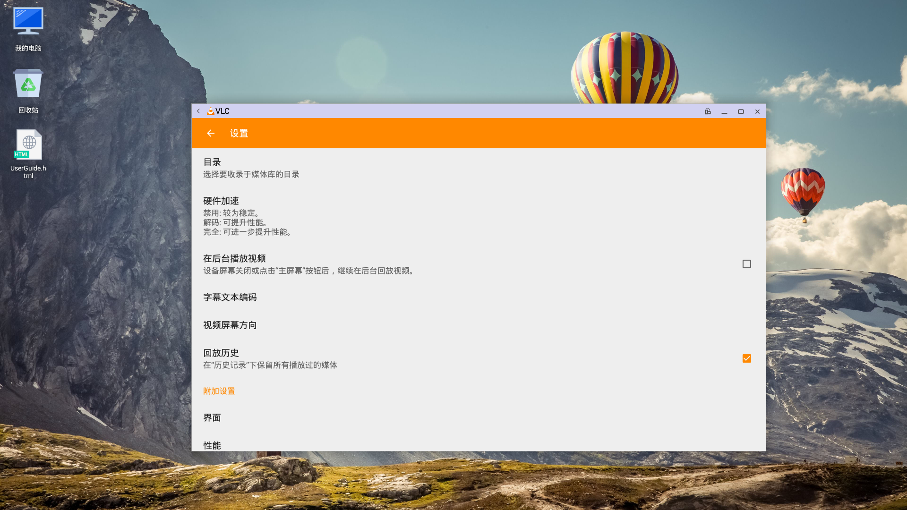
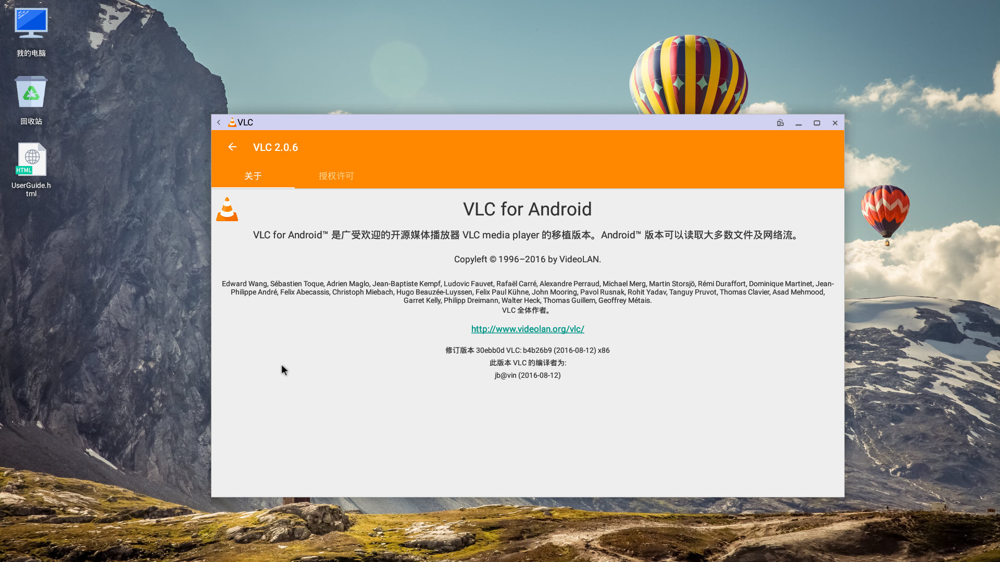
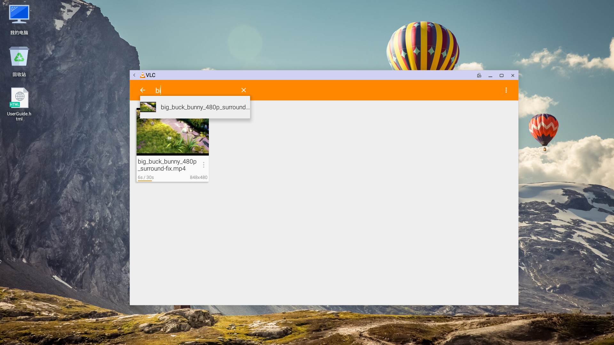
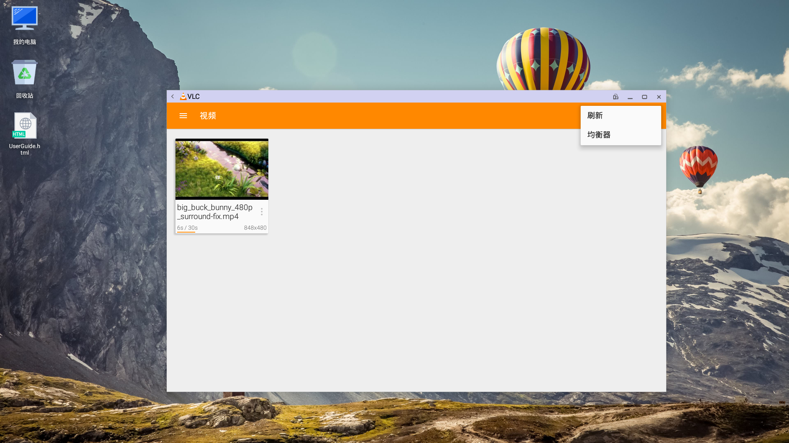

# VLC使用说明书
VLC效果图  

## VLC功能点
   - 支持mpg,mp4,avi,swf,3gp,mpeg4格式的视频播放
   - 支持从指定目录查找视频
   - 每次启动时支持自动扫描本地视频文件功能，并显示
   - 支持视频搜索功能，点击视图中的放大镜，会弹出搜索框
   - 支持刷新视频列表功能
   - 支持视频列表的排序，可以按名称（正序，倒序），长度，日期排序
   - 支持视频播放时暂停，继续功能
   - 支持视频播放时锁定功能
   - 支持加载网络或本地字幕功能
   - 支持视频显示的模式，水平匹配，垂直匹配，拉伸填充，16：9，4：3，居中，最为合适等
   - 支持视频播放时快退，快进功能
   - 支持从任意位置播放视频
   - 支持从本地网络查看视频列表
   - 支持通过网络视频链接播放视频
   - 支持播放音频文件
   - 音频播放中支持按照"艺术家","专辑","歌曲","流派","播放列表"进行排序功能
   - 支持音频播放的暂停与继续
   - 支持音频文件的列表分类
   - 支持查看历史记录
   - 支持清除历史记录功能
   - 支持选择收录媒体库的目录
   - 支持选择硬件加速模式
   - 可以设置是否允许后台播放视频
   - 支持选择字幕文本编码
   - 支持设置屏幕方向
   - 支持回滚历史记录
   - 支持界面设置
   - 支持清空媒体数据库
   - 可以查看vlc版权内容
   - 支持退出保存播放进度功能

## VLC Input
   - 通过搜索输入的关键字查找音视频文件
   - 通过输入音视频的网络地址来进行播放

## VLC基本操作说明
   - 点击左上角图标，可以查看软件的功能结构  

   
   - 选择视频项，会自动搜索本机的视频，并且显示出来
   - 点击展示出来的视频列表，可以进入视频播放  

   
   - 点击音频项，会自动搜索本机的音频文件，并且展示出来
   - 点击目录项，可以进入本地自己选择视频路径  

   - 例如，查找本地movies下的文件，可以通过点击目录，找到movie查找到以后点击可以播放
   - 点击本地网络项，可以查看本地网络的视频  

   - 点击流项，可以输入视频的网络地址来播放视频  

   - 点击历史项，可以查看播放的视频的历史记录  

   - 点击设置项，可以设置本机的配置，具体内容如图  

   - 点击关于项，可以查看本应用的信息  

   - 点击放大镜，可以进行搜索功能

   - 点击最右侧的三点，可以进行刷新操作  

