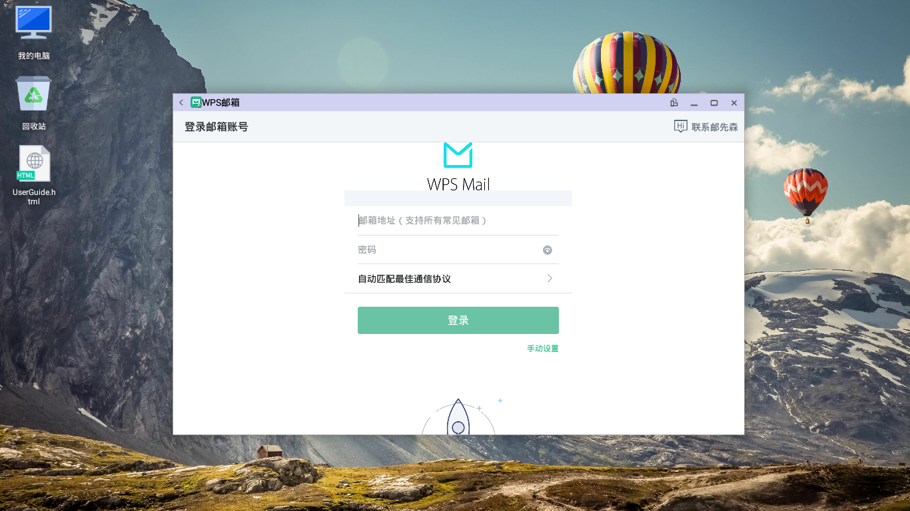
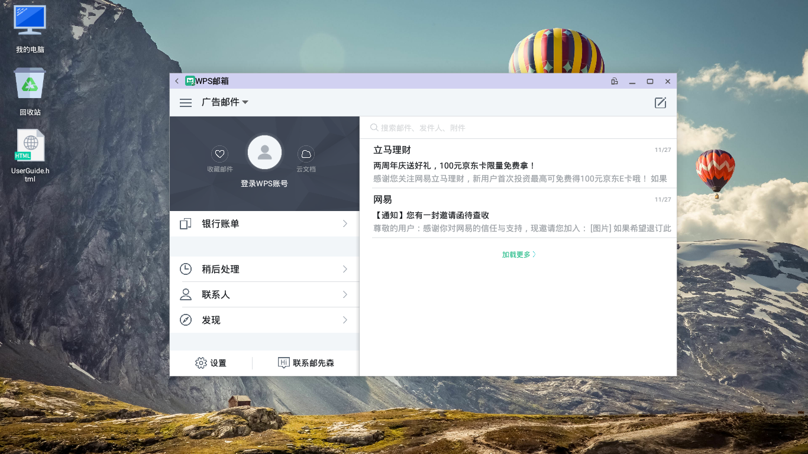

# WPS邮箱  

## wps邮箱登陆：  
- 打开应用输入用户名、密码登陆wps邮箱。登录后如下图:
  
 
- 遇到无法登录时：
  - WPS邮箱初次登录对于有的邮箱是登录不上的，需要去Web网页版邮箱进行开通设置，步骤如下：  
    - 网页版邮箱-> 设置-> 左侧列表中点击“POP3／SMTP／IMAP“-> 在中间面板中√的地方都打上√ -> 保存 -> 再在左侧列表中点击 “客户端授权密码“ -> 在中间面板设置“开启“ -> 自行设置授权密码 -> 完成后重新登录即可。如图：
  
      

## wps邮箱功能点

### 邮件分类
点击左上角按钮，查看如图邮件分类;

### 发送邮件

- 支持发送带附件的邮件;  
    - 进入写邮件页面->主题右侧“回形针“按钮->选择附件(如本地图片)->选择图片->完成
- 支持发送包含多个附件的邮件;    
- 支持发送带链接的邮件;
- 支持给正文标颜色;
- 支持发送带表格的邮件;
- 支持发送WPS云文档;
- 支持群发邮件，添加抄送人;
- 抄送收件人时可以选择密送;

### 收取各类邮件

- 支持回复、全部回复收到的邮件;
- 可收取带附件的邮件，且附件可以打开;
- 可收取包含多个附件的邮件，且多个附件均下载成功，可打开;
- 可收取发送带链接的邮件,可点链接直接打开链接;
- 可收取带图片的邮件，图片显示正常;
- 可收取带表格的邮件，表格显示正常;
- 点击附件最右端按钮可以选择下载到本地，或上传到WPS云端;

- 支持转发邮件;
- 支持收藏邮件，点击右上角心形按钮，可在首页查看已收藏邮件;
- 支持将邮件移动到其它文件夹，邮件详情右上角更多按钮;
- 支持将文件设为稍后处理，延后时间可在设置里自定义，邮件详情右上角更多按钮;
- 支持将发件人的邮件进行标记，邮件详情右上角更多按钮;
- 支持将当前邮件设为已读，邮件详情右上角更多按钮;

### 联系人

- 自动保存有过邮件往来的邮箱为联系人;
- 点击联系人可查看详情，列出往来邮件;
- 联系人详情页可直接发送邮件;
- 联系人详情页可对联系人归类;
- 联系人详情页可对联系人信息编辑;
- 支持新增联系人，联系人界面右上角加号按钮,如图填写新增邮箱;

- 支持新增组，联系人界面右上角加号按钮;

### 云服务

- 查看上传到云端的所有文档;
- 云端文档可点击直接下载到本地;
- 已下载的文档可直接点击打开;

### 收藏文件
- 点击首页用户头像左侧按钮，查看所有已收藏邮件;

### 设置

- 支持手势密码，进入邮箱时验证;
- 支持设置邮件展示方式;
- 支持夜间模式;
- 支持设置邮件摘要显示行数;
- 支持设置邮件稍后处理时间;
