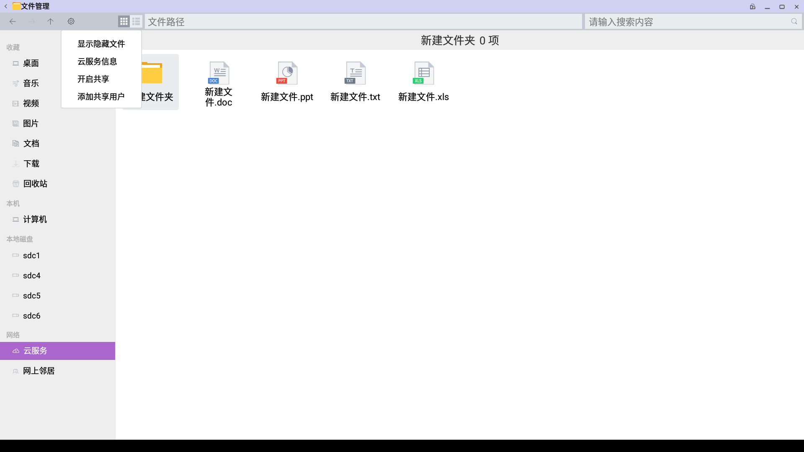
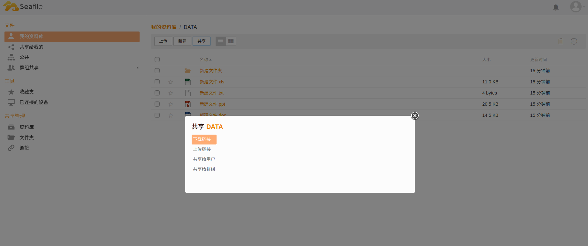

### 云服务
文件管理器左侧导航栏进入“云服务”
   - 系统需先进入设置 - 系统帐户管理 绑定openthosID
   - 进入文件管理器云服务  

#### 功能点
   - 进入云服务  

   - 新建文件夹/新建doc/新建ppt/新建txt/新建xls  
鼠标右键可新建文件夹/文件  
   

   - 粘贴文件夹/文件  
可从文件管理器其它目录粘贴文件/文件夹放到云服务中

   - 同步到云服务网页端  
      - 打开文件管理器设置-云服务信息  

      - 选择“同步”，云服务中的内容可同步到网页端  

      - 网页端地址：https://dev.openthos.org
      - 网页端先登录帐号，即可看见云服务中的内容  
   
   

      - 网页端可新建文件夹/文件  

      - 网页端可共享云服务中的内容/创建群组共享  

      - 网页端可下载上传/收藏/查看连接设备  

   - 解除同步  
本地文件管理器云服务解除同步后，网页端将不再同步云服务中的信息  

