### 云服务

#### 功能点
   - 进入云服务  
      - 系统需先进入设置中的系统帐户管理，绑定openthosID，否则使用中会提示未发现openthosID
      
      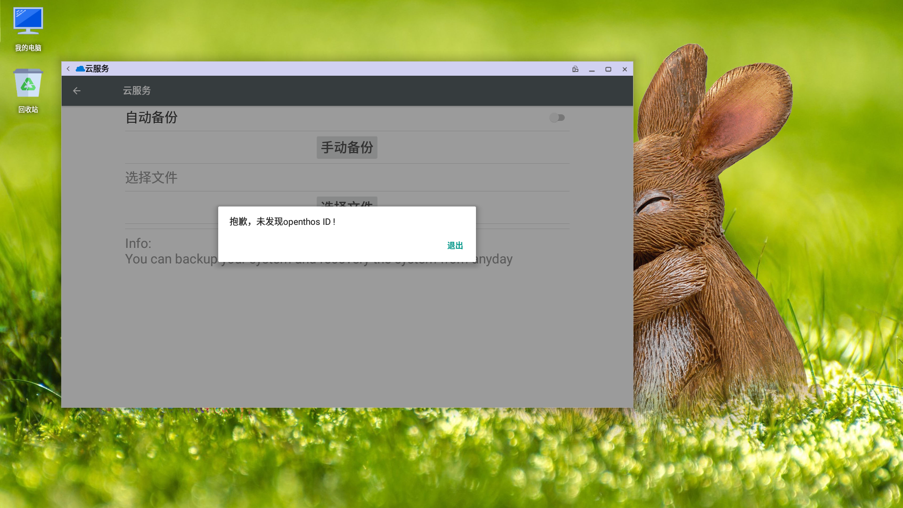
      - 文件管理器左侧导航栏进入“云服务”
      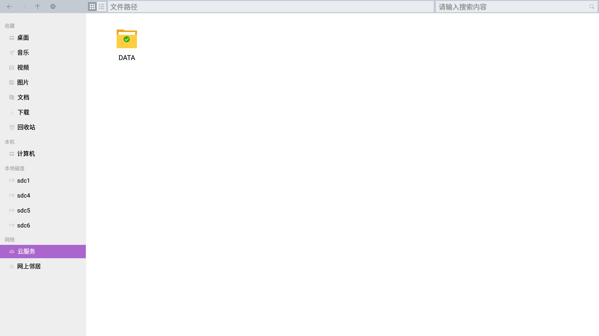
      

     
   - 账号管理 （设置-->系统账户管理-->openthos ID）
   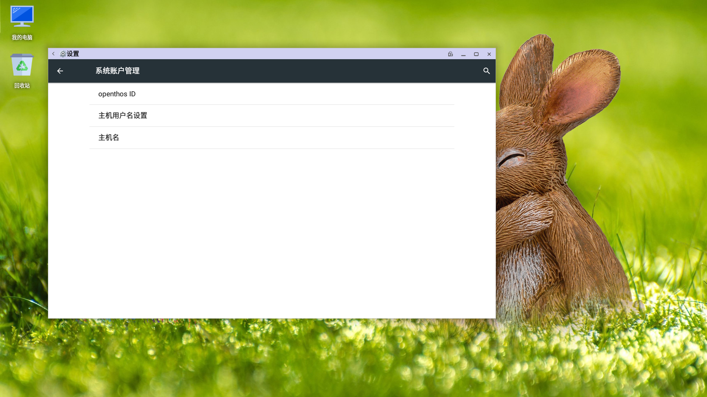
     - 没有账号界面
     
     - 选择服务器地址
     
     - 注册账号
     
     - 绑定账号
     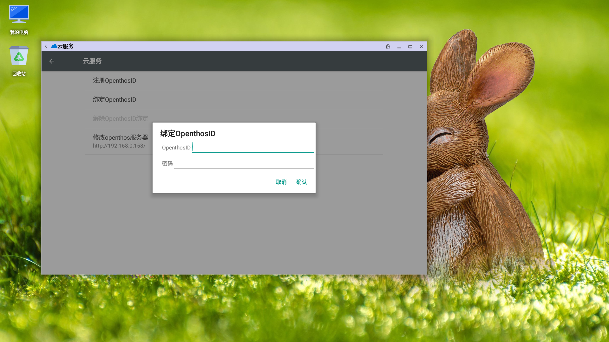
     - 解绑账号
     
     - 绑定账号后界面
     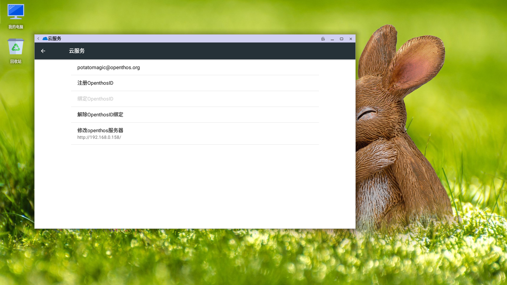
     
   - 首次配置也可以注册绑定账号
     - 绑定账号
     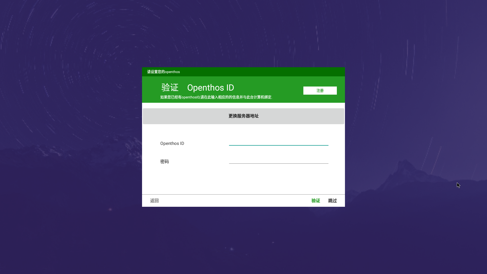
     - 注册账号
     
     
   - 备份还原 （设置-->云服务）
   
      - 自动备份：每天备份一个配置文件
      - 手动备份：自己手动备份配置文件
      - 选择备份文件
      
      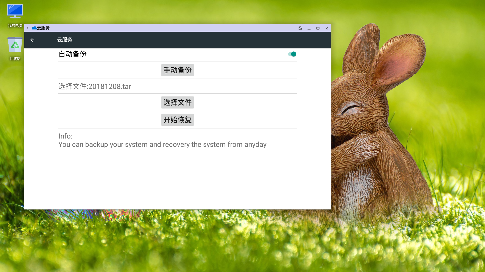
      - 还原系统
      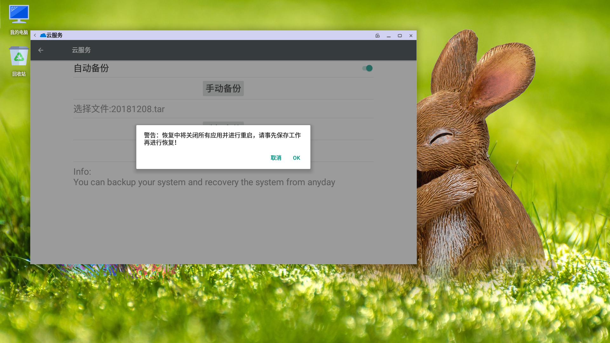
      
   - 使用同文件管理器   
      - 绑定帐号后会自动同步本地云服务目录和服务器该帐号下的内容  
      `目前下载文件后不会自动刷新目录，可以通过按f5的方式查看新下载的文件`
      - 新建文件夹/新建doc/新建ppt/新建txt/新建xls  
      - 鼠标右键可新建文件夹/文件  
         
      
      - 粘贴文件夹/文件：可从文件管理器其它目录粘贴文件/文件夹放到云服务中
      - 云服务状态信息查看在通知栏
      
      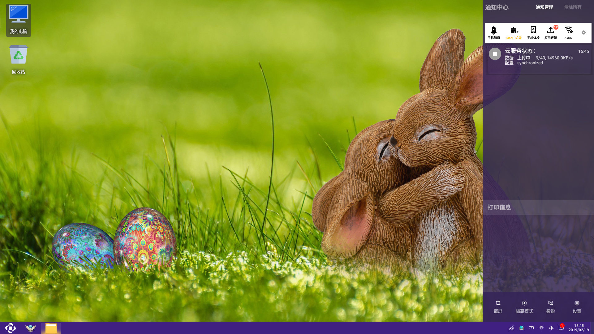
      - 容量默认2G大小，使用达到80% 90%会给出提示，超过90%会停止同步，停止同步后，低于80%会再次开启同步  
      `由于android默认对apk文件进行扫描，删除后被进程的link还没有立即释放掉，因此刚被删掉的apk文件仍然占用容量。可以通过重启电脑解除这个空间占用`
      
      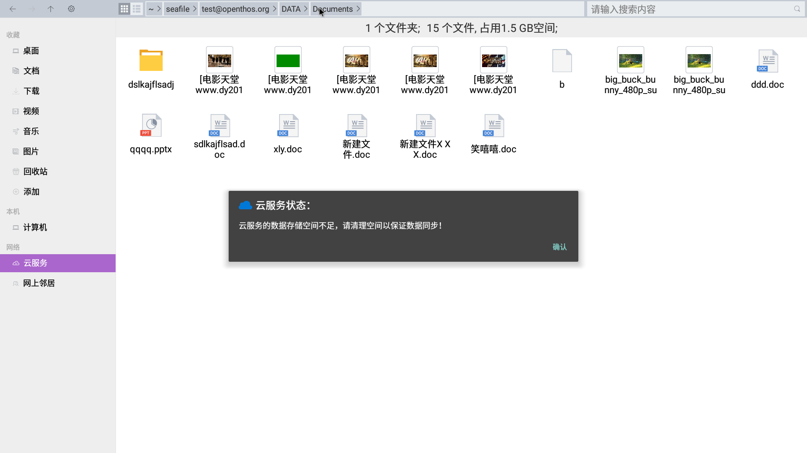      
 
    - 网页端使用   
      - 网页端地址：https://dev.openthos.org
         - 网页端登陆时用户名后面需要加后缀，比如OpenthosID是abc，网页端登陆时的用户名就是abc@openhtos.org
      - 网页端先登录帐号，即可看见云服务中的内容  
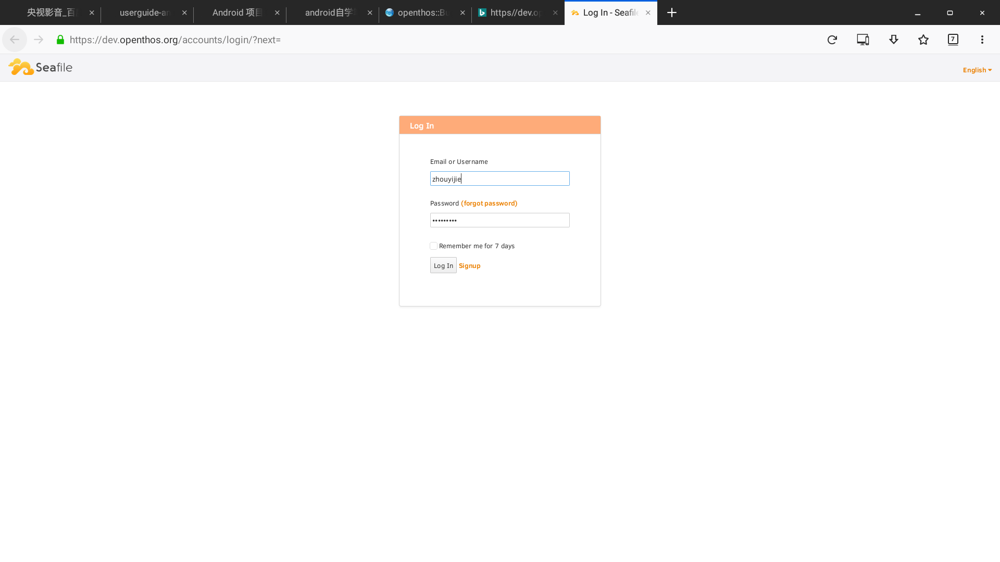   
   
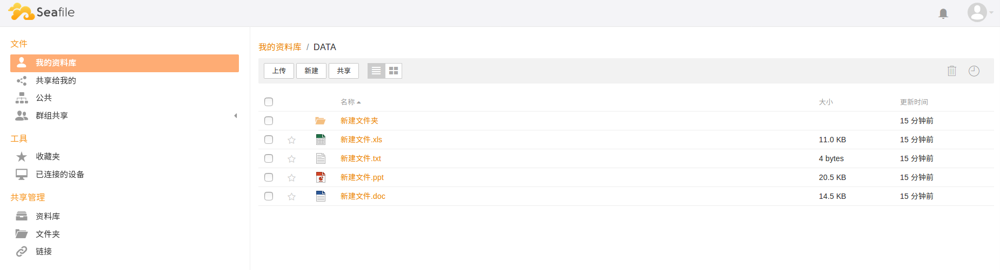

      - 网页端可新建文件夹/文件  

      - 网页端可下载上传/收藏/查看连接设备  

   - OPENTHOS云客户端
      - OPENTHOS云客户端包括android、windows、linux和mac，下载链接如下：http://dev.openthos.org/download_client_program/
