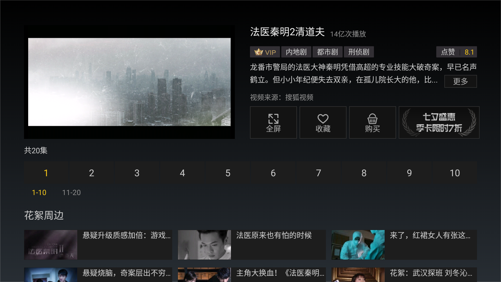
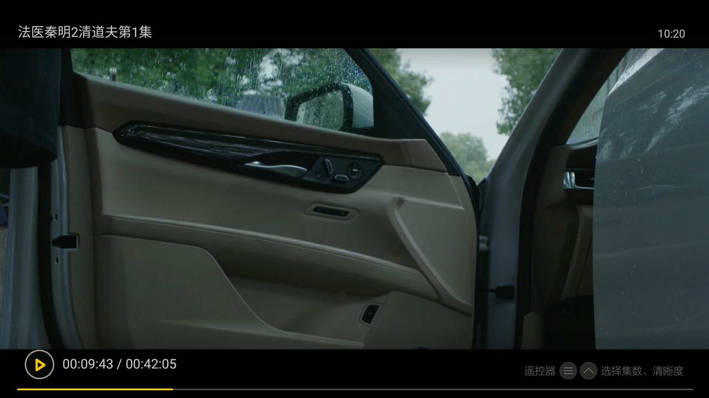
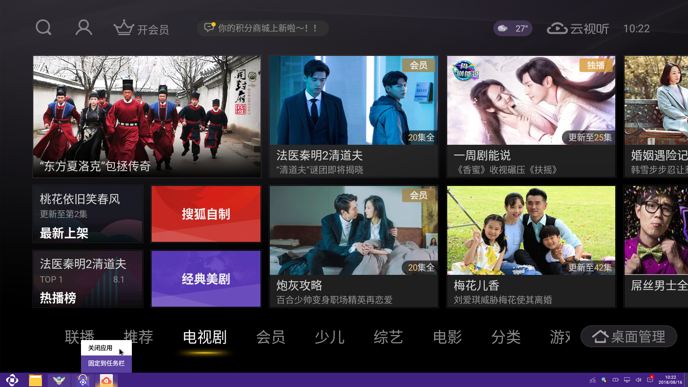

## 云视听悦厅TV
云视听悦厅TV 是一款电视客户端产品，视频画面精美。在OPENTHOS上，您依然可以通过鼠标和键盘来进行操控。

### 选择要播放的视频
   - 打开应用后，可以通过鼠标选择分类和需要播放的视频。  
   

### 全屏观看
   - 进入视频播放后，鼠标点击视频小窗口，或者视频右侧的全屏按钮，可全屏播放视频。  
 

### 播放/暂停
   - 全屏播放时可以通过键盘上的Enter键暂停播放，之后再按一次Enter可继续播放。  

### 前进/后退
   - 全屏播放时可以通过键盘上的右方向键(→)跳过一小段内容；也可以通过左方向键(←)回退一小段内容。  
 

### 调出播放菜单
   - 全屏播放时可以通过键盘上的菜单键调出播放菜单，来选择视频清晰度和播放集数。之后再按一次菜单键可屏蔽菜单。  

### 退出播放
   - 全屏播放时可以通过键盘上的esc键退出全屏播放，再按一次esc键可回到首页。

### 关闭应用
   - 由于云视听悦厅TV是全屏应用，无法调出窗口的标题栏，可以通过在任务栏右键该应用图标来关闭应用；也可以在首页按esc键并点击退出按钮退出。  
    
   
