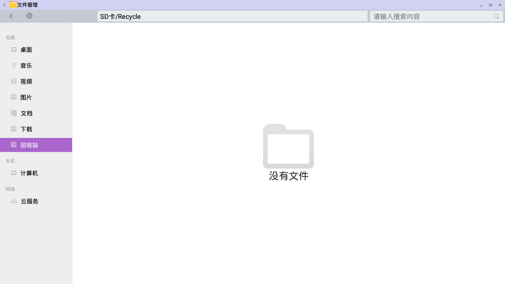
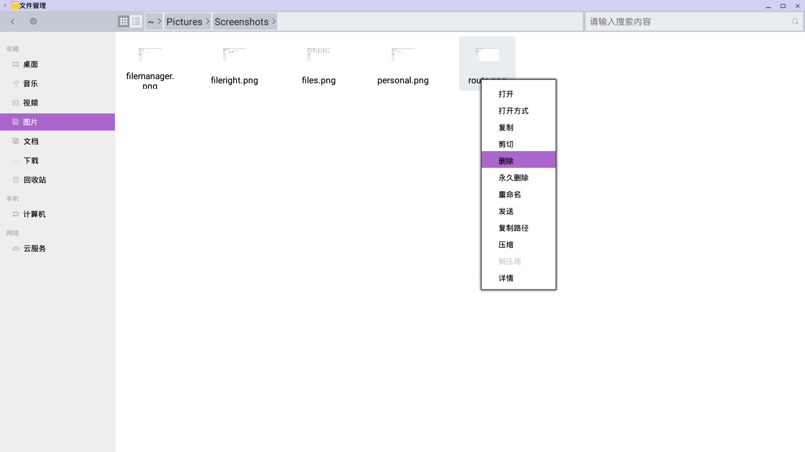
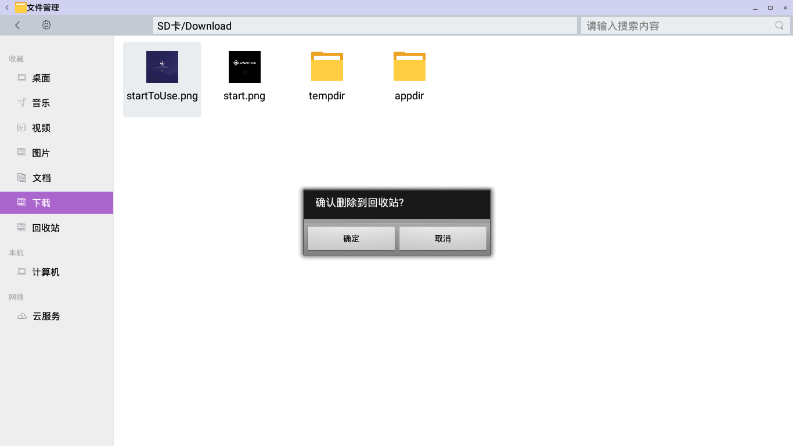
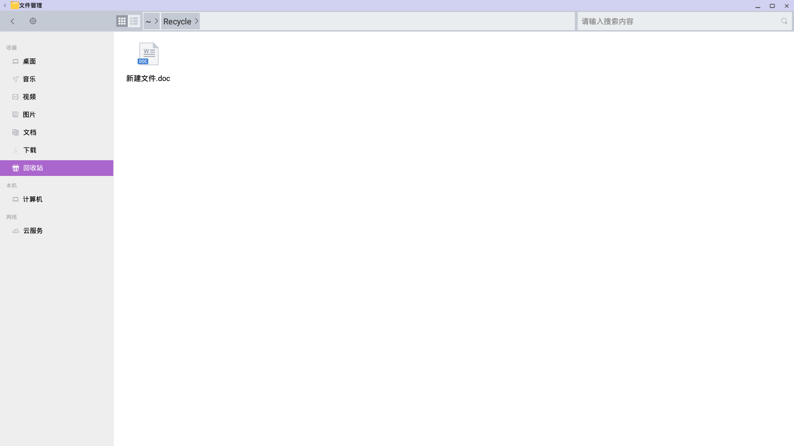
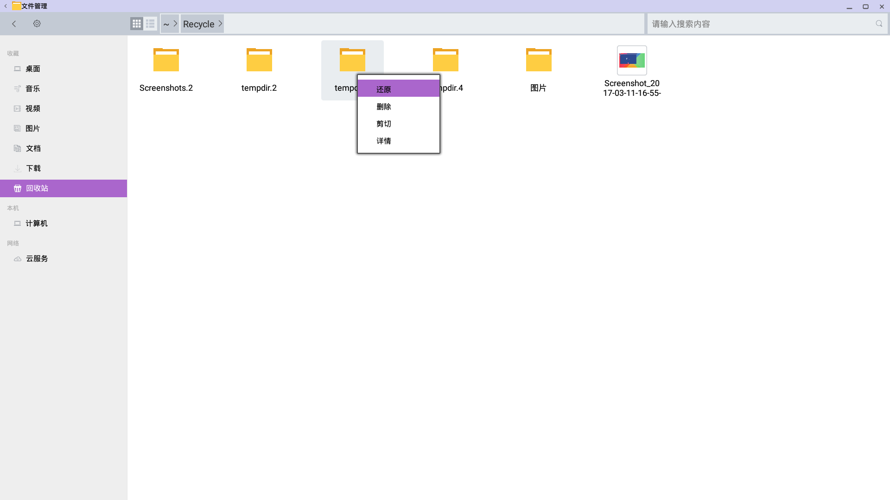
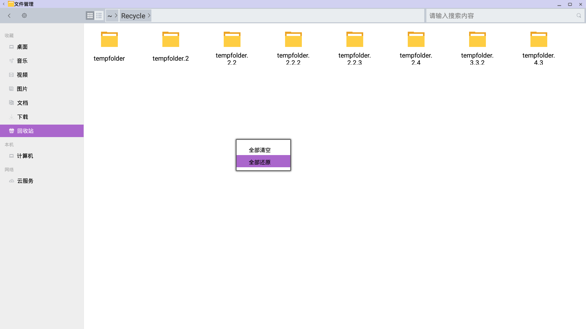
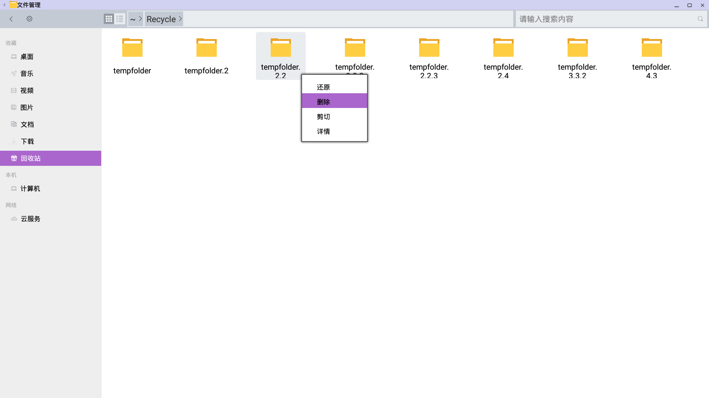
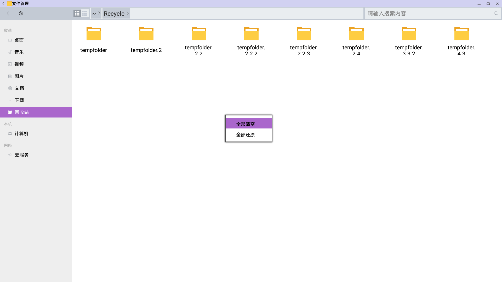
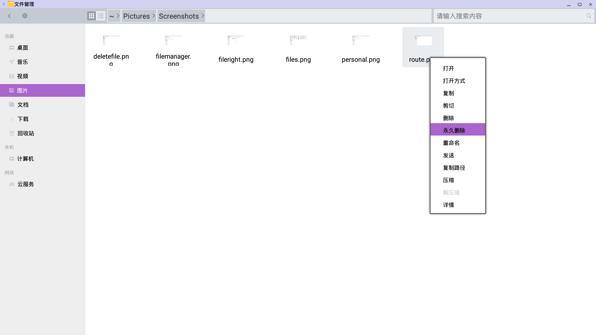
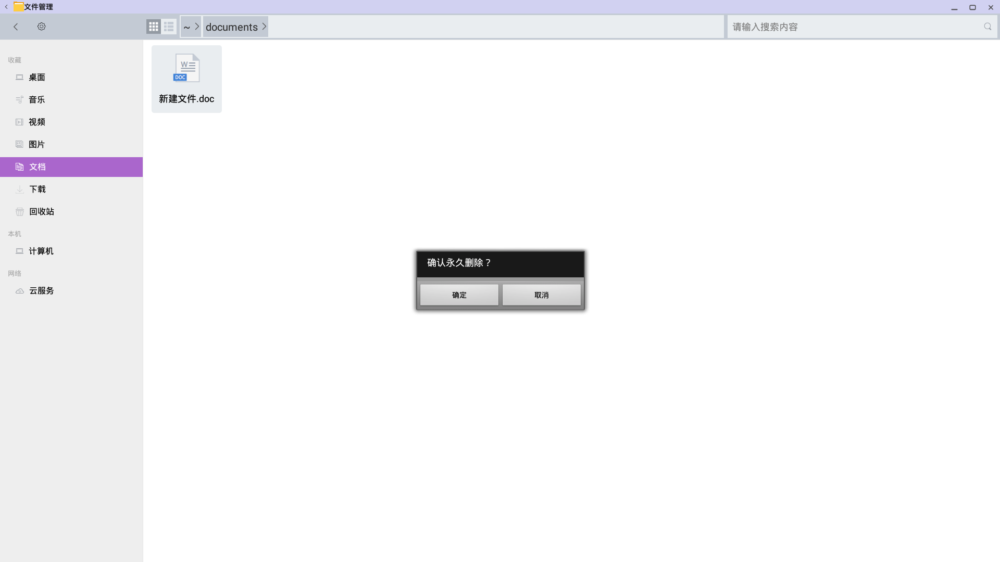

# 删除文件和文件夹

- 回收站文件夹  

  - 当您删除某个项目时，该项目被移到“回收站”文件夹，在您清空回收站之前，它将一直存储在此处。

***
## 要将文件移动到回收站：

- 删除项目

  - 1.单击您想要删除的项目。
  - 2.按键盘上的 Delete 键。或者，在右键菜单中选择删除。

- 确认删除或取消

  - 3.在弹出的对话框中选择确认删除或者取消操作

- 已删除项目

  - 4.在回收站中可以查看到您删除的文件

## 回收站文件还原：
- 您可以将回收站的文件还原至之前的目录

  - 1.单击您想要还原的项目。
  - 2.在右键菜单中选择还原。

- 您也可以将回收站的文件全部还原至之前的目录

  - 1.在空白处弹出右键菜单，选择全部还原
  
***
## 回收站文件清空：
- 您可以将回收站的文件删除（清空）

  - 1.单击您想要删除的项目。
  - 2.在右键菜单中选择删除。
 
- 您也可以将回收站的文件全部删除（清空）

  - 1.在空白处弹出右键菜单，选择全部清空

## 永久删除文件

- 您可以立即永久删除一个文件，而无需将其先放进回收站。

  - 1.选择您想要删除的项目。

  - 2.按住 Shift 键，然后按键盘上的 Delete 键；或者在右键菜单中选择永久删除
 
  - 3.由于您无法取消此操作，因此会要求您确认是否确实要删除文件或文件夹。
