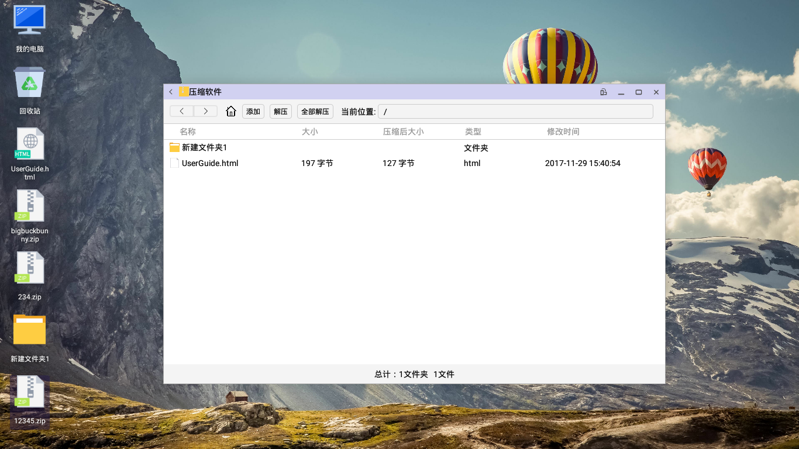
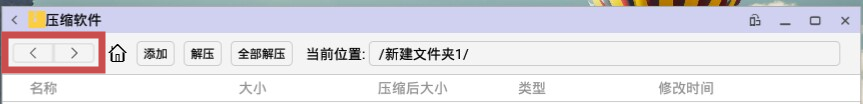

# 压缩软件
在OPENTHOS的桌面或文件管理器中双击压缩包，可以进入压缩软件界面。

## 功能点

### 前进/后退

当打开的压缩包中包含文件夹时，可以通过前进/后退按钮切换到之前的目录

### home
当打开的压缩包中包含文件夹时，可以通过home按钮回到压缩包的根目录

### 添加
可以通过添加按钮向打开的压缩包中添加文件，并生成新的压缩包

### 解压
单独解压选定的文件到指定目录

### 全部解压
解压压缩包中所有文件到指定目录

### 当前位置
显示当前目录相对于压缩包的位置
