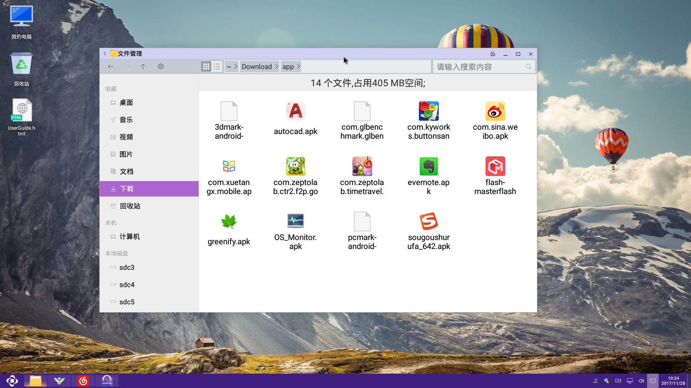
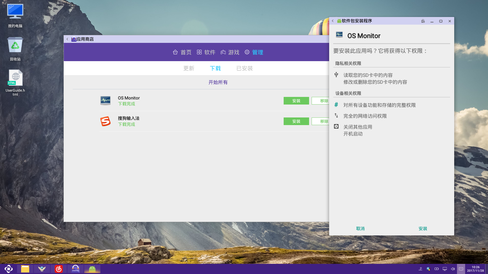

# 安装应用

- 如果这个应用没有下载，需要先进行下载  [下载应用](../soft/下载应用.md)

- 所用通过AppStore下载的应用默认的存储路径是（/storage/emulated/0/Download/app），可以进入这个目录找到你所下载的应用，双击可进行安装

- 也可以选择AppStore的管理页面，在下面的下载中有已下载的应用，点击可弹出一个菜单，点击上面的“安装”选项就可以进行安装

- 在每个下载页面，如果下载完成会有“下载完成”提示，点击可以进行安装

- 每个应用一下载完成就会自动提示安装
