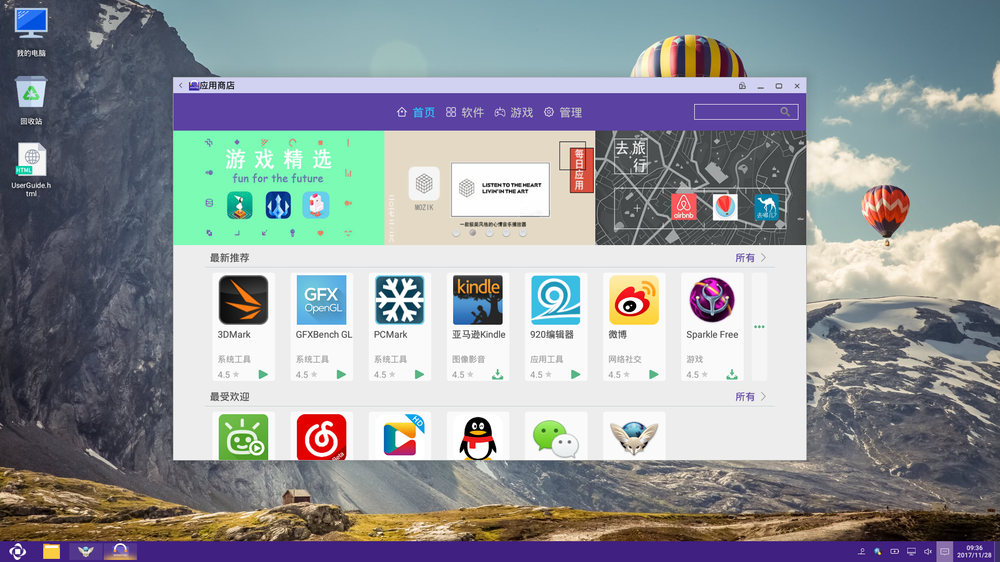
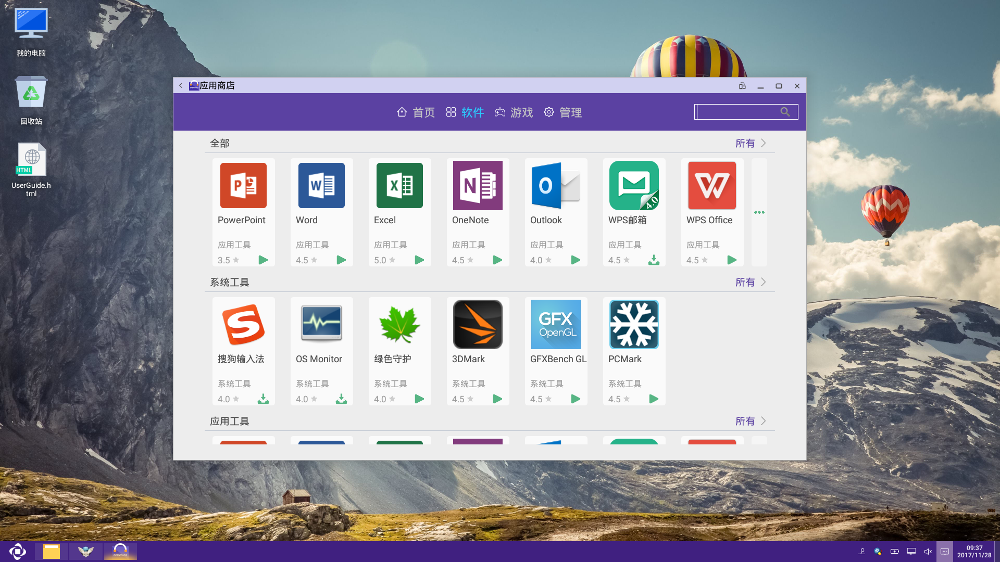
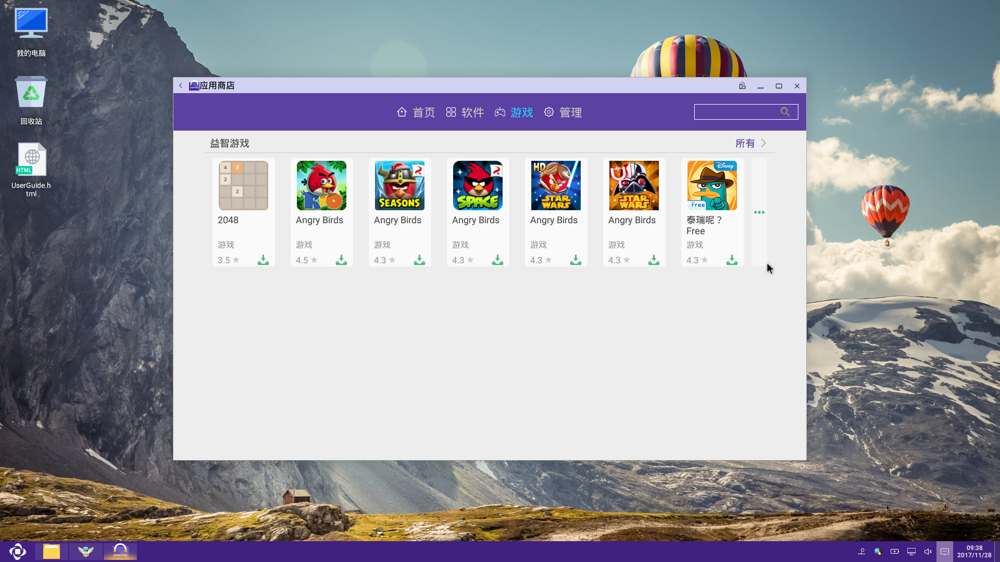
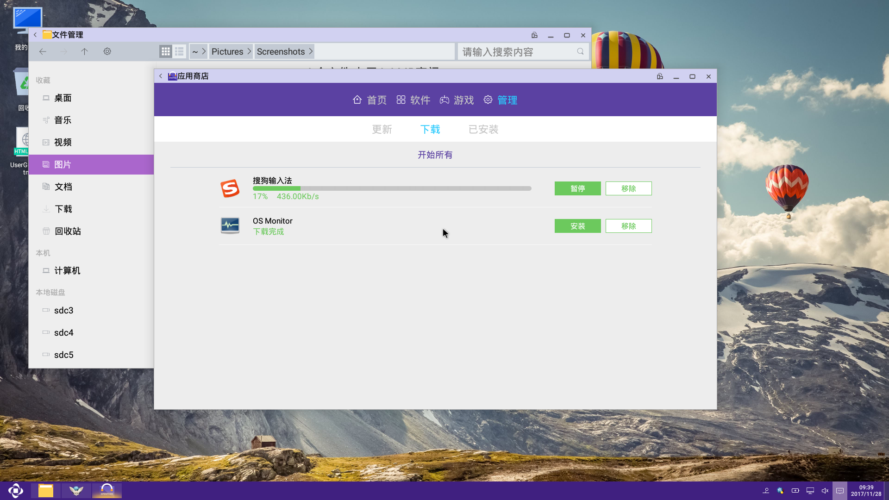
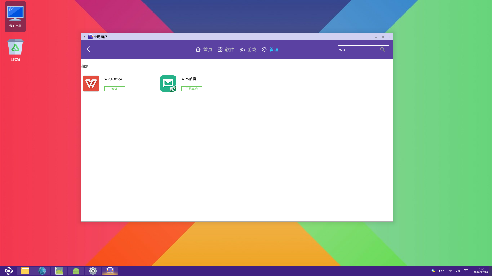

# AppStore使用说明书
## AppStore功能
  
  - 查找App
  
  - 下载App
  
  - 应用管理 

***
## 功能点

- 001 通过关键字查找应用
- 002 可下载qq，微信等常用聊天软件
- 003 可以暂停或继续应用的下载
- 004 按类别查看非游戏类的软件
- 005 按类别查看游戏类的软件
- 006 可安装下载的应用
- 007 可卸载已安装的应用
- 008 快速方便查找应用
- 009 可清除已安装应用的缓存
- 010 显示当前正在下载的应用
- 011 可移除当前应用的下载
- 012 开始下载所有已暂停的任务
- 013 停止所有正在下载的任务
- 014 可查看软件详细信息
- 015 更新已安装的应用

***
## Input
 
 - 通过关键字搜索应用

***
## 操作说明

  - 首页，软件，游戏这三个页面中点击单个软件可进入软件详情，在这里可以查看这些个软件的具体内容，左上部分的应用图标下面有下载按钮，也可以点击这个按钮进行软件的下载等一系列操作。点击单个软件的右半部分的按钮，根据按钮显示的内容可以进行下载，暂停，更新等操作
  
  - 回退    （返回历史加载过的界面）
  
  - 首页    (按指定的条件展示软件。每一个条件下按游戏和软件分别展示)
    - 编辑推荐    (自定义展示)
    - 最受欢迎    (按下载量展示)
    - 最受好评    (按评分展示)
    - 常用软件	
    
      - more      (点击可以查看更多软件内容)
	
 	

  - 软件    (展示属于非游戏类的软件)
    
      - 右侧显示非游戏软件的分类，分别是全部，影音娱乐，实用工具，社交通讯，学习办公和网络生活，点击相应分类可以展示该类别软件。
   
  
  
  - 游戏    (展示属于游戏类的软件)
     
      - 右侧显示游戏类软件分类，分别是全部，休闲益智和经营策略，点击相应分类可查看该类别软件。 
  
  
  - 管理    (无点击事件，查看软件的下载情况)
    
      - 更新    (本机已经安装的软件)  
        - 点击内容项会弹出应用信息框，可进行卸载，清除缓存等操作;
        - 更新所有  {更新所有需要更新的软件};
       
      - 下载    (添加进下载列表的软件)    
        - 点击内容会弹出安装和移除任务选项;
        - 安装       (进入安装页面，安装app);
        - 移除任务    (移除当前下载项);
        - 开始所有  {开始或暂停所有软件）;
        - 下载中显示下载的基本信息，右侧的按钮可以控制暂停和继续;
       
 
 
  - 搜索  
  
  
  按关键字搜索所需应用

