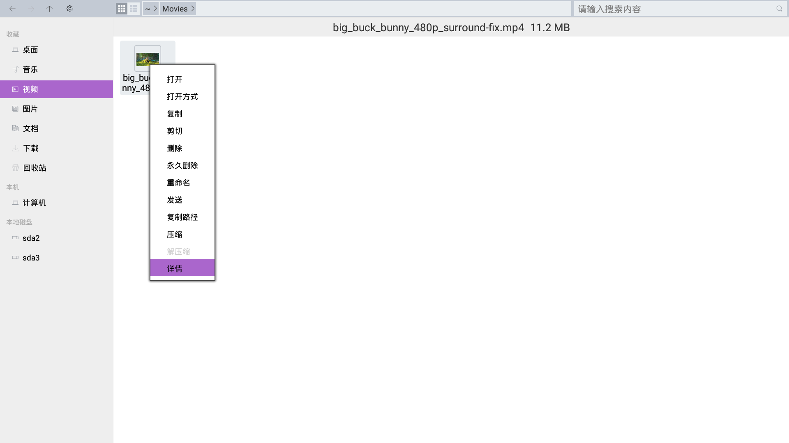

### 文件属性
   - 要查看有关文件或文件夹的信息，请右键单击文件或文件夹，然后选择详情。  

   
   - 文件属性窗口用于显示文件类型、文件大小，文件权限和上次文件修改时间之类的信息。  

#### 基本属性
   - 名称
     - 可以关闭属性窗口重命名文件。
   - 位置
      - 查看文件存放的位置信息。
      - 每个文件在计算机中的位置均由其绝对路径显示。这是文件在计算机中的唯一 "地址"，由列出的文件夹构成，必须转到这些文件夹中才能找到相应文件。例如，如果 Jim 的主文件夹中有个文件名为 Resume.pdf，则其位置会是 /home/Jim/Resume.pdf。
   - 大小
      - 查看文件占有多少磁盘空间。
      - 可能会以字节、KB、MB 或 GB 为单位显示大小；如果用后三种方式显示大小，也会在括号中以字节为单位显示大小。从技术角度来说，1 KB 是 1024 字节，1 MB 是 1024 KB，以此类推。
   - 创建时间
      - 文件创建的日期和时间。
   - 修改时间
      - 上次修改文件的日期和时间。
   - 访问时间
      - 上次打开文件的日期和时间。
   - 权限
      - 查看各用户的读、写和执行权限。
