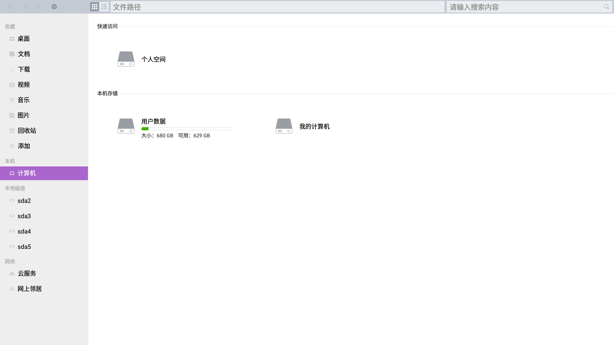
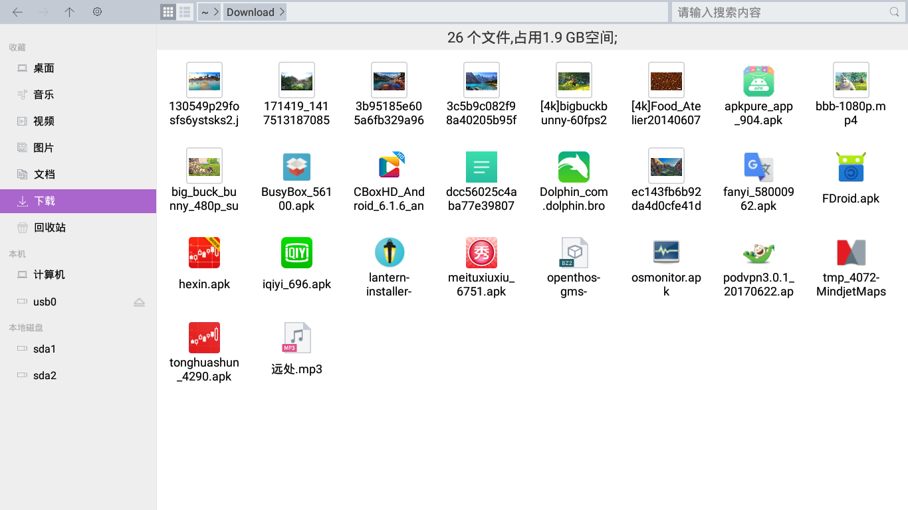
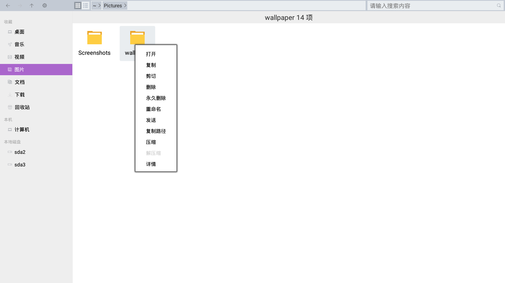
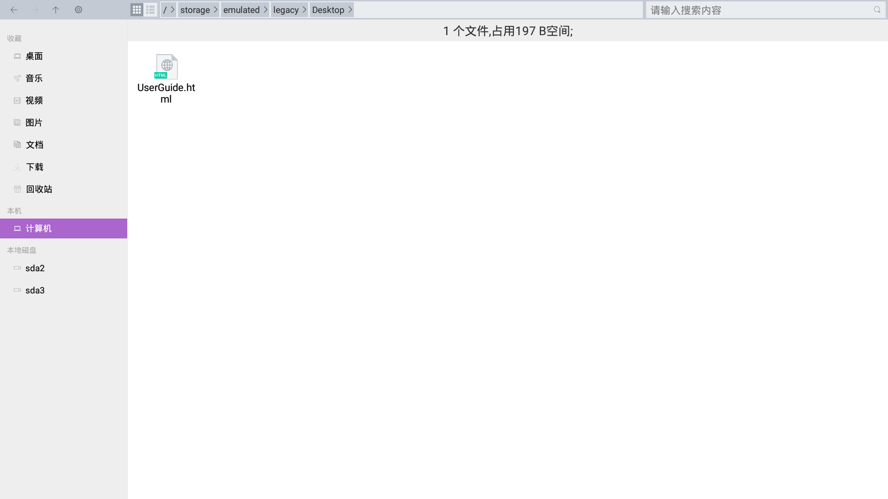
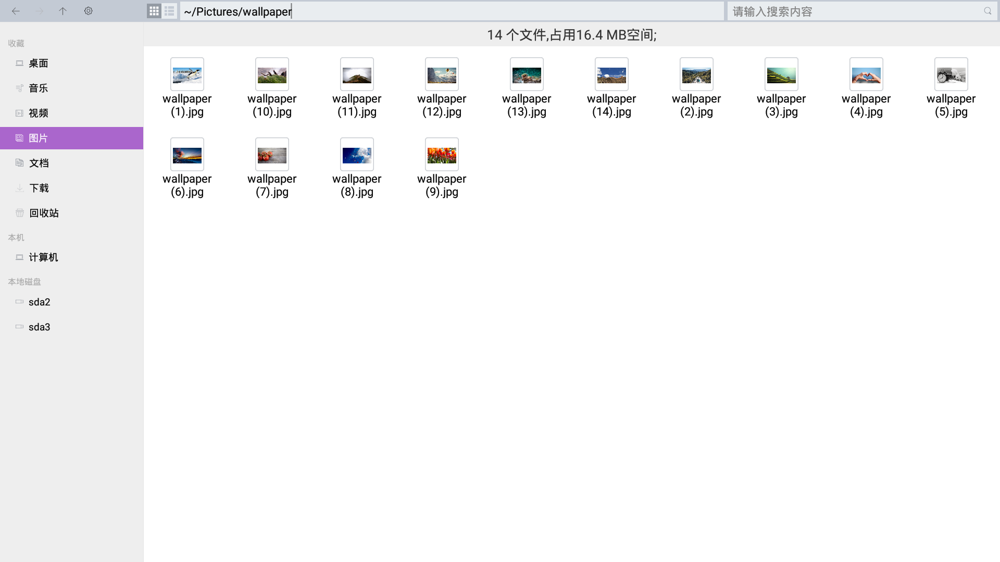
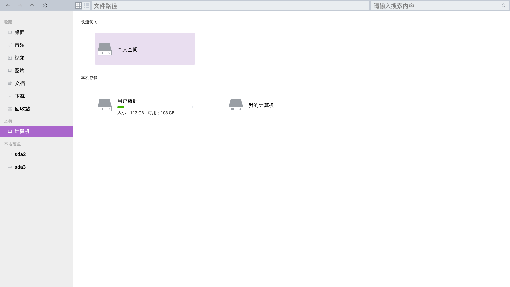

## OPENTHOS 文件管理器

### 目录
   - [浏览](../soft/浏览文件或文件夹.md)
   - [删除](../soft/删除文件或文件夹.md)
   - [复制或移动](../soft/复制和移动文件或文件夹.md)
   - [对文件和文件夹排序](../soft/对文件和文件夹进行排序.md)
   - [搜索文件](../soft/搜索文件.md)
   - [重命名](../soft/重命名文件或文件夹.md)
   - [框选文件](../soft/框选文件.md)
   - [压缩软件](../soft/压缩软件.md)
   - [云服务](../soft/云服务.md)
   - [网上邻居](../soft/网上邻居.md)
   - [使用其他应用程序打开文件](../soft/使用其他应用程序打开文件.md)
   - [寻找丢失的文件](../soft/寻找丢失的文件.md)
   - [文件属性](../soft/文件属性.md)  
   - [安全删除外部设备](../soft/安全删除外部设备.md)  
   - [文件管理器功能点](../soft/点此查看功能点.md)

### 浏览文件和文件夹
   - 您可以用文件管理器浏览和组织您电脑上的文件或管理本地存储设备（如外置硬盘）、云服务和网络共享上的文件
   - 要启动文件管理器，您可以在桌面打开我的电脑。您也可以点击任务栏或开始菜单中的文件管理器快捷图标
   - 双击查看文件夹  
   在文件管理器中，双击任何文件夹查看其内容。双击文件，使用文件的默认应用程序打开它。  
      
   - 右键查看文件夹  
   您也可以右键点击一个文件或文件夹打开它。  
   
   - 点击地址栏按钮查看上级目录  
   您也可以点击地址栏上的路径按钮来跳转到相应的上级目录。  
   
   - 文件夹显示路径  
   文件和文件夹列表上方的路径栏显示您正在查看的文件夹，其中包括最高可至主目录、可移动设备根目录或文件系统根目录的父文件夹。  
   
   - 快速查看常用位置／个人空间  
   您可以快速地从侧边栏访问常用的位置。也可以进入个人空间访问常用的位置。  
   <br\>
   
