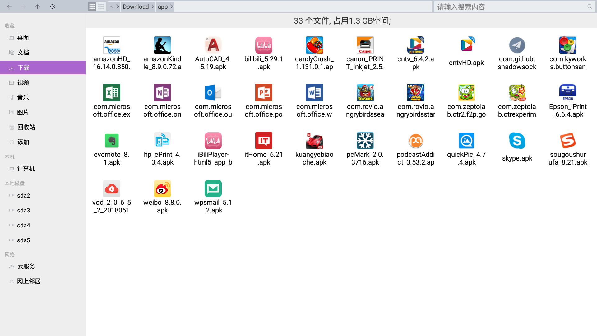
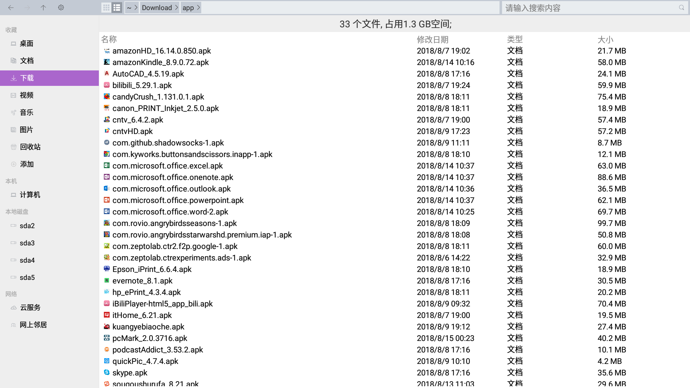
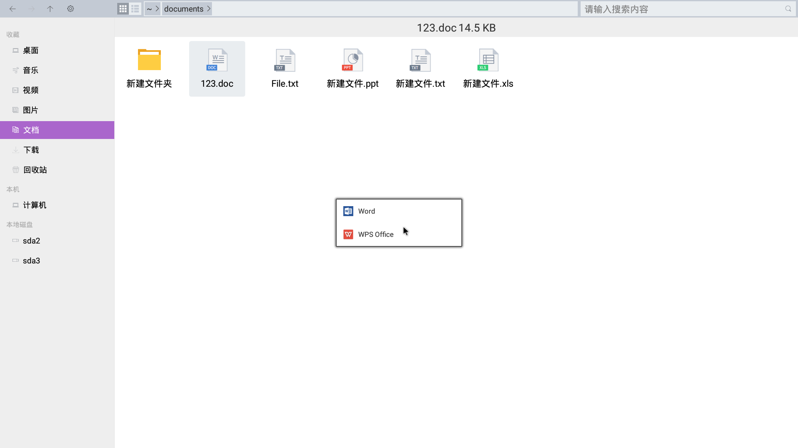
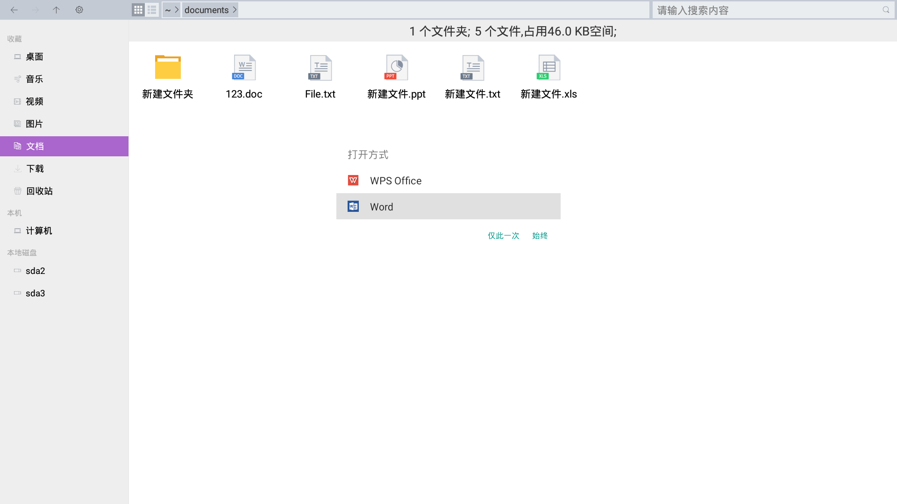
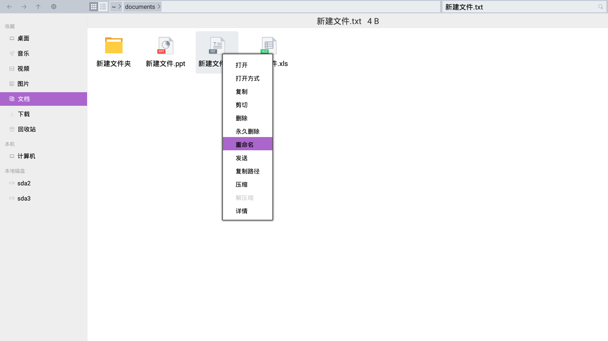
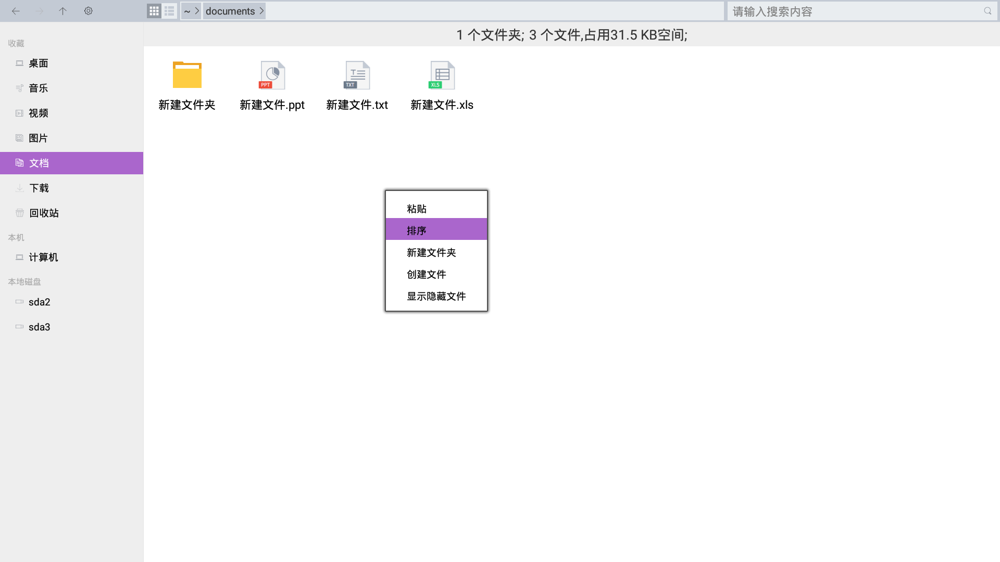
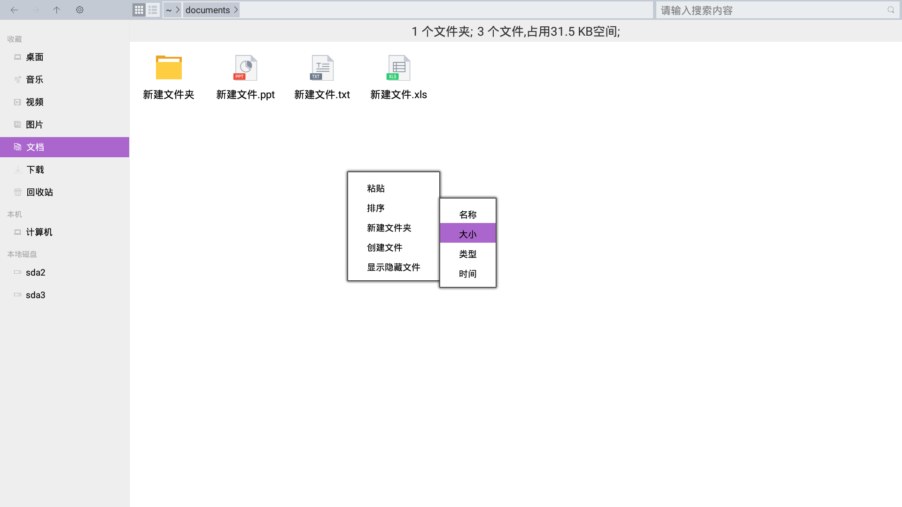
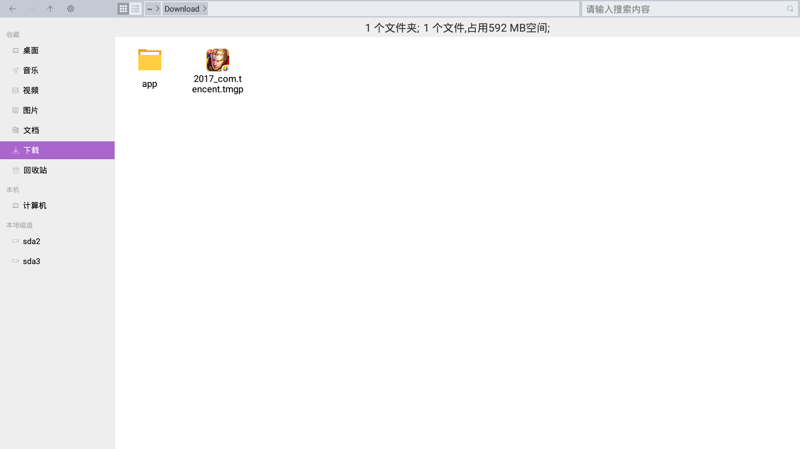

## OPENTHOS 文件管理器

### 目录
   - [浏览](#浏览)
   - [使用其他应用程序打开文件](#使用其他应用程序打开文件)
   - [复制或移动](#复制或移动文件和文件夹)
   - [重命名](#重命名文件或文件夹)
   - [删除](#删除文件和文件夹)
   - [文件属性](#文件属性)  
   - [框选文件](#框选文件)
   - [对文件和文件夹排序](#对文件和文件夹进行排序)
   - [搜索文件](#搜索文件)
   - [寻找丢失的文件](#寻找丢失的文件)
   - [安全删除外部设备](#安全删除外部设备) 
   - [压缩软件](../soft/压缩软件.md)
   - [云服务](../soft/云服务.md)
   - [网上邻居](../soft/网上邻居.md)
   - [文件管理器功能点](../soft/点此查看功能点.md)

### 浏览
   - 您可以用文件管理器浏览和组织您电脑上的文件或管理本地存储设备（如外置硬盘）、云服务和网络共享上的文件
   - 要启动文件管理器，您可以在桌面打开我的电脑。您也可以点击任务栏或开始菜单中的文件管理器快捷图标
   - 双击查看文件夹  
   在文件管理器中，双击任何文件夹查看其内容。双击文件，使用文件的默认应用程序打开它。
   - 右键查看文件夹  
   您也可以右键点击一个文件或文件夹打开它。  
   
   - 文件夹显示路径  
   文件和文件夹列表上方的路径栏显示您正在查看的文件夹，其中包括最高可至主目录、可移动设备根目录或文件系统根目录的父文件夹。  
   
   - 点击地址栏按钮查看上级目录  
   您也可以点击地址栏上的路径按钮来跳转到相应的上级目录。
   - 切换图标/列表模式  
   您可以通过上方地址栏左侧的两个按钮切换图标视图或列表视图。
    
   
   - 快速查看常用位置／个人空间  
   您可以快速地从侧边栏访问常用的位置。也可以进入个人空间访问常用的位置。
    
   

### 使用其他应用程序打开文件
   - 要使用默认应用程序以外的应用程序打开某个文件，右击该文件，选择打开方式。如果没有看到您想要的应用程序，单击使用其他应用程序打开。默认情况下，文件管理器仅显示它认为可以处理该文件的应用程序。  
    
   
   - 在文件管理器中双击某个文件时，会使用该文件类型的默认应用程序打开。如果您需要变动，请参考[更改默认应用程序](#更改默认应用程序)。
   - 如需将所有应用的打开方式恢复到出厂状态，请参考[重置应用偏好设置](#重置应用偏好设置)。
#### 更改默认应用程序
   - 在文件管理器中双击某个文件时，选择打开方式后，选择始终，此后该类型文件会默认使用此方式打开。  

#### 重置应用偏好设置
   - 进入设置，点击 应用 ->右上角更多按钮(位于放大镜右侧)。  

   - 选择重置应用偏好设置，确认重置应用，即可重新设置默认应用程序。  

### 复制或移动文件和文件夹
   - 文件或文件夹可以通过使用复制、剪切和粘贴命令，或者使用快捷键进行操作。  
例如，您可能需要把演示文稿复制一份放进 U 盘以便随身携带和修改。您也可能需要在修改文档之前先复制一份。
   - 这些做法对文件和文件夹都有效，您可以用同样的方式移动和复制文件和文件夹。
#### 复制和粘贴文件
   - 复制文件  
   单击以选择您想要复制的项目，点击右键，选择 复制，或者按 Ctrl + C 键。  
   
   - 粘贴文件  
   前往您想要存放复制后文件的目录，点击右键，选择 粘贴，或者按 Ctrl + V 键。这将在源文件夹和其他文件夹上生成这个文件的一个拷贝。  
   
#### 通过剪切和粘贴操作来移动文件
   - 剪切文件  
   单击选择您想要移动的项目，点击右键，选择剪切，或者按 Ctrl + X 键。  
   
   - 粘贴文件  
   前往您想要存放移动后项目的文件夹，点击右键，选择 粘贴，或者按 Ctrl + V 键。该文件将从原始文件夹移动到其他文件夹。
      - **您不能将文件复制或移动到只读文件夹。有些文件是只读的以防止您更改其内容。您可以通过更改文件权限来更改文件的只读状态。**
      - **您也不能剪切U盘中的文件到其它文件夹，请选择复制粘贴的方式。**  
   

### 重命名文件或文件夹
   您可以使用文件管理器来为文件和文件夹进行重命名。
   1. 右击文件或文件夹，然后选择重命名；或选择文件或文件夹，然后按 F2 键。  
   
   2. 在弹出的对话框中输入新名称，然后按回车键。或者点击确定按钮。  
   
#### 常见问题
   - 提示：重命名失败，可能使用该名称的文件或文件夹已存在。
      - 在同一文件夹中不能有两个文件或文件夹使用同一名称。如果您尝试将文件重命名为您所在文件夹中已存在的名称，文件管理器将不允许该操作。
      - 文件和文件夹名称目前不能区分大小写。例如，File.txt 和 file.txt 会被识别为同一个文件。所以同样会提示重命名失败
   - 文件名称过长
      - 在一些文件系统中，文件名不能超过255个字符，这255个字符数限制同时存在于文件名和文件路径中，因此您应该尽可能避免过长的文件和文件夹名。
         - 目前存在问题：文件名过长会有提示，但是提示不正确。目前使用重命名失败的提示信息

### 删除文件和文件夹
#### 要将文件移动到回收站
   - 删除项目  
   单击您想要删除的项目，按键盘上的 Delete 键。或者，在右键菜单中选择删除  
     
   在弹出的对话框中选择确认删除或者取消操作
   
   - 已删除项目  
   在回收站中可以查看到您删除的文件  
   
#### 回收站文件还原
   - 您可以将回收站的文件还原至之前的目录  
   单击您想要还原的项目，在右键菜单中选择还原

   - 您也可以将回收站的文件全部还原至之前的目录  
   在空白处弹出右键菜单，选择全部还原

#### 回收站文件清空
   - 您可以将回收站的文件删除  
   单击您想要删除的项目，在右键菜单中选择删除  
   
   - 您也可以将回收站的文件全部删除  
   在空白处弹出右键菜单，选择全部清空
   
#### 永久删除文件
   - 您可以立即永久删除一个文件，而无需将其先放进回收站
   选择您想要删除的项目，按住 Shift 键，然后按键盘上的 Delete 键；或者在右键菜单中选择永久删除  
     
   由于您无法取消此操作，因此会要求您确认是否确实要删除文件或文件夹
   

### 框选文件
   您可以在图标视图或列表视图的空白处，按住鼠标左键，然后拖动鼠标，即可选中区域内的文件  
   
   
### 对文件和文件夹进行排序
   - 您可以使用不同的方式(名称、大小、时间、类型)对文件夹中的文件进行排序，例如按照类型或文件大小排序。
   - 对文件进行排序，请点击鼠标右键，然后选择排序。  

   - 在弹出的对话框中选择，按名称、按大小 、按类型 或者按时间进行排序 。  
      - 例如，如果您选择按名称排序，文件将会按照名称的字母顺序来排列，参阅[文件排序方式](#文件排序方式)了解其他选项。
      - 您可以通过再次选择按名称排序，让文件按相反顺序排列。

#### 文件排序方式
   - 按名称排序
      - 按文件名以字母顺序排列。
   - 按大小排序 --（暂不可用）
      - 按文件大小(文件占用的磁盘空间)排序。默认情况下会从最小到最大排列。
   - 按类型排序 --（暂不可用）
      - 按文件类型以字母顺序排列。会将同类文件归并到一起，然后按名称排序。
   - 按时间排序 --（暂不可用）
      - 按上次更改文件的日期和时间排序。默认情况下会从最新到最旧排列。
   
### 搜索文件
   您可以根据文件的名称或类型直接在文件管理器中搜索文件。
   1. 打开文件管理器。
   2. 如果您知道您想要的文件位于哪个文件夹中，则转到该文件夹，或者在计算机页面选择进入安卓系统目录下进行搜索。
   3. 在搜索栏上输入您知道的出现在文件名中的字词。  
   
   4. 输入完成后按回车键，或者点击输入框右侧的放大镜图标，文件管理器会显示搜索结果。  
   
   5. 与在文件管理器中的任何文件夹中一样，您可以在搜索结果中打开、复制、删除或以其它方式处理您的文件。
   6. 点击左上角的回退按钮或者直接敲击回退键退出搜索并返回文件夹。

### 寻找丢失的文件
如果您创建或下载了一个文件，但现在却找不到它，请按照以下方式进行操作。
   - 如果您忘记文件保存的位置，但您还记得其名称，您可以按名称搜索该文件。请参阅[搜索文件](#搜索文件)了解如何搜索。  
   - 如果您刚刚下载了该文件，您的浏览器可能已自动将其保存在某个文件夹中。检查您的主文件夹中的桌面和下载文件夹。  
   
   - 您可能意外删除了文件。您删除文件时，文件将被移入回收站，在您手动清空回收站之前，它将一直保存在此处。  
   
