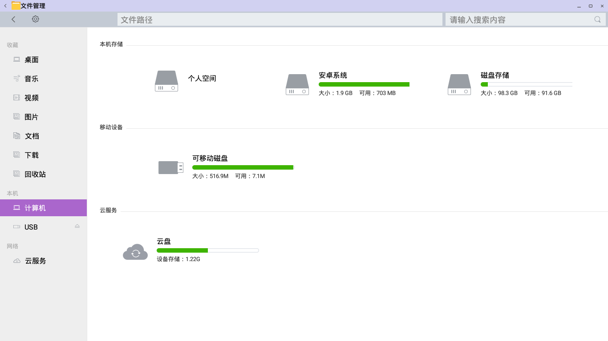

# OpenThos 文件管理器

## 常见任务

- [浏览文件和文件夹](../soft/浏览文件或文件夹.md)

- [删除文件和文件夹](../soft/删除文件或文件夹.md)

- [复制或移动文件和文件夹](../soft/复制和移动文件或文件夹.md)
     
- [对文件和文件夹进行排序](../soft/对文件夹或文件进行排序.md)

- [搜索文件](../soft/搜索文件.md)
  
- [重命名文件或文件夹](../soft/%E9%87%8D%E5%91%BD%E5%90%8D%E6%96%87%E4%BB%B6%E6%88%96%E6%96%87%E4%BB%B6%E5%A4%B9.md)

- [框选文件](../soft/%E6%A1%86%E9%80%89%E6%96%87%E4%BB%B6.md)

## 更多主题

- [使用其他应用程序打开文件](../soft/%E4%BD%BF%E7%94%A8%E5%85%B6%E4%BB%96%E5%BA%94%E7%94%A8%E7%A8%8B%E5%BA%8F%E6%89%93%E5%BC%80%E6%96%87%E4%BB%B6.md)

- [寻找丢失的文件](../soft/%E5%AF%BB%E6%89%BE%E4%B8%A2%E5%A4%B1%E7%9A%84%E6%96%87%E4%BB%B6.md)

- [文件属性](../soft/%E6%96%87%E4%BB%B6%E5%B1%9E%E6%80%A7.md)

## 可移动驱动器和外部磁盘

- [安全删除外部设备](../soft/%E5%AE%89%E5%85%A8%E5%88%A0%E9%99%A4%E5%A4%96%E9%83%A8%E8%AE%BE%E5%A4%87.md)

## 云服务

- [点此查看云服务](../soft/%E7%82%B9%E6%AD%A4%E6%9F%A5%E7%9C%8B%E4%BA%91%E6%9C%8D%E5%8A%A1.md)

## FileManager 功能点

- [点此查看功能点](../soft/%E7%82%B9%E6%AD%A4%E6%9F%A5%E7%9C%8B%E5%8A%9F%E8%83%BD%E7%82%B9.md)

## FileManager input

- [点此查看Input](../soft/%E7%82%B9%E6%AD%A4%E6%9F%A5%E7%9C%8BInput.md)
