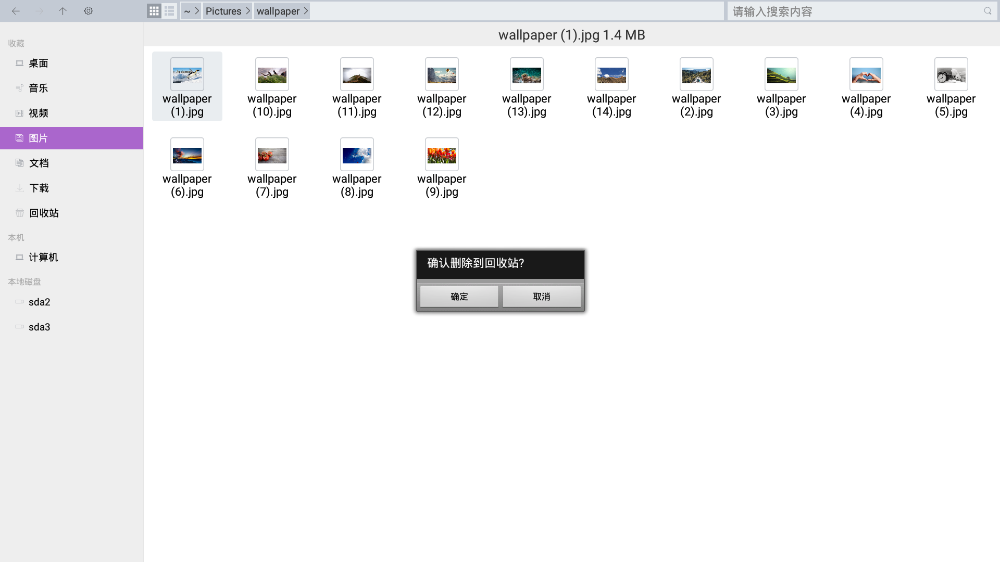
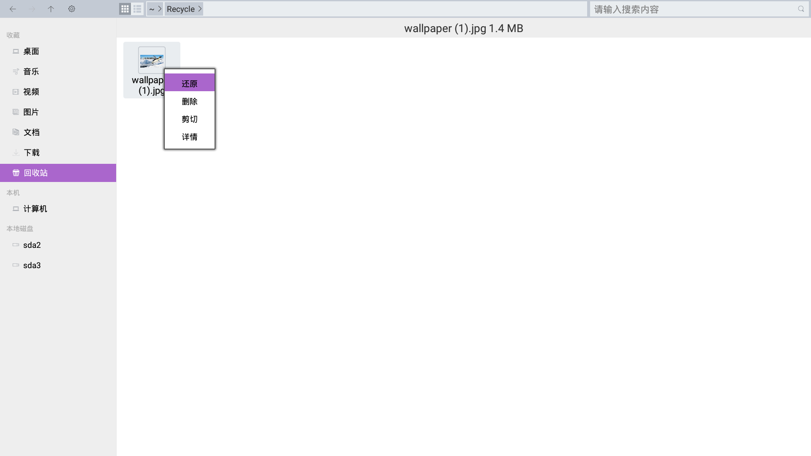
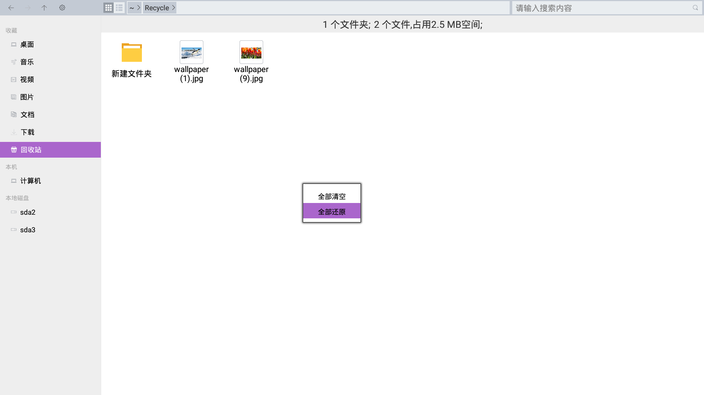
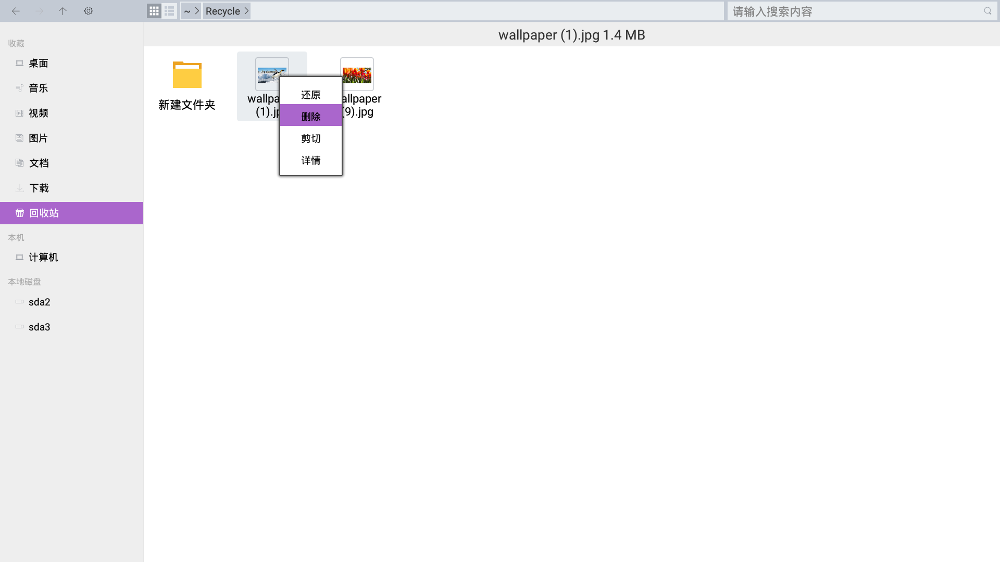
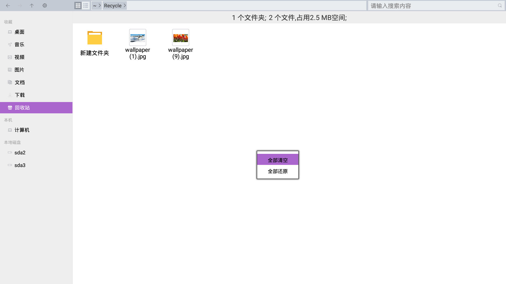
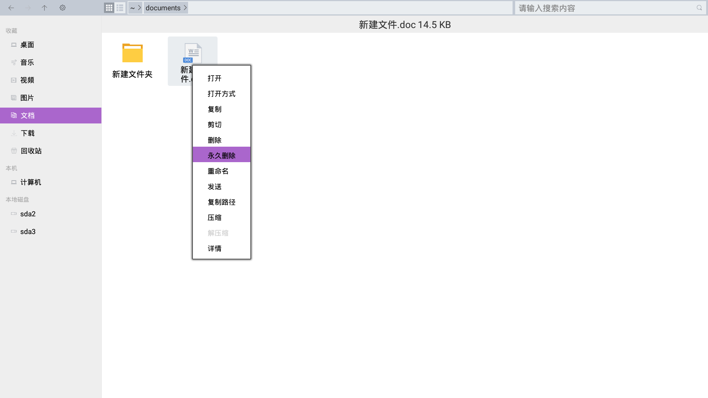
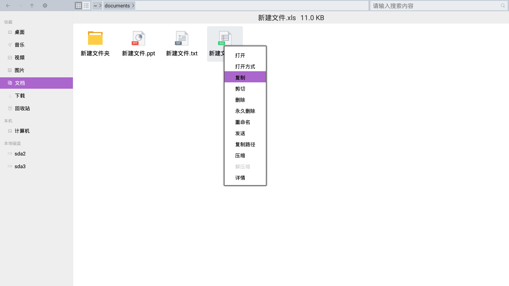
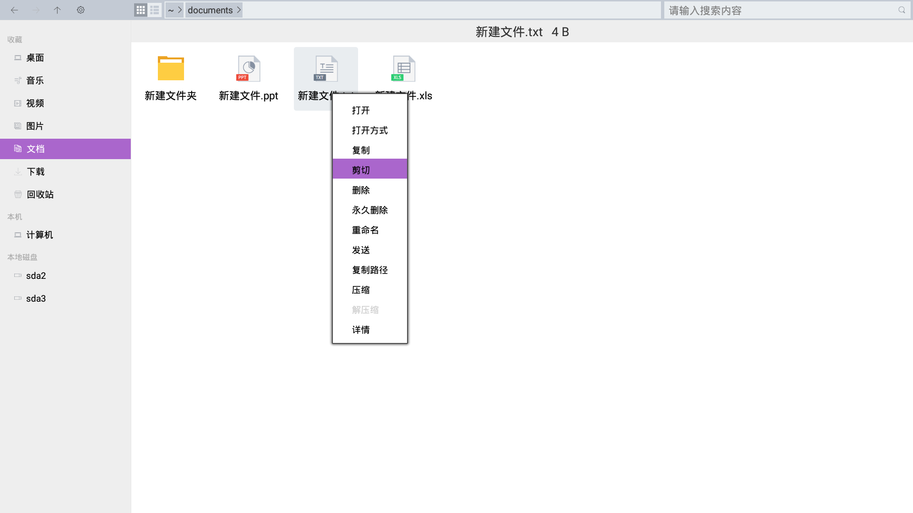

## OPENTHOS 文件管理器

### 目录
   - [浏览](../soft/浏览文件或文件夹.md)
   - [删除](../soft/删除文件或文件夹.md)
   - [复制或移动](../soft/复制和移动文件或文件夹.md)
   - [对文件和文件夹排序](../soft/对文件和文件夹进行排序.md)
   - [搜索文件](../soft/搜索文件.md)
   - [重命名](../soft/重命名文件或文件夹.md)
   - [框选文件](../soft/框选文件.md)
   - [压缩软件](../soft/压缩软件.md)
   - [云服务](../soft/云服务.md)
   - [网上邻居](../soft/网上邻居.md)
   - [使用其他应用程序打开文件](../soft/使用其他应用程序打开文件.md)
   - [寻找丢失的文件](../soft/寻找丢失的文件.md)
   - [文件属性](../soft/文件属性.md)  
   - [安全删除外部设备](../soft/安全删除外部设备.md)  
   - [文件管理器功能点](../soft/点此查看功能点.md)

### 浏览文件和文件夹
   - 您可以用文件管理器浏览和组织您电脑上的文件或管理本地存储设备（如外置硬盘）、云服务和网络共享上的文件
   - 要启动文件管理器，您可以在桌面打开我的电脑。您也可以点击任务栏或开始菜单中的文件管理器快捷图标
   - 双击查看文件夹  
   在文件管理器中，双击任何文件夹查看其内容。双击文件，使用文件的默认应用程序打开它。
   - 右键查看文件夹  
   您也可以右键点击一个文件或文件夹打开它。  
   
   - 文件夹显示路径  
   文件和文件夹列表上方的路径栏显示您正在查看的文件夹，其中包括最高可至主目录、可移动设备根目录或文件系统根目录的父文件夹。  
   
   - 点击地址栏按钮查看上级目录  
   您也可以点击地址栏上的路径按钮来跳转到相应的上级目录。  
   - 快速查看常用位置／个人空间  
   您可以快速地从侧边栏访问常用的位置。也可以进入个人空间访问常用的位置。
    
   

### 删除文件和文件夹
#### 要将文件移动到回收站
   - 删除项目  
   单击您想要删除的项目，按键盘上的 Delete 键。或者，在右键菜单中选择删除  
     
   在弹出的对话框中选择确认删除或者取消操作
   
   - 已删除项目  
   在回收站中可以查看到您删除的文件  
   
#### 回收站文件还原
   - 您可以将回收站的文件还原至之前的目录  
   单击您想要还原的项目，在右键菜单中选择还原

   - 您也可以将回收站的文件全部还原至之前的目录  
   在空白处弹出右键菜单，选择全部还原

#### 回收站文件清空
   - 您可以将回收站的文件删除  
   单击您想要删除的项目，在右键菜单中选择删除  
   
   - 您也可以将回收站的文件全部删除  
   在空白处弹出右键菜单，选择全部清空
   
#### 永久删除文件
   - 您可以立即永久删除一个文件，而无需将其先放进回收站
   选择您想要删除的项目，按住 Shift 键，然后按键盘上的 Delete 键；或者在右键菜单中选择永久删除  
     
   由于您无法取消此操作，因此会要求您确认是否确实要删除文件或文件夹
   

### 复制或移动文件和文件夹
   - 文件或文件夹可以通过使用复制、剪切和粘贴命令，或者使用快捷键进行操作。  
例如，您可能需要把演示文稿复制一份放进 U 盘以便随身携带和修改。您也可能需要在修改文档之前先复制一份。
   - 这些做法对文件和文件夹都有效，您可以用同样的方式移动和复制文件和文件夹。
#### 复制和粘贴文件
   - 复制文件  
   
   
      - 单击以选择您想要复制的项目。
      - 点击右键，选择 复制，或者按 Ctrl + C 键。
   - 粘贴文件  
   
   
      - 前往您想要存放复制后文件的目录。
      - 点击右键，选择 粘贴，或者按 Ctrl + V 键。这将在源文件夹和其他文件夹上生成这个文件的一个拷贝。
#### 通过剪切和粘贴操作来移动文件
   - 剪切文件  
   单击选择您想要移动的项目，点击右键，选择剪切，或者按 Ctrl + X 键。  
   
   - 粘贴文件  
   前往您想要存放移动后项目的文件夹，点击右键，选择 粘贴，或者按 Ctrl + V 键。该文件将从原始文件夹移动到其他文件夹。
      - **您不能将文件复制或移动到只读文件夹。有些文件是只读的以防止您更改其内容。您可以通过更改文件权限来更改文件的只读状态。**
      - **您也不能剪切U盘中的文件到其它文件夹，请选择复制粘贴的方式。**  
   
