# Internet浏览器说明书

## Internet浏览器效果图
   

***
## Internet浏览器 功能点
  - 001 支持 触摸板放大缩小功能;
  - 002 支持 打开网页记忆保存功能;
  - 003 支持 常用邮箱登录功能 (网易，QQ，新浪，阿里);
  - 004 支持 页面内容片选功能;
    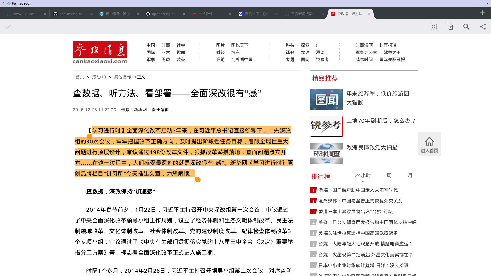
  - 005 支持 快捷键'ctrl' + "a"  选择全部内容功能;
  - 006 支持 快捷键"ctrl" + "c"  复制功能;
  - 007 支持 快捷键"ctrl" + "v"  粘贴功能;
  - 008 支持 快捷键"ctrl" + "x"  剪切功能;
  - 009 支持 快捷键"alt" + "F4"  删除当前页面功能;
  - 010 支持 百度搜索功能;
  - 011 支持 手机版视频播放功能（网页播放不支持，可点击设置页面“request,desktop“按钮，切换手机版播放视频）;
    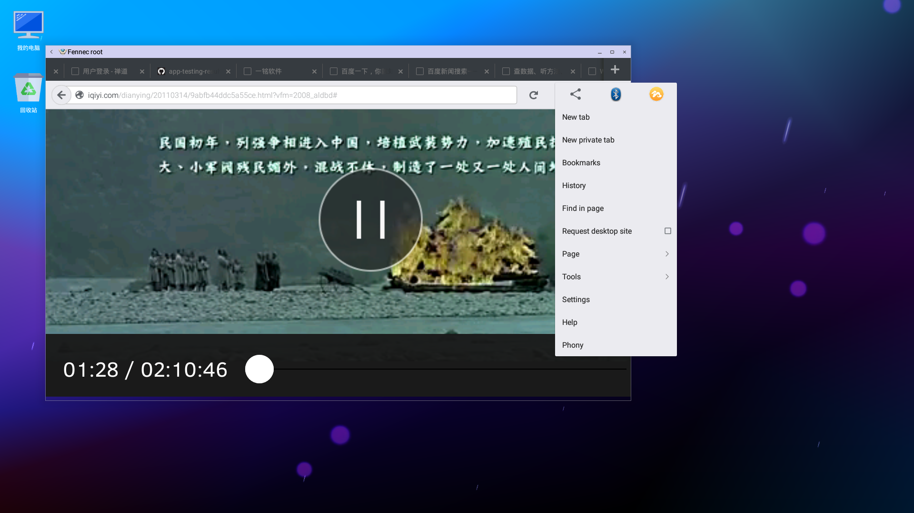
  - 012 支持 双击页面顶部缩小功能;
    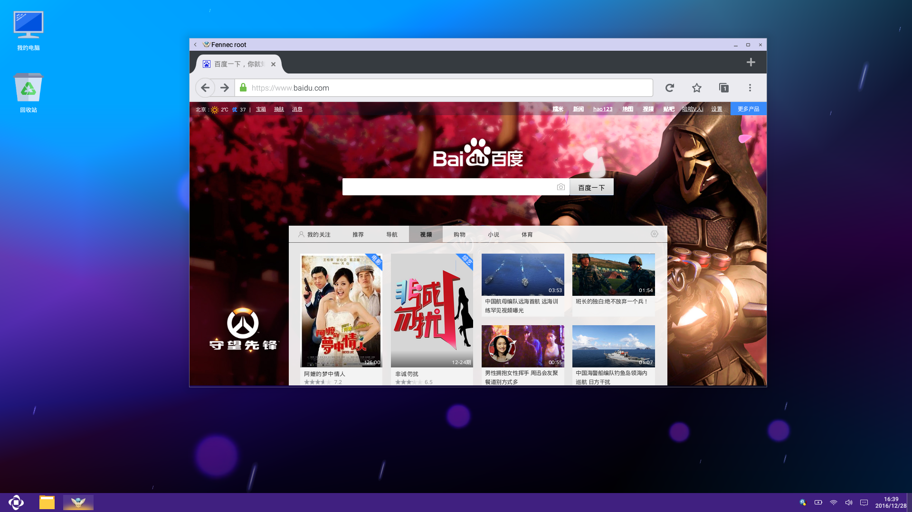
  - 013 支持 双击页面顶部放大页面功能 (放大存在问题，解决方案为：点击页面右上角“X“关闭浏览器，重新打开可解决);
    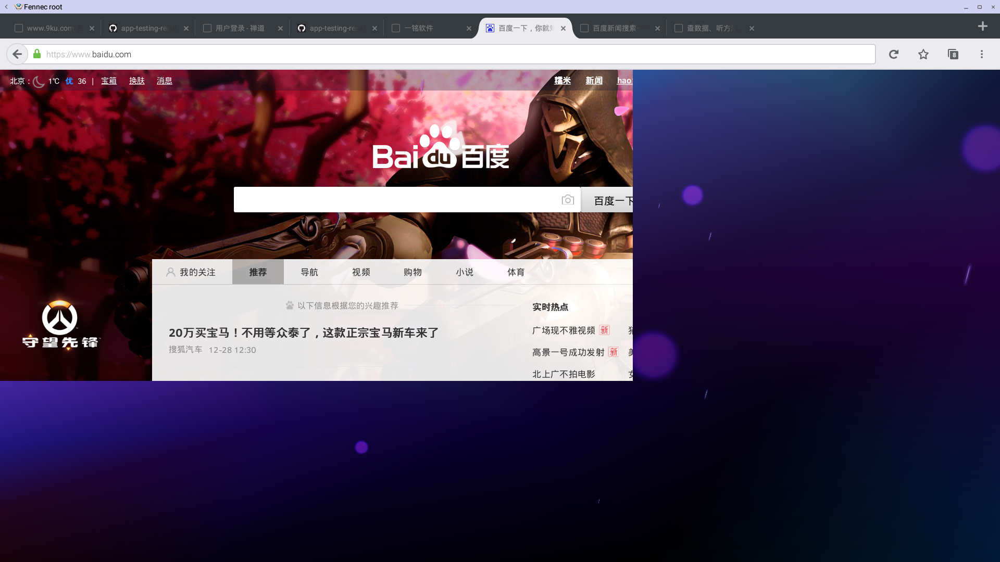
  - 014 支持 网页版百度云盘存取数据功能;
  - 015 支持 手机版音乐播放功能（网页版暂不支持）;
    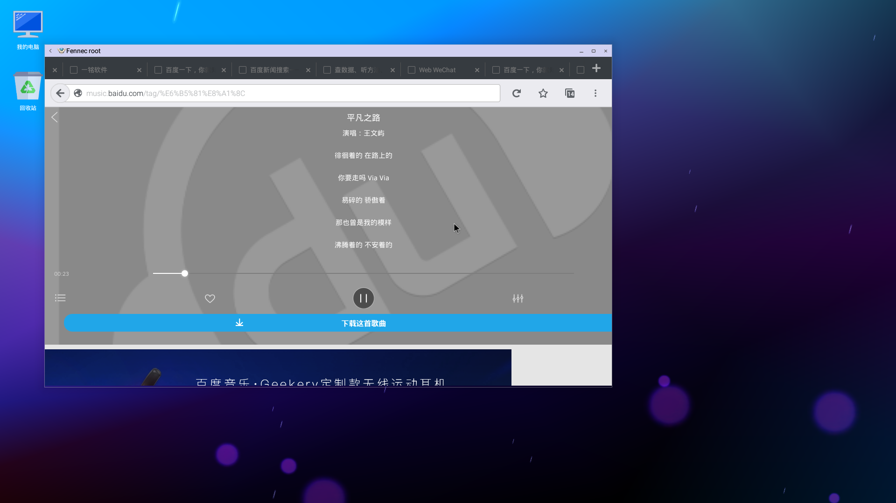
  - 016 支持 网页应用下载功能;
  - 017 支持 网页新开窗口功能;
  - 018 支持 页面收藏功能;
  - 019 支持 查看新闻功能;
  - 020 支持 网页版微信扫码登录功能(需要安装phony插件，微信二维码可显示);
    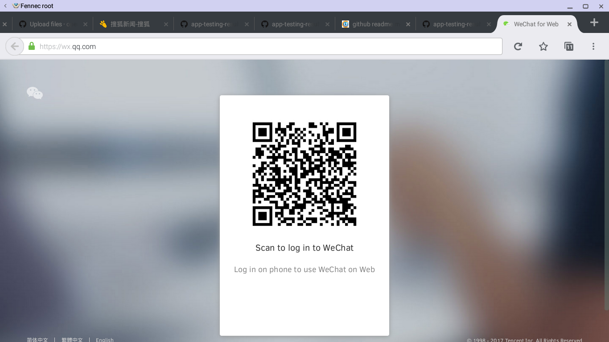
     - phony 链接：https://addons.mozilla.org/en-US/android/addon/phony/?src=hp-dl-featured
     - 选择phony 中Desktop firefox模式
  - 021 支持 firefox安装第三方插件
  - 022 支持 百度换皮肤，登录百度帐号功能
    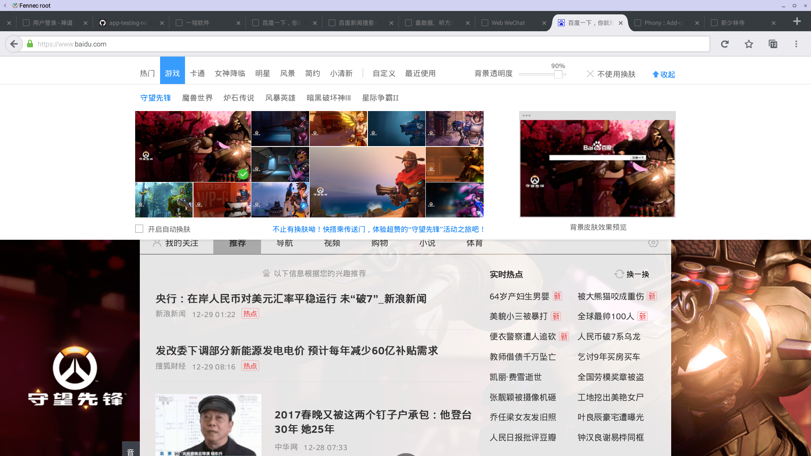
  - 023 支持 鼠标滚轮上下滑动功能
  - 024 支持 地图功能
  - 025 支持 贴吧功能
  - 026 支持 知道问题提问
  - 027 支持 百度编辑框提示信息
    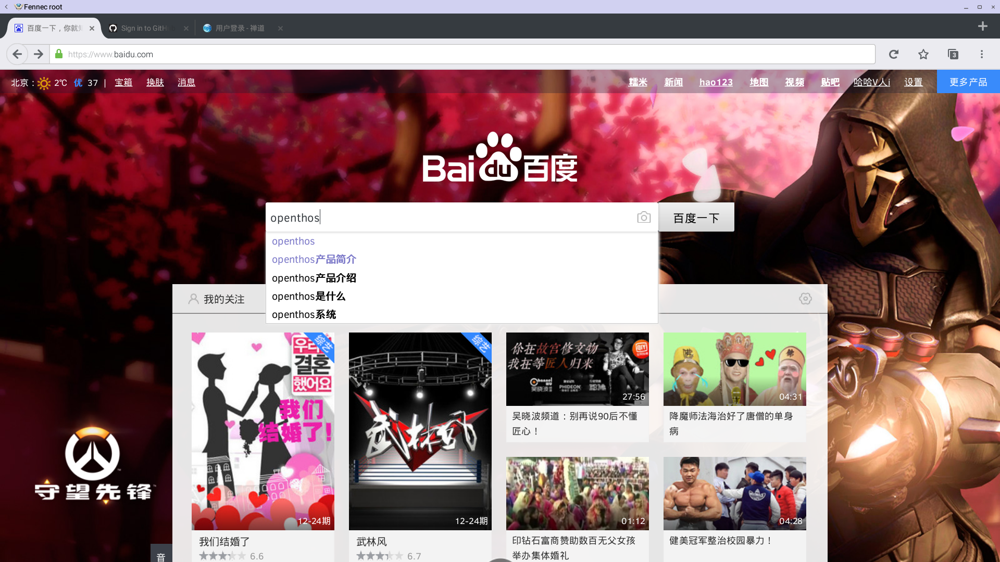
  - 028 支持 编辑框搜索历史记录
  - 029 支持 天气查看功能
  - 030 支持 百度图片上传搜索功能
    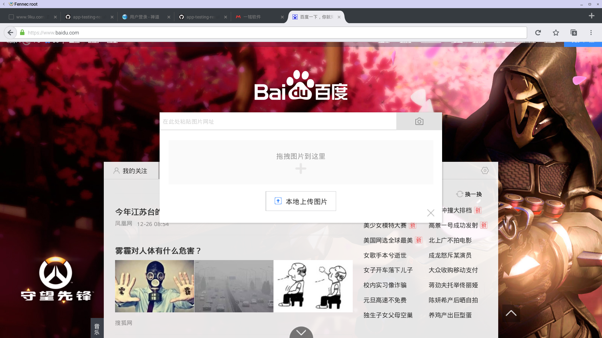
  - 031 支持 页面手机 ＆ pc切换模式 (请点击设置窗口中 “request destop site “ 按钮进行手机和桌面的切换)
    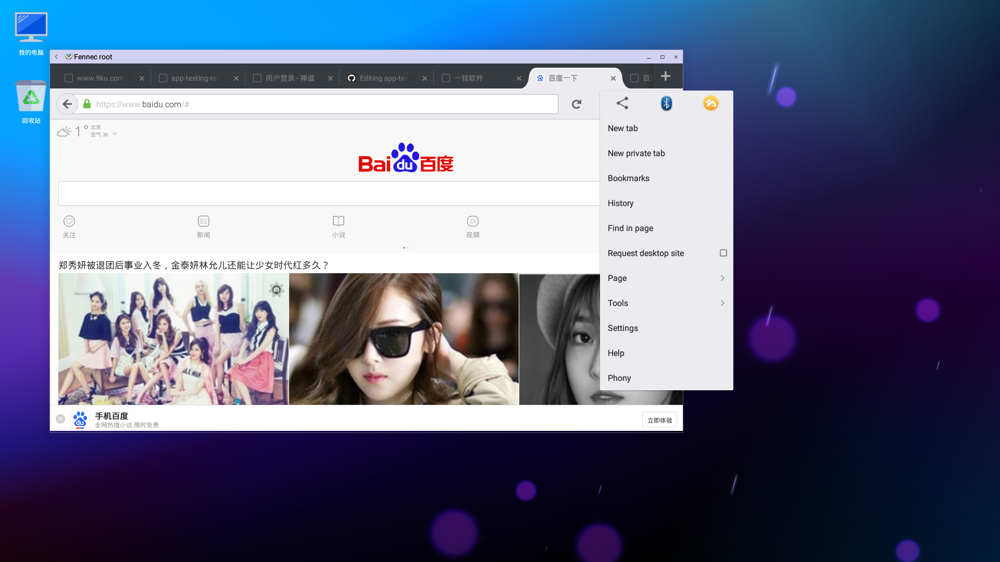
  - 032 支持 图片分享功能
  - 033 支持 百度百科
  - 034 支持 百度文库
  - 035 支持 百度今日热搜词
  - 036 支持 github 登录
    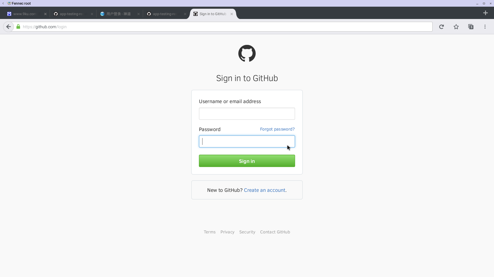
  - 037 支持 一铭邮箱登录
    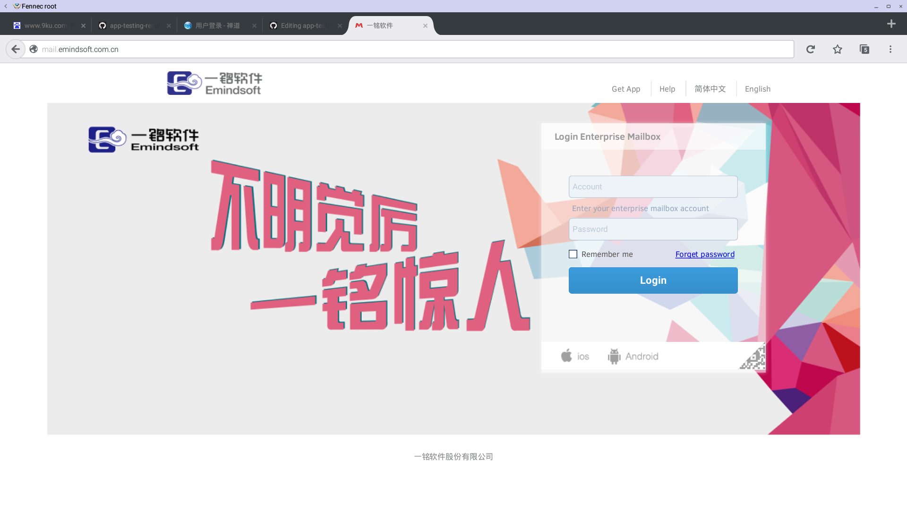
  - 038 支持 禅道登录功能
    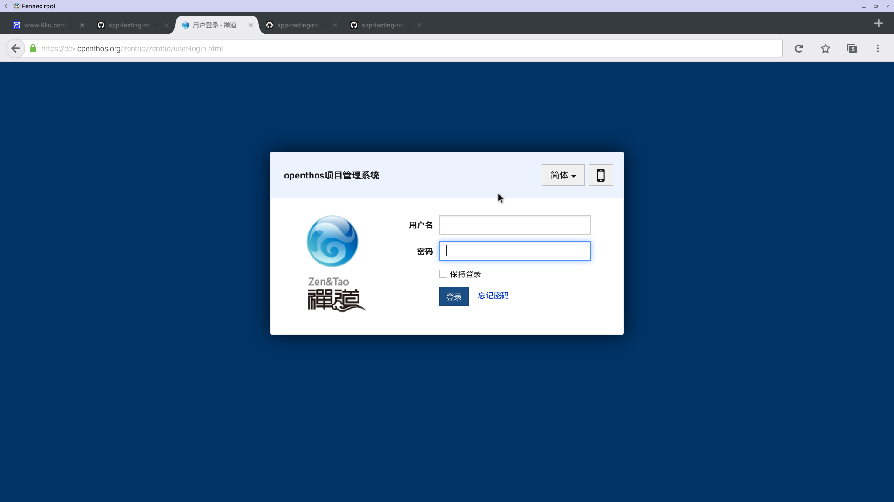   
    
***
## Firefox input

  - 新闻类
  
     - 新浪新闻：http://news.sina.com/
        
     
     - 搜狐新闻：http://news.sohu.com/
        
     
     - 腾讯新闻：http://news.qq.com/
        
     
     - 央视新闻：http://news.cctv.com/
        
     
     - 网易新闻：http://news.163.com/
        
     
  - 购物类
     
     - 淘宝网：https://www.taobao.com/
     
        
     
     - 天猫精选：https://www.tmall.com
        
     
     - 京东商城： https://www.jd.com/
        
     
     - 唯品会：http://vip.com/
     
        
     
     - 亚马逊：https://www.amazon.cn/
        
     
  - 视频类
 
     - 优酷：http://www.youku.com/
        
     
     - 爱奇艺：http://www.iqiyi.com/
        
     
     - 百度视频：http://v.baidu.com/live/
        
     
     - 土豆视频：http://www.tudou.com/
        
     
     - 搜狐视频：http://tv.sohu.com/
        
     
  - 体育类

     - 新浪体育：http://sports.sina.com.cn/
        
     
     - 搜狐体育：http://sports.sohu.com/
        
     
     - 腾讯体育：http://sports.qq.com/
        
     
     - CCTV5：http://tv.cctv.com/cctv5/
        
     
     - NBA 官网：http://sports.qq.com/nba/?ptag=baidu.ald.sc.nba
     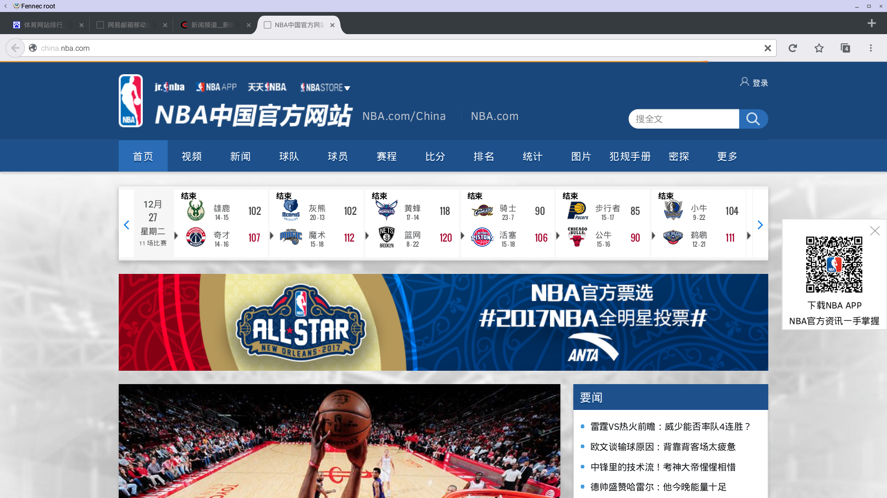   
     
  - 办公类

     - 清华info：http://info.tsinghua.edu.cn/
     
     
  - 注意事项
    - 文件上传操作流程
     
       - 1.先点击本地上传，在弹出的窗口中选择文档
            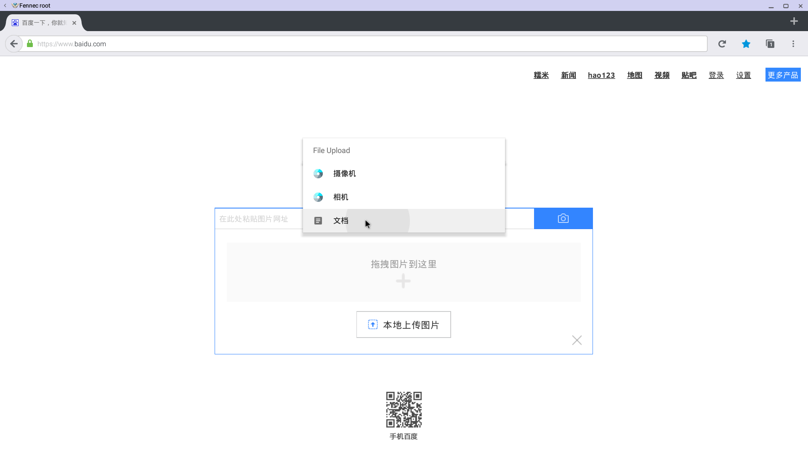
       - 2.再选择文件管理
            
       - 3.参照文件管理器双击打开文件的操作，即可完成上传

