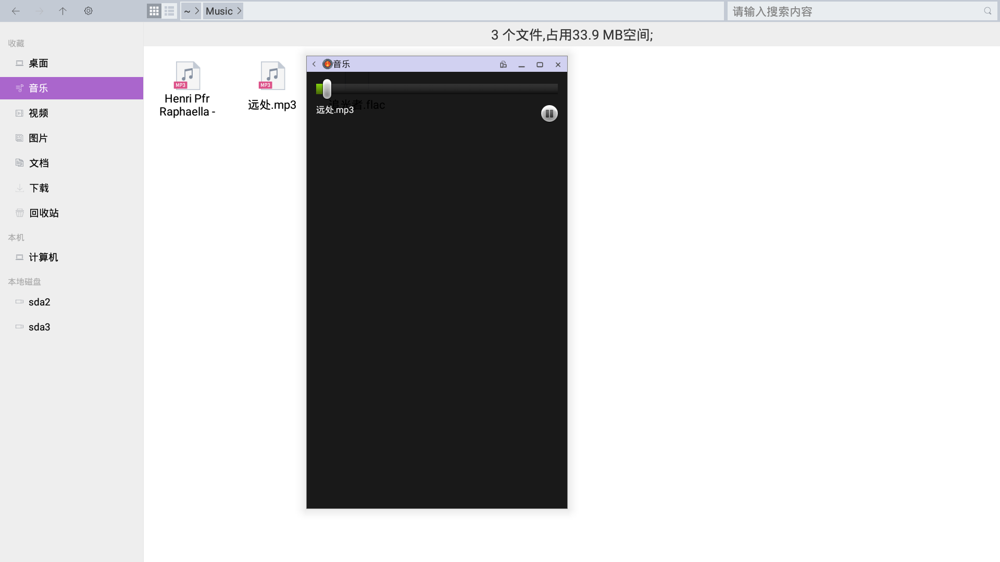
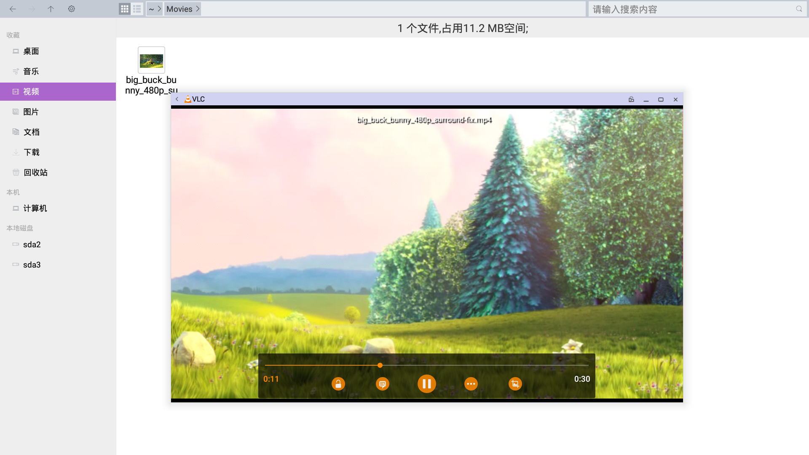
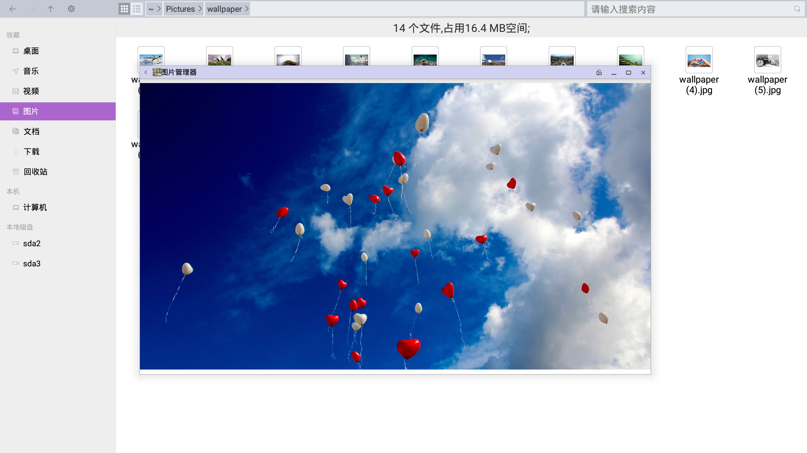
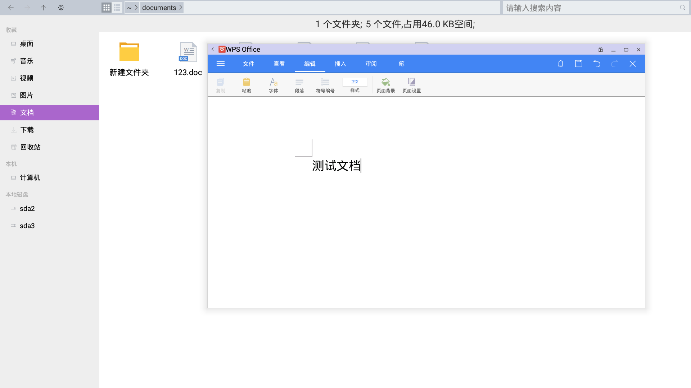
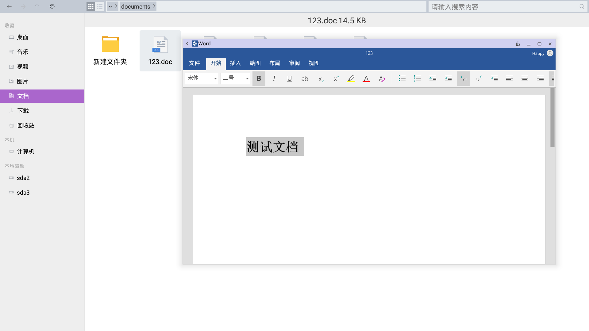
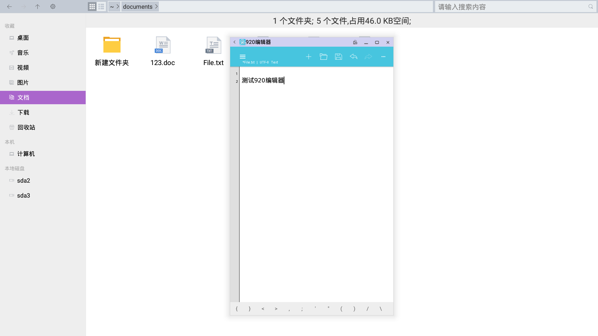

### FileManager Input

#### 音乐
   - 音乐  

   
      - 播放： 可正常播放
      - 显示： 可正常显示
   - 网易云音乐  

   
      - 播放： 可正常播放
      - 显示： 可正常显示

#### 视频
   - vlc  

   
      - 播放： 可正常播放

#### 图片管理器
   - 图片浏览  

   
      - 显示： 可正常显示
      - 多个图片快速浏览 ：支持鼠标左右拖拽快速浏览

#### 文档
   - WPS  

   
      - 页面： 内容显示正常
      - 文字： 显示正常
      - 编辑： 可使用中英文正常编辑
      - 保存： 可正常保存
   - Word  

   
      - 页面： 内容显示正常
      - 文字： 显示正常
      - 编辑： 无法编辑，需登录MSOffice帐号
   - 文本编辑器  

   
      - 页面： 内容显示正常
      - 文字： 显示字体偏小,可点击右上方"…"进入设置，改变字体大小
      - 编辑： 可使用中英文正常编辑
      - 保存： 可正常保存
