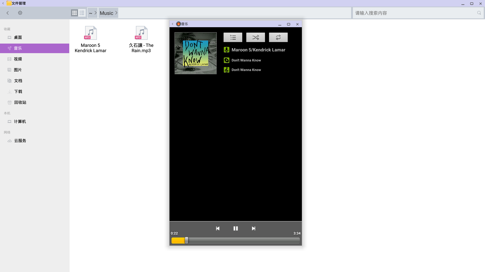
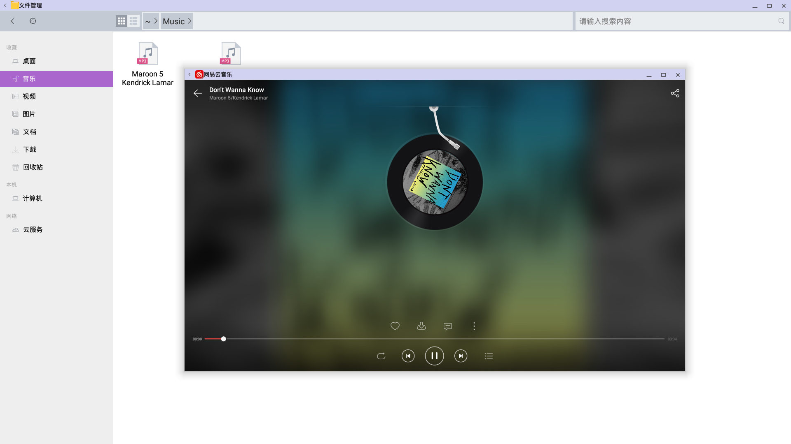
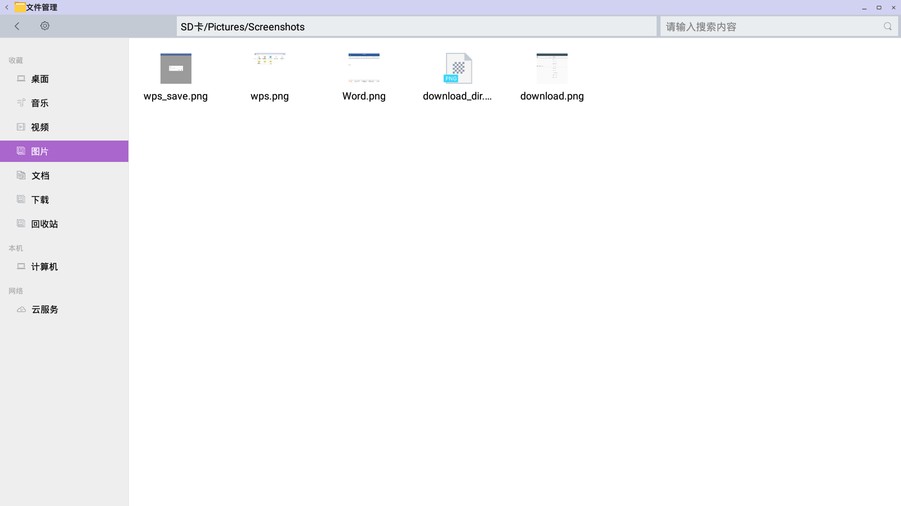
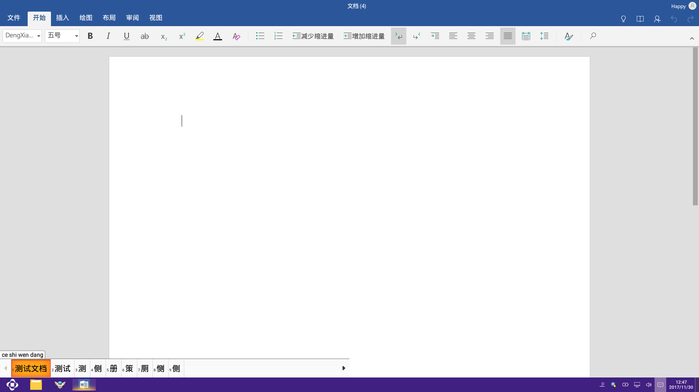
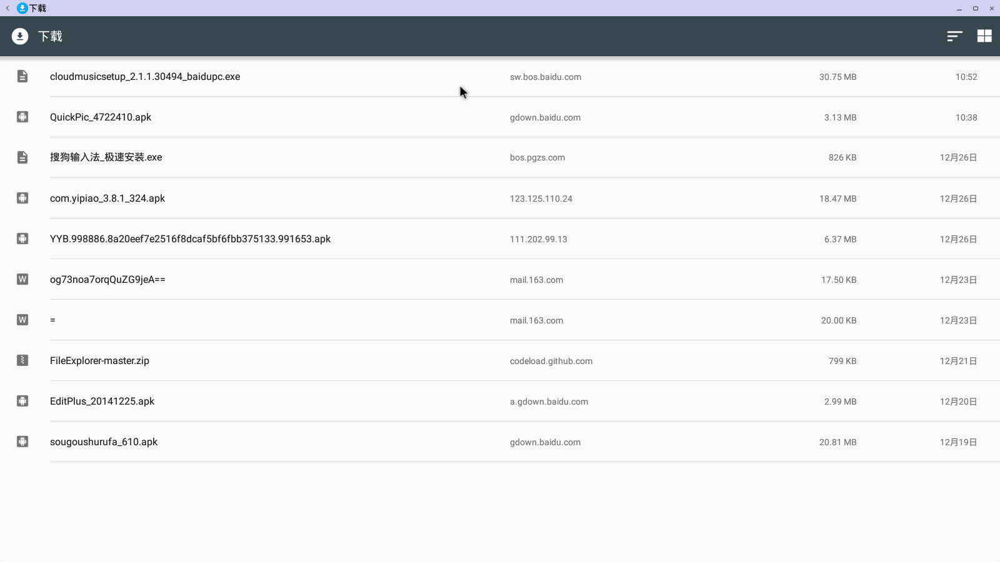

# FileManager Input

***
## 音乐
- 1.音乐  

  - 播放：可正常播放
  - 显示：可正常显示
  

- 2.网易云音乐  
 
  - 播放：可正常播放
  - 显示：可正常显示
  

***
## 视频
- 1.vlc

  - 播放：可正常播放
  

***
## 快图        
- 1.快图浏览

  - 显示 :可正常显示
  - 多个图片快速浏览 ：支持鼠标滚轮和键盘方向键快速浏览
  

***
## 文档
- 1.WPS  

  - 页面： 内容显示正常
  - 文字： 显示正常
  - 编辑: 可使用中英文正常编辑
  - 保存: 可正常保存
  

- 2.Word  

  - 页面： 内容显示正常
  - 文字： 显示正常
  - 编辑: 无法编辑
  
- 3.文本编辑器  

  - 页面： 内容显示正常
  - 文字： 显示字体偏小
  - 编辑: 可使用中英文正常编辑
  - 保存: 可正常保存      
  

***
## 下载
    
- 1.下载  

  - 页面： 内容显示正常  
  
   
  - 路径: 默认保存到个人空间的下载目录下
  
