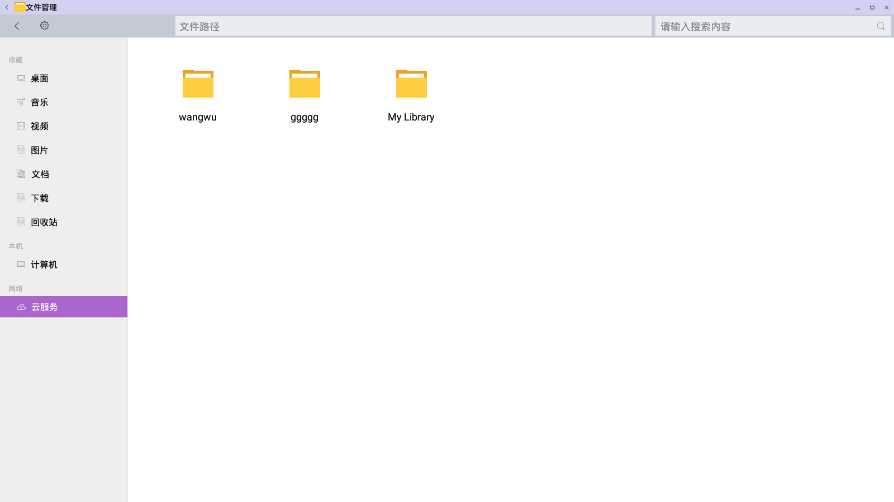
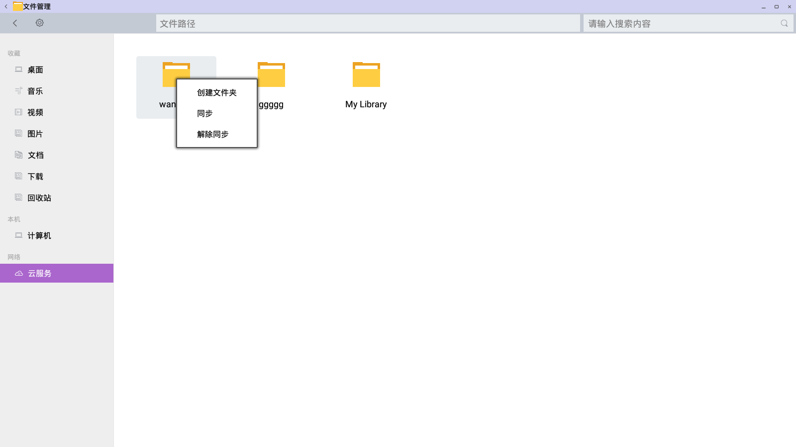

# 云服务主要功能

## 文件同步
- 你可以创建不同的资料库来分类组织文件。每个资料库都可以有选择性地在多台设备上同步。

## 云服务
- 在文件管理器左侧导航栏点击云服务，即可打开云服务界面
  
- 云服务界面右键菜单：
  
- 云服务使用须知：
  - OpenThos绑定openthosID(需要使用邮箱来注册,注册的时候如果需要输入用户名，需要输入邮箱)
  - 目前由于客户端的一些文件，有如下几点限制：
    - 文件库名称只能是英文
    - 真实的目录问题：如在云服务界面看到一个文件库名叫:My library，双击进入后到达的文件夹。
    - 新建库后，右键点对应的库，点击同步，然后关闭文件管理器，重新进入，双击进入对应的库，看到一个文件夹是库名，则正常，如果显示没有文件，则需要重新同步，再次退出进入查看
