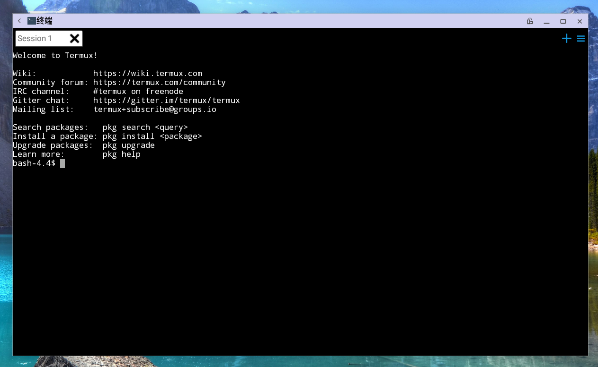

## 终端
### 基本功能

   - 右上角加号，点击可以新增编辑窗口，上限为8个。  
   
   - 右上角三个横杠，点击可以调出菜单。  
   
   - 上方标签，点击选中编辑窗口;上方标签右侧x号，点击关闭该标签对应的编辑窗口。  
   
   - 窗口获得焦点后，可以正常输入。
   
### 快捷键

   - 1.窗体内右击后，出现选择框，包括内容（编辑文本，选择文本，全部复制，粘贴，发送ctrl键，发送fn键）。
   - 2.复制功能：
      - 直接选择文本，鼠标up后即可复制选中区域。
   - 3.粘贴功能：
      - a.右击选择粘贴条目，即可粘贴
      - b.使用ctrl+shift+v同样可以实现粘贴功能
   - 4.切换窗口:

      - a.使用（基本功能条目 第4项）可以实现窗口切换
      - b.使用右上角的设置选项中的窗口的窗口列表选选项
      - c.通过alt+1,2,3...0的方式切换窗口，1，2，3...0对应所开的窗口
      
### 右上角设置条目具体内容

   - 1.窗口列表 --（可切换、关闭窗口）
   - 2.打开／关闭软键盘
   - 3.特殊键 --（展示）
   - 4.首选项 --（包括状态设置，文本大小，字体颜色，编码格式，键盘设置，shell命令设置），设置完毕重启terminal才会生效）
   - 5.重置终端
   - 6.发送邮件到
   - 7.开启唤醒锁
   - 8.开启wifi锁
   - 9.help
