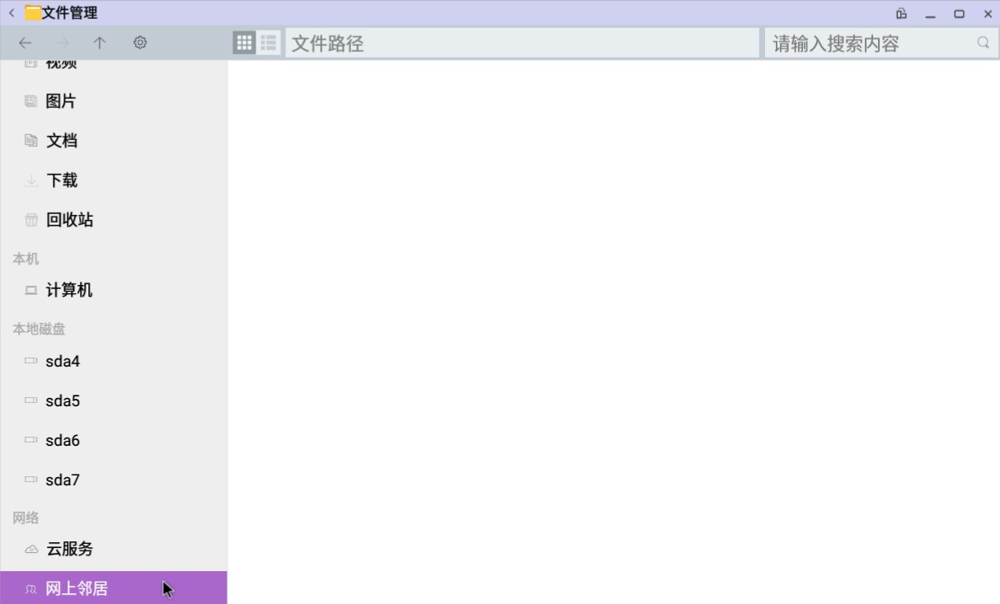

# 网上邻居
OPENTHOS的网上邻居可以查看其他用户的共享文件，也可以共享自己的文件

## 查看其他用户的共享文件
### 如何查看
 - 点击文件管理器左侧网上邻居按钮

 - 右键空白处，点击扫描选项

 - 点击要查看的设备，如果该设备禁止匿名查看会弹出帐号密码窗口
 
 
### 功能点
#### 扫描
#### 身份验证

## 共享文件
### 如何共享

### 功能点
#### 开启/关闭共享

#### 添加共享用户

#### 共享单个文件夹

