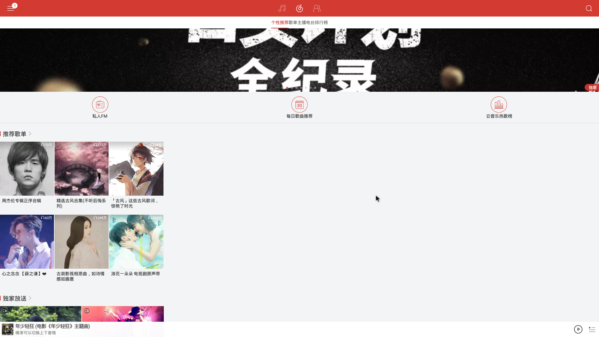
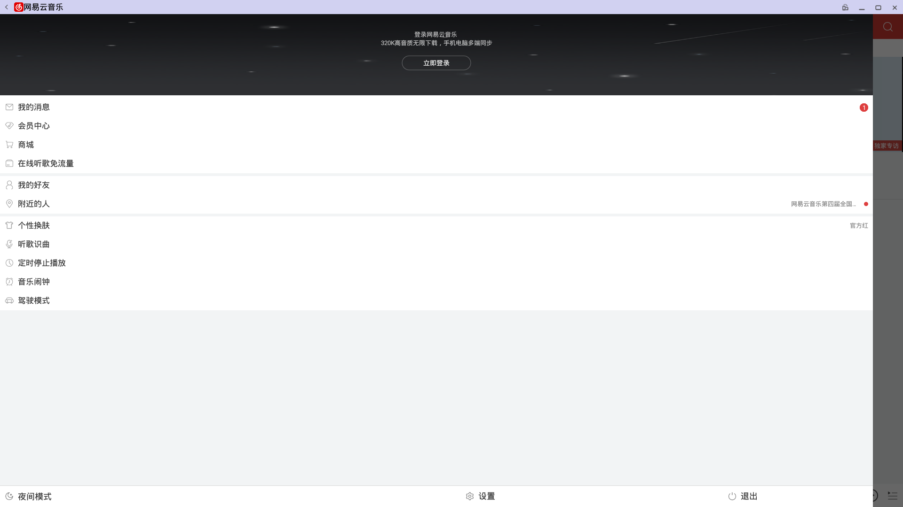
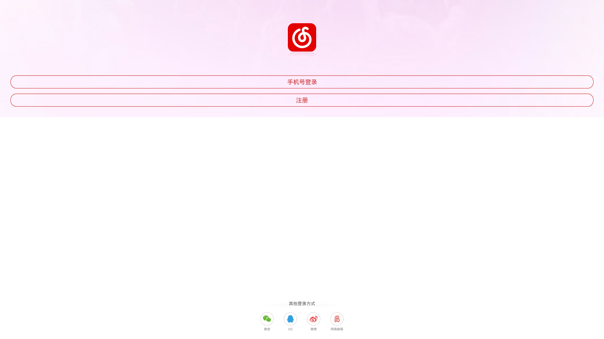
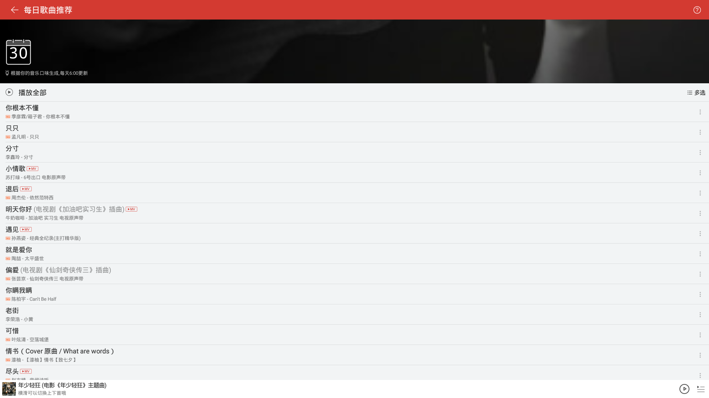
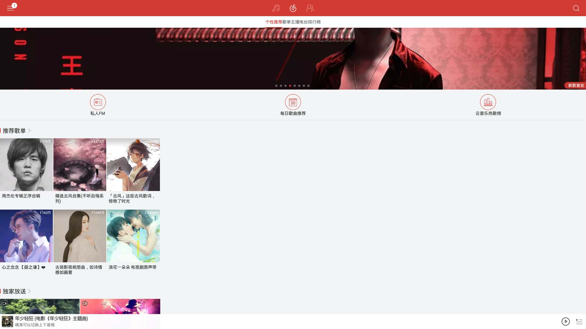
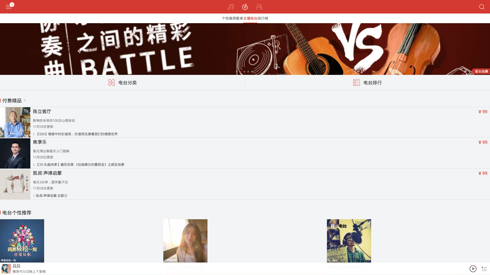
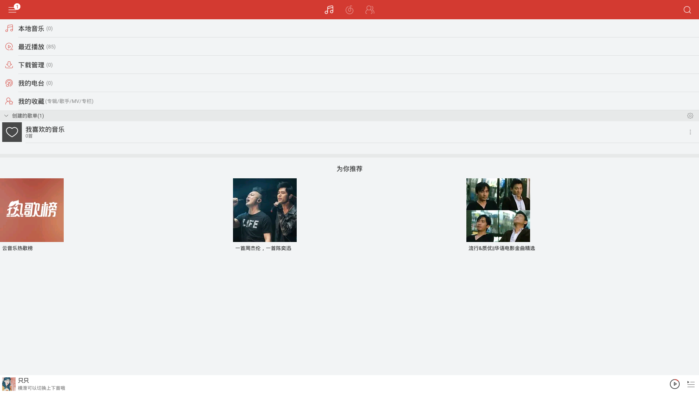
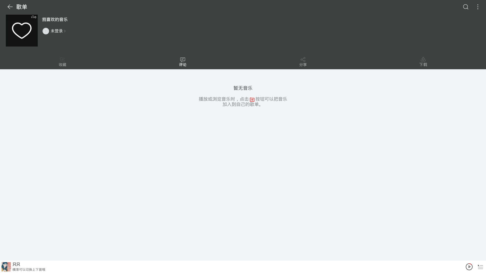
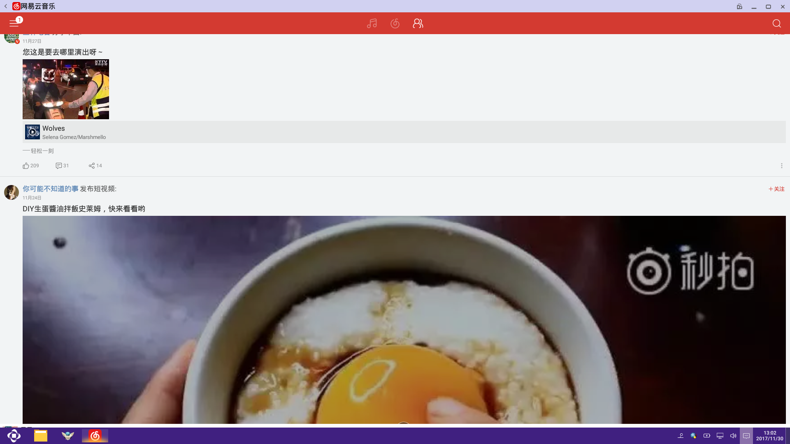

#  网易云音乐简介  

网易云音乐Andoid是网易为 Android设备量身定做的一款专注于发现与分享的音乐产品，依托专业音乐人、DJ、好友推荐及社交功能，按照自己的爱好个人化定制，打造最符合自己口味的 iPad 音乐客户端。与同类相比，网易云音乐 HD 拥有最多的签约电台 DJ 和众多的精品歌单，支持多个平台云端同步，而且功能很多。  
现在，OPENTHOS(好用的Android桌面系统)已经内置网易云。  
网易云音乐上手非常简单，如果您是OPENTHOS的新用户，请参考下面的快速使用指南。  
如果你在使用过程中遇到了程序功能不正常，请参考后面的兼容性报告。   

***
# 快速使用指南  
## 登录／注册
如果要使用网易云音乐的完整功能，需要注册一个用户。可以使用网页注册，也可以使用客户端来注册。
### 网页注册
请点击下面的链接
[网易通行证注册](https://zc.reg.163.com/regInitialized)
### 客户端登录／注册
首次打开网易云音乐，会提请用户登录。如您之前选择了体验而没有登录，可以按照下面的方法登录。
请点击网易云音乐左上侧的菜单图标，打开如下图的菜单。
  
点击最上面的立即登录，使用已有的通行证进行登录（如尚未注册网易通行证，也可以在此使用客户端注册）。
    

***
## 搜索音乐及下载
### 搜索音乐与歌手
点击程序右上角的搜索图标，将打开如下的搜索界面  
输入您想听的歌名或歌手姓名，回车后将得到相关结果。

点击相应的结果，即可收听。  
  
如果喜欢当前音乐，可以点击屏幕下部第二行的下载按钮将音乐保存到本地。  
如果下载按钮未显示，可以左键在程序中部空白区域点击或者左右拖动直到按钮显示。   

***
## 发现您喜爱的音乐

网易云音乐Andorid版为用户提供了高品质音乐的推荐。- 如果你找不到想听的音乐了，可以在发现音乐中找到热门的音乐或者软件通过你听过的歌而推荐的同类型的比较好的歌曲。
回到程序主界面，点击上方的“个性推荐“标签，下方的“推荐歌单“是系统根据您的经常听的曲目推荐的您可能喜欢的歌单。   
如果您只是想随便翻翻，可以点击“歌单“标签进行浏览。    

***
## 观看MV
   

入口为：如果当前播放的曲目有MV，点击歌曲封面处倒数第二行的最后一个按钮，将出现如下菜单，选择其中的查看MV即可。   

***
## 主播电台

网易云音乐上，有多种类型的直播电台。您可以从主界面打开“主播电台“标签，根据自己的喜好进行收听。   

***
## 打造自己的音乐库
平时，遇到自己喜欢的歌曲，一定要收藏下来哦。那么如何对自己收藏的音乐进行管理呢？
程序顶部，菜单按钮之后搜索按钮之前，有三大功能按钮分别是“在线资源“、“我的音乐“、“社交网络“。  
点击“我的音乐“按钮，将打开如下界面。
  
点击“创建的歌单“后面的菜单按钮。
  
选择“创建新歌单“，及可创建新歌单。在以后的收听曲目时，您就可以将曲目收藏到该歌单中。   

***
## 社交功能
   
在网易云音乐中，用户可以关注一些音乐达人或音乐明星，来发现更好的音乐。  
点击主界面顶部的“社交网络“按钮，进入社交界面。  
可以根据自己的喜好进行关注。   

***
## 设置
点击程序顶部的“主菜单“按钮，选择“设置“进行软件的设置。   

***
# 兼容性报告
## Known Issue
1.  程序在OPENTHOS上dpi不对，图片显示过大。  
     可能原因为，系统框架中适用dpi或缩放系数不正确  
2.  部分菜单轻微溢出显示区域之外，如“创建的歌单“处的菜单。  
     可能原因为，系统框架多窗口功能BUG。
3.  图片显示大小固定，不能根据窗口的缩放而缩放，最大化存在大部分区域白边的问题
