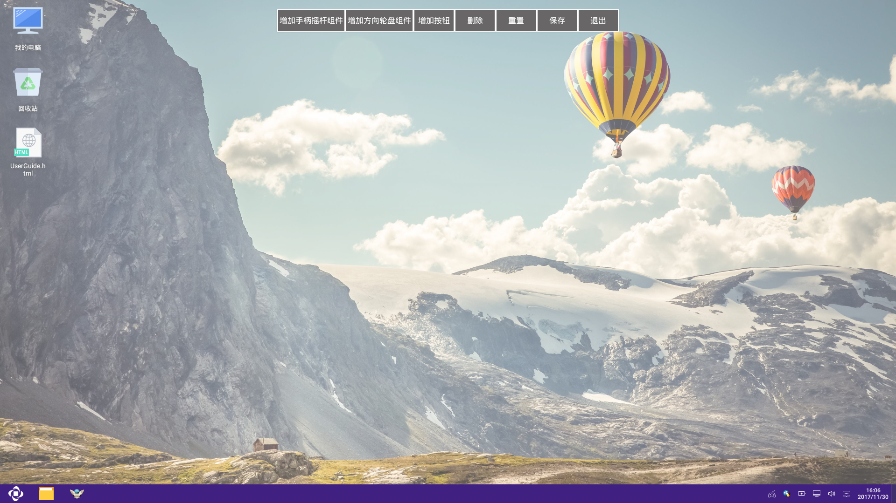
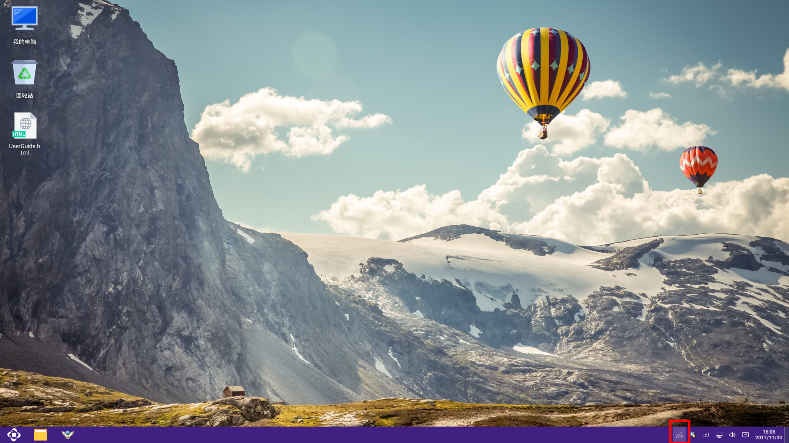
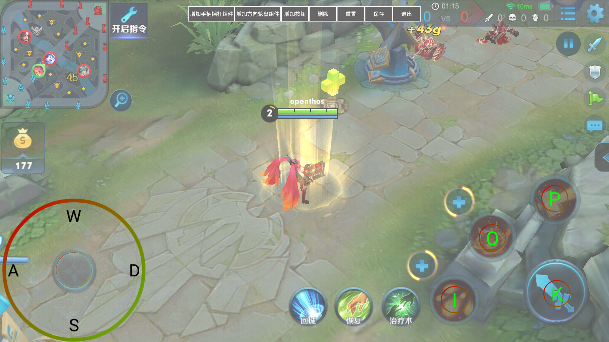

## 键盘映射

   - 打开键盘映射
      - 选中任务栏上的键盘映射图标单击，打开键盘映射界面。
      
      注：建议先打开相关应用，然后打开键盘映射
   - 打开/关闭快捷键：Win键+G
   
   - 界面操作
      - 增加手柄摇杆组件（敬请期待……）
      - 增加方向轮盘组件（点击，添加方向轮盘）
         - 鼠标拖动可以改变位置，当鼠标放置在轮盘边缘时，拖动可以改变轮盘的大小
         - 默认方向键为AWSD，修改方式：选中当前字母，如W，W变为红色，此时按键盘或拨动手柄方向键，即可设定
         
      - 增加按钮（点击，添加一个按钮）
         - 添加的按钮为空，鼠标拖动到指定位置
         - 点击按钮，然后按键盘或使用手柄按钮，即可设定
      - 删除(点击想要删除的按钮或轮盘，然后点击删除，则将该按钮删除)
      - 重置(点击，清空所有组件和按钮)
      - 保存(点击，保存当前配置，下次打开相同应用时，自动加载该配置)
      - 退出(点击，退出键盘映射)

