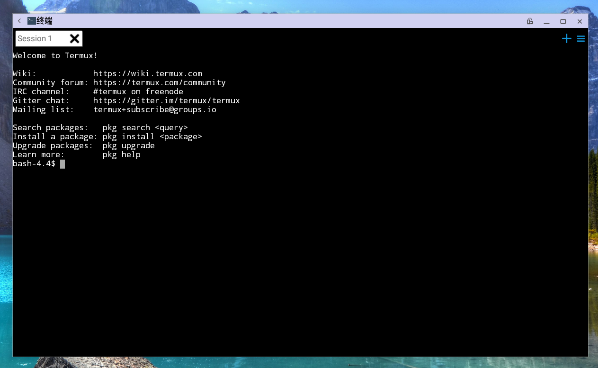
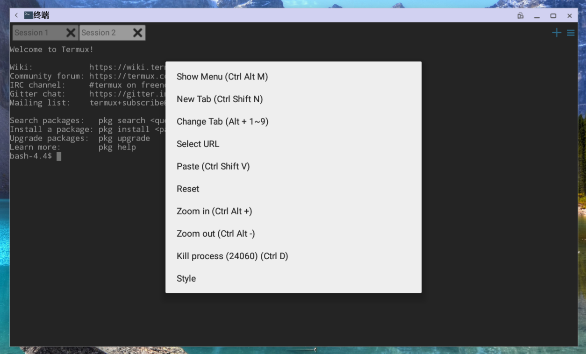
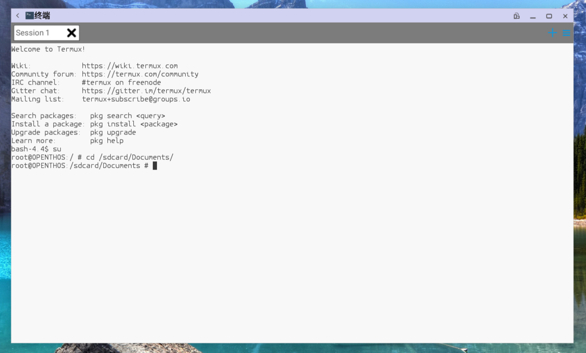

## 5.6 终端
### 基本功能

   - 点击右上角加号可以新增编辑窗口，上限为8个。  
      
   - 点击右上角三个横杠可以调出菜单。  
      
   - 点击上方标签选中编辑窗口；点击上方标签右侧x号关闭该标签对应的编辑窗口。  
      
   - 窗口获得焦点后，可以正常输入。
      - **如需输入中文，请选择谷歌拼音开源输入法**

### 快捷键
点击右上角三个横杠按钮，调出菜单页面，此时可以查看终端支持的快捷键列表。  

   - 目前支持的快捷键有
      - 快速打开菜单：ctrl + alt + m
      - 新开编辑窗口：ctrl + shift + n
      - 切换编辑窗口：alt + 1~9
      - 粘贴文本：ctrl + shift + v
      - 放大页面：ctrl + alt + 加号
      - 缩小页面：ctrl + alt + 减号
      - 关闭当前窗口的进程：ctrl + d
      - 复制文本：鼠标拖拽选中文本后直接复制
      
### 其它功能
   - 改变终端背景颜色和字体
      - 点击右上角三个横杠按钮，调出菜单页面，选择Style选项，即可设置背景颜色和字体。  

