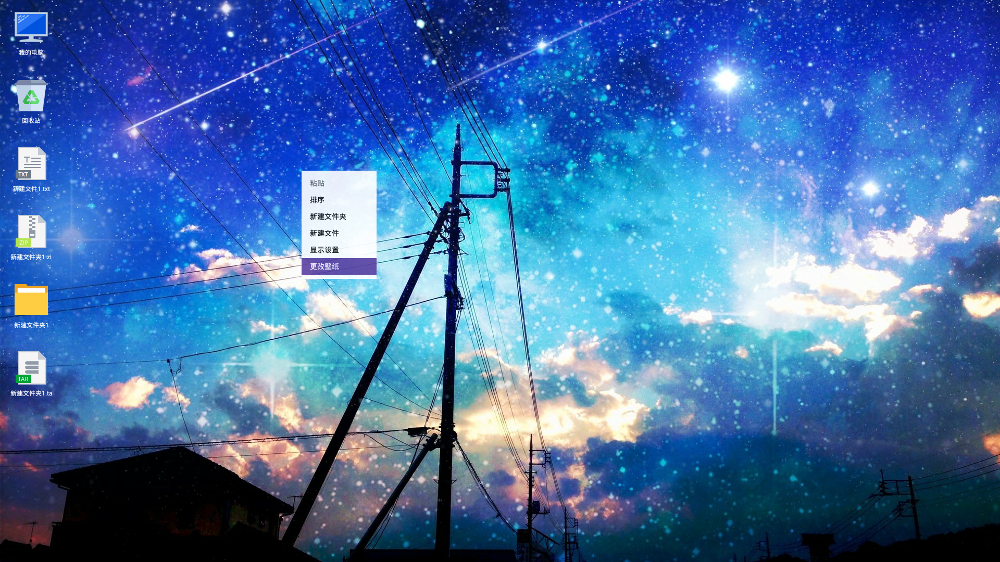
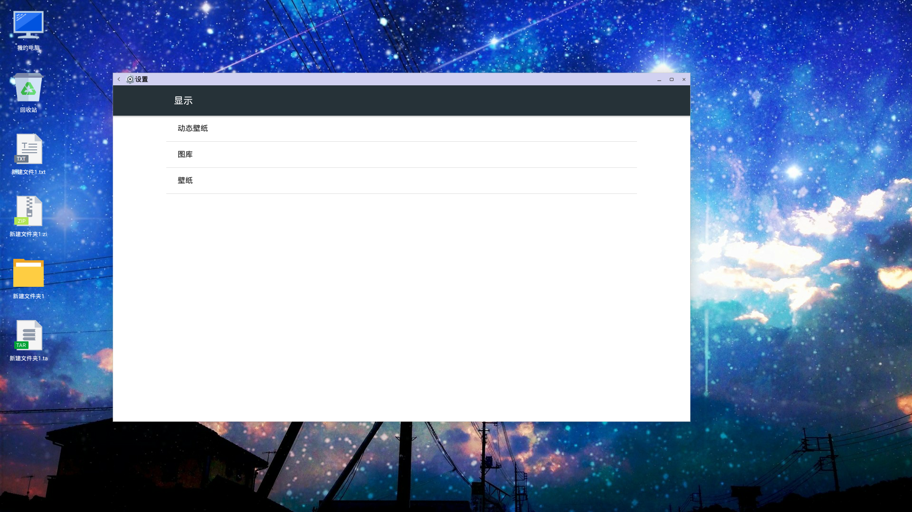
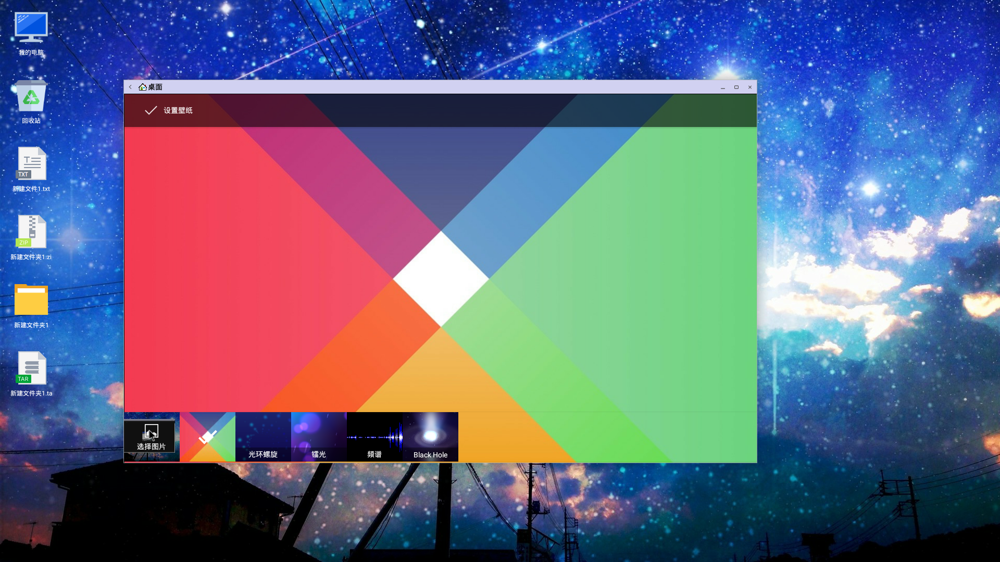
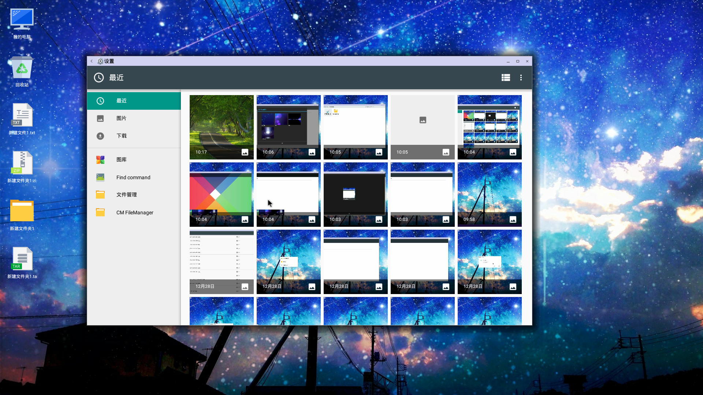
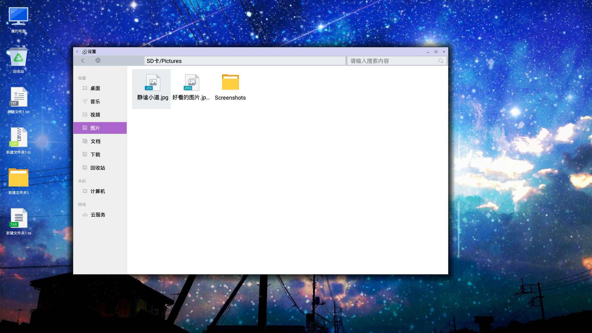
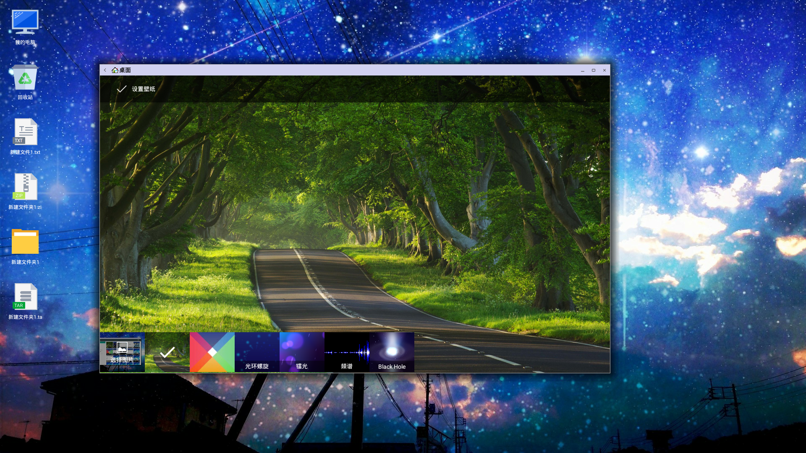

# 更换壁纸

- 右键空白区域，选择更改壁纸
    - 
- 跳转到设置更改壁纸页面
    - 
- 可以选择更换壁纸的方式，比如选择第一个选项通过图库应用更改壁纸
    - 
- 下方分为选择图片，还有一些曾经设置过的壁纸和动态壁纸
    - 
- 如果想选择的壁纸图片不在列表中，可以点击选择图片,弹出如下界面更加方便的寻找想要设置的壁纸图片
    - 
- 推荐使用文件管理，在文件管理中找到自己想要设置的图片，双击即可成功选中并返回到预览界面
    - 
    - 
- 点击预览页面左上角 “设置壁纸“ 即可成功更换壁纸
