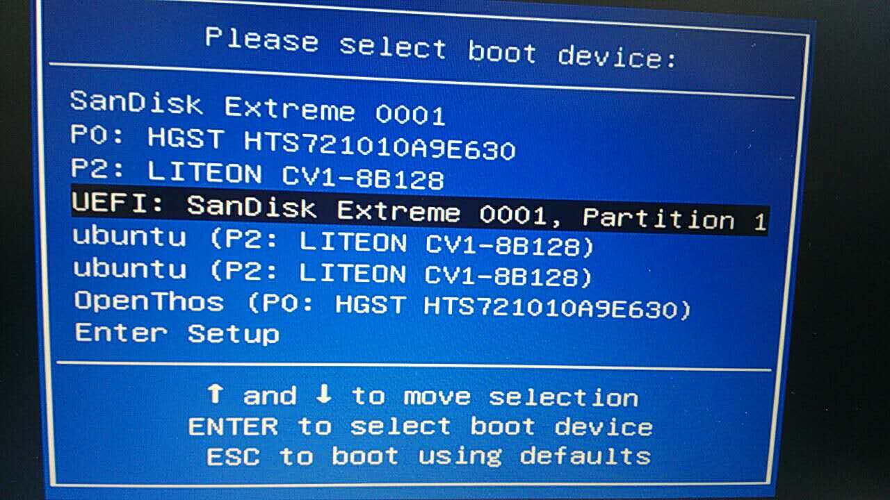
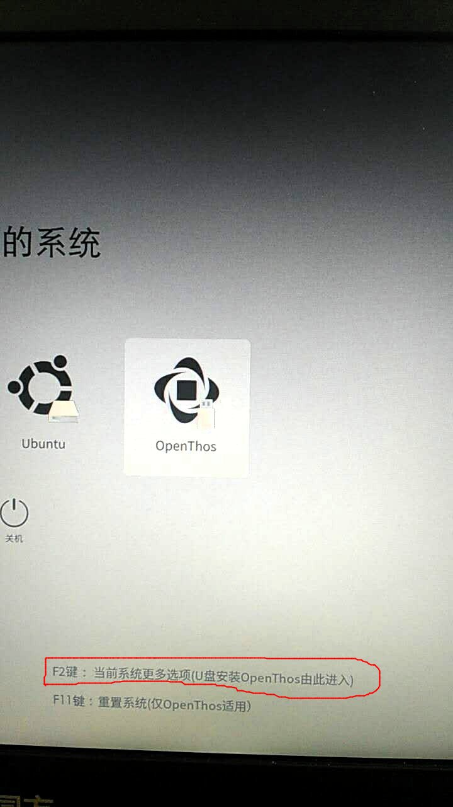
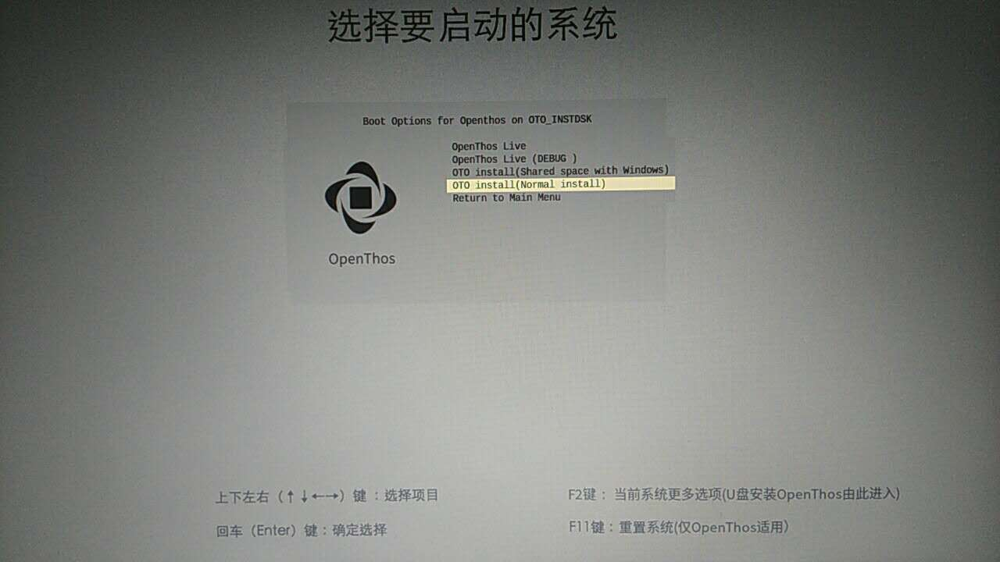
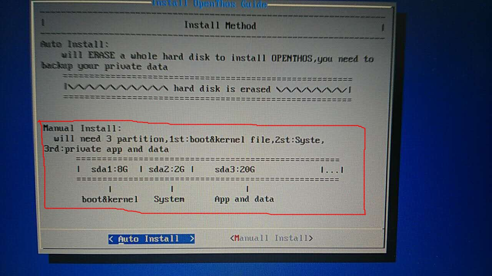
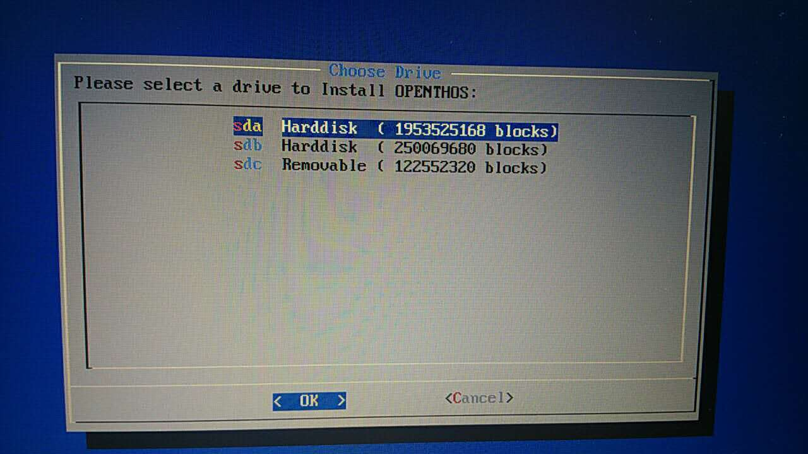
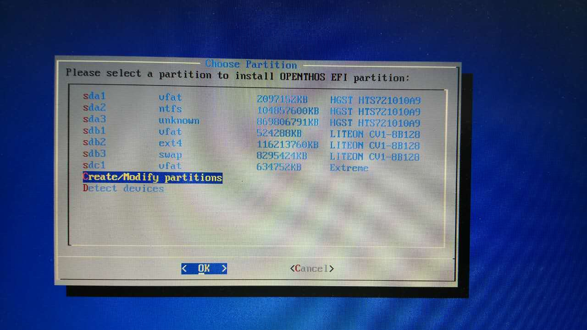
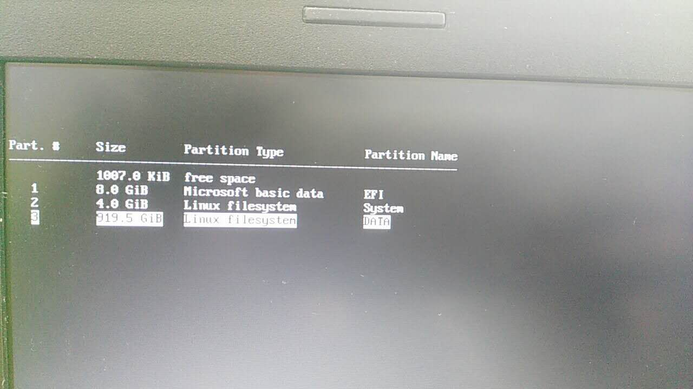
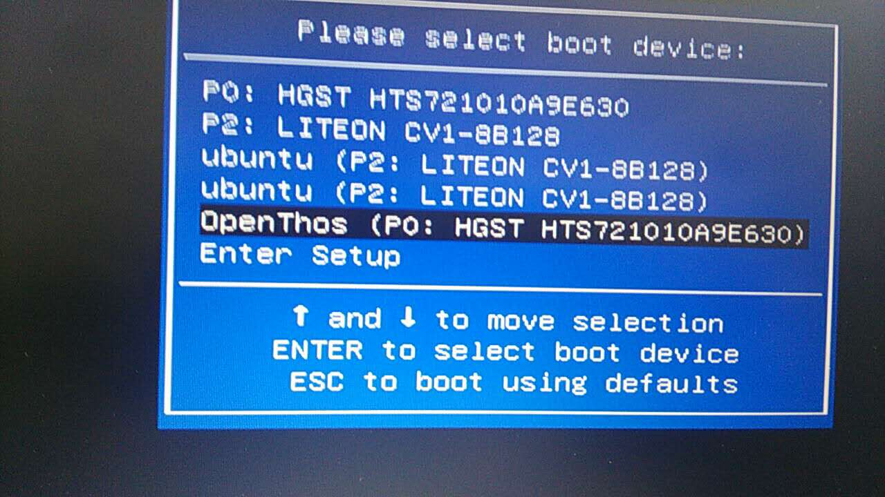

# openthos安装
## oto_img 镜像安装 （建议以此种方式安装）
oto_img的安装仅支持UEFI引导方式  
<p id="install1" name="install1">

</p>
### 准备：下载镜像
我们首先需要获取到openthos的系统镜像并做成U盘启动,有两种方式可以选择:  
- 1.纯windows用户

```
安装工具:[https://pan.baidu.com/s/1skHwVCx]  
提取码:smrh  
```
插入U盘,然后运行:
```
OpenThos U盘体验版生成工具.exe
```
请选择自己的U盘(该操作将会格式化u盘,请提前保存个人数据),等待写入数据完成;
- 2.拥有linux发行版系统或者windows的资深使用者  

```
image addr: [http://pan.baidu.com/s/1kVauJ5t](http://pan.baidu.com/s/1kVauJ5t)   
PassWord: y48g
```
linux发行版使用dd命令   
```
sudo dd if=/your/oto_img/path of=/dev/sdx
例如:sudo dd if=/home/openthos/image/android_x86_64_oto.img of=/dev/sdc
```
windows使用UltraISO软件,请询问度娘...

### openthos系统安装介绍
**通常出现如下图标表示您的U盘系统已经制作成功.**  
在启动的时候选择启动顺序,电脑的快捷键可能不同,我这
里是F10看到如下界面,并请选择你的UEFI U盘选项:  
    
Openthos有多种启动方式,如下图所示:  
  
  
- 1.Live:无需安装即可启动,而且用户的数据可以保存在U盘上;  
要求:对U盘的安装要求比较高,否则容易出现卡顿现象  
- 2.Live DEBUG
针对极客的一种模式,可以暂停系统的启动来观察系统行为  
- 3.install(Shared space with Windows)  
和windows进行双系统安装进行定制的一种安装模式,清华同方电脑已经经过测试可用  
- 4.install(Normal Install)
普通安装模式(**推荐**)  

普通安装模式下的选项:  
如果你的电脑有一整块完整的硬盘或固态硬盘空闲,您可以选择自动安装模式<Auto Install>;  
  
<font color=red>*选择空闲的磁盘,请仔细确认!!!*</font>  

### 分区
#### 使用openthos自带的cgdisk工具分区
手动安装<Manual Install>方式适用范围  
```
1.同一块硬盘上安装双系统:openthos+windows,openthos+ubuntu  
2.对系统默认的分区size有其他需求的   
3.对linux分区有一定了解的爱好者  
```
请您仔细看下面的介绍以避免对您的数据的破坏  
创建分区入口  
  
openthos下的分区是基于cgdisk来分区,它是一个基于光标的工具,用户可以使用上,下,左,右键和
最后分区的效果示例(仅适用于normal install模式):  
  
#### 借助ubuntu系统分区  
请提前下载好一个ubuntu镜像并做成启动盘,请参考<http://www.cr173.com/html/50530_1.html>
 1.打开系统分区工具，例如磁盘工具（gparted）：  


 2.为OPENTHOS预留3个分区（此处为/dev/sda3 /dev/sda11 /dev/sda12）  


建议的分区大小可以如下表：

|大小   |文件系统格式|用途|
|:----:|:-----:|:----:|
| 8G   | FAT32 |openthos EFI分区|
|4G|ext4|openthos system分区|
|40G|ext4|openthos data 分区|

二.重启系统，按F10 进入启动选择菜单（根据自身机器决定快捷键），  根据U盘选择 UEFI U盘启动


### 三.安装openthos  

  依次选择曾经分好的3个分区，先选择EFI分区

  格式化EFI分区（如果还有其它系统，且引导安装在该分区可以选择第一项不格式化）

  选择system存放分区

  格式化

  选择dataimg存放分区

  格式化


 - 重新启动系统， 安装完毕，此时如果重新启动出现如下页面，为引导默认分辨率问题，可修改相应配置，或暂不去理他，到此openthos oto_img版本安装完成。  
  

### linux系统+Openthos双系统安装方式
（win下安装方式相同，差别在于分区等工具略有不同，可在网络上查找windows下相关工具）  
单独安装openthos也按如上安装

## iso 镜像安装
<p id="install2" name="install2">
 1. 下载镜像
</p>
ISO addr: [http://pan.baidu.com/s/1kVauJ5t](http://pan.baidu.com/s/1kVauJ5t)   
PassWord: y48g  

## qemu 虚拟机安装

 1. 下载iso镜像

  - 创建虚拟磁盘：  
    `qemu-img create a.raw +20G`  
  - 手动格式化磁盘：  
    parted a.raw  
        `mklabel msdos`  
        `mkpart p ext4 1 20G`  
        `quit`
  - 启动虚拟机，默认从cdrom启动：  
    `qemu-system-x86_64 -hda a.raw -enable-kvm -m 2048 -cdrom you-download.iso -boot once=d`  
    启动后选择安装…… 选择第一个安装grub，第二个安装grub2选择skip，其它随意
  - 安装后直接虚拟硬盘启动：
    `qemu-system-x86_64 -hda a.raw -enable-kvm -m 2048 -vga cirrus`
