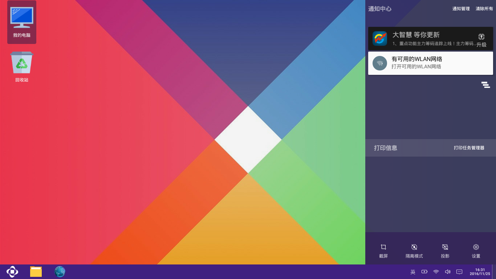

# 通知栏
   - 通知栏属于Openthos模块之一。它的加入使阁下对系统消息和应用消息的查看操作变得更加方便快捷
   - 了解更多请查看下方（通知栏功能详情介绍）

## 整体效果图

## 功能模块
   - 通知管理
   - 清除所有
   - 通知消息 位置：通知中心下侧
   - 打印任务管理器
   - 打印消息 位置：打印信息下侧
   - 截屏
   - 隔离模式
   - 投影
   - 设置
   
## 具体介绍  
   - 通知管理 --（*屏蔽和优先*）
      - 点击通知管理：显示所有发送通知的应用，然后你点击列表中的应用，进行屏蔽操作和优先操作
   - 清除所有 --（*清除通知*）
      - 点击清除所有：将所有显示的通知管理信息进行清除
   - 通知消息 --（*显示应用*）
      - 点击一个通知消息，将显示该应用的界面
   - 打印任务管理 --（*暂停和开始 取消打印*）
      - 点击打印任务管理： 将显示打印管理的列表，根据自己的需求进行操作
   - 打印消息 --（*关闭*）
      - 点击右侧的"x"号：对正在进行的打印进行关闭
   - 截屏 --（*截取全屏*）
      - 点击截屏：将截取整个屏幕
   - 隔离模式  --（*切断连接*）
      - 点击隔离： 将切断有线网和无线网和蓝牙
   - 投影 --（*即插即用*）
   - 设置 --（*系统的设置*）
      - 点击设置： 进入设置的界面
