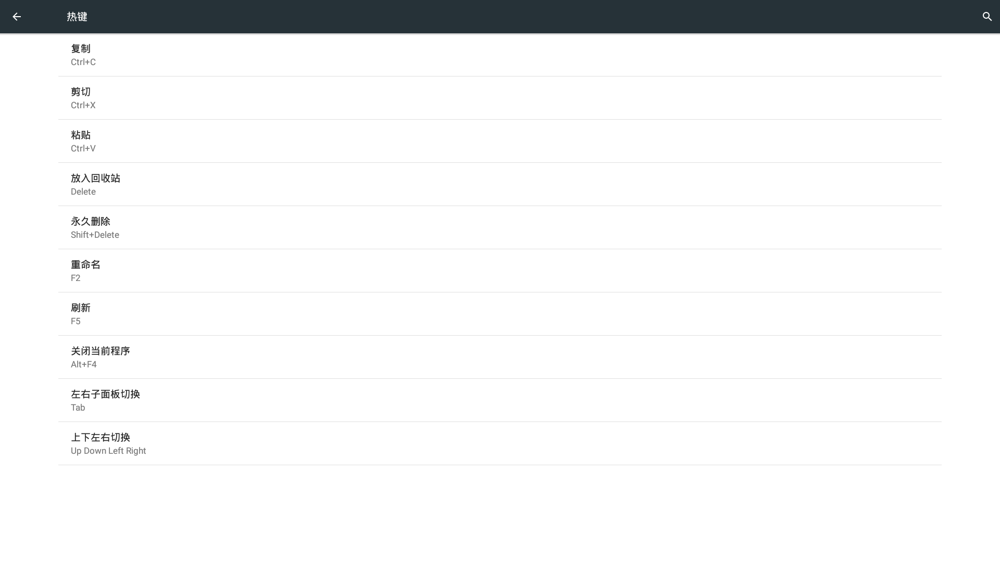

# 系统设置(展示图)  

## 一. 无线和网络
   - WLAN
 

      - 右上角 菜单键（三个点图标）  
         - 添加网络
         - 已保存的网络
         - 刷新
         - 高级  

   - 蓝牙
    
      - 右上角 菜单键 （三个点图标）
         - 刷新
         - 重命名此设备
         - 显示收到的文件
     
   - 以太网      
        
      - 关闭/开启
         - 关闭:关闭以太网
      - 开启
         - 配置以太网
         - 链接类型
            - DHCP
            - 静态IP
         - IP地址
         - 网络前缀长度
         - DNS地址
         - 放弃
         - 保存
   - 代理
            

   - 更多
  
      - 飞行模式
      - VPN

## 二. 设备
   - 显示
  
      - 亮度
      - 壁纸
      - 字体大小
   - 提示音和通知     
        
      - 音量
         - 媒体音量
         - 闹钟音量
         - 通知音量
         - 默认通知铃声
         - 其他提示音
      - 通知
         - 应用通知 (设置通知权限)
         - 通知使用权
   - 电源管理
   
      - 节能设置 (节能模式:平衡,节能,高效)
      - 休眠 (设置休眠时间)
      - 电量详细信息
      - 不锁定屏幕
     
   - 应用      
   
      - 已下载 (可强制停止和卸载)
      - 正在运行 (可停止)
         - 设备内存
         - 应用内存使用情况
         - 显示当前运行的服务
         - 显示缓存进程
      - 全部 (可强制停止和卸载)
   - 自启管理

   
## 三. 个人
   - 位置信息 (点击，pc 进入关机模式)

      - 开启
         - 模式
            - 准确度高
            - 耗电量低
            - 仅限设备
      - 关闭
      - 最近的位置信息请求
   -  安全
     
      - 屏幕锁定方式
      - 密码
      - 机主信息
      - 加密
         - 加密设备
      - 密码
         - 显示密码
      - 设备管理
         - 设备管理器
         - 未知来源
      - 凭据存储
      - 高级
         - 屏幕固定
         - 有权查看使用情况的应用
   - 账户

      - 添加账户
  
   - 系统账户管理

      - openthos ID

      - 主机用户名设置
         - 修改用户名
         - 修改锁屏密码
      - 主机名
   - 语言和输入法

      - 语言
      - 拼写检查工具
      - 个人字典
      - 键盘和输入法
         - 当前输入法
         - 安卓键盘
      - 指针速度
   
## 四. 系统
   - 日期和时间

      - 自动确定日期和时间
      - 自动确定时区
      - 使用24小时格式
   - 无障碍

      - 服务
      - 系统
      - 字幕
      - 大号字体
      - 显示
      - 颜色反转
      - 色彩校正
   - 打印（打印操作请查看‘常用功能’详细介绍）

      - 已添加设备
      - 本地打印机
   - 关于设备

      - 系统重置 （使用此功能将清空系统所有设置，文件等)
      - 系统升级配置
      - 系统升级 
         - 手动升级
            - 点击手动升级

            - 进入文件管理器，选择openthos_V1.0.zip(可从百度网盘下载：网盘地址:http://pan.baidu.com/s/1kVauJ5t 提取码: y48g)

            - 校验升级包

            - 手动升级风险提示，确认是否手动升级

         - 立即更新
         - 更新说明
      - 法律信息
      - 型号
      - Android 版本
      - 内核版本
      - Openthos 1.0-RC1
      - 浏览器版本
      - CPU
      - 内存
      - 硬盘    
   - 热键

      - 介绍当前系统支持的一些快捷键
