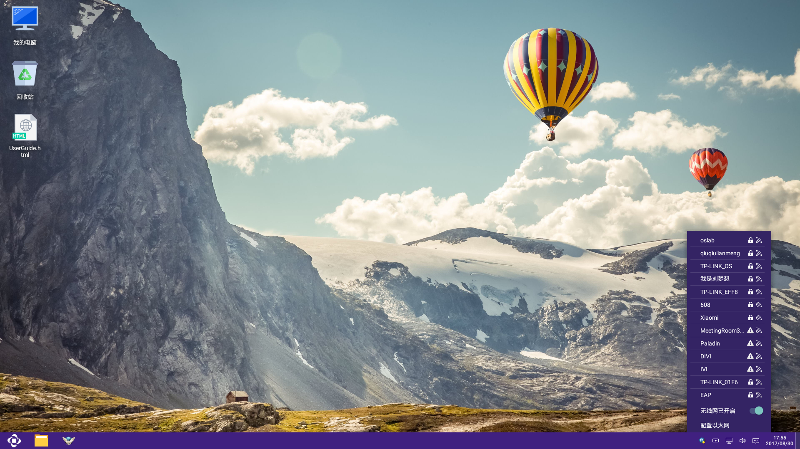

# 任务栏使用说明

## Note:
  - 任务栏属于Openthos模块之一。它的加入使阁下对系统进行时间、输入法、WiFi、键盘映射的设置等操作变得更加方便快捷。
  - 了解更多请查看下方（任务栏功能详情介绍）

## 任务栏效果图

## 任务栏功能模块
  - 开始菜单
  - 文件管理器
  - Internet浏览器
  - 键盘映射
  - 输入法
  - 电量
  - 网络
  - 音量
  - 通知中心
  - 日历
  - 返回桌面

## 任务栏功能详情介绍
   - 在没有应用图标处，右键可以选择固定任务栏和自动隐藏任务栏。

   - 在应用图标处，单击鼠标右键，打开菜单
     - 打开应用(关闭应用)   (选中单击，打开/关闭应用)
     - 解除固定(固定到任务栏)   (选中单击，可解除固定/固定应用到任务栏)
     - 手机模式          (选中单击，以手机模式运行应用)
     - 桌面模式          (选中单击，以桌面模式运行应用)

   - 开始菜单     (鼠标左键／右键，打开开始菜单页面)

   - 文件管理器   (选中单击，打开文件管理器界面)

   - Internet浏览器      (选中单击，打开Internet浏览器界面)

   - 键盘映射     (选中单击，打开键盘映射界面。注：建议先打开相关应用，然后单击打开键盘映射或使用Win键+G快捷键)
   
     - 增加手柄摇杆组件
     - 增加方向轮盘组件    （点击，添加方向轮盘）
       - 鼠标拖动可以改变位置，当鼠标放置在轮盘边缘时，拖动可以改变轮盘的大小
       - 默认方向键为AWSD，修改方式：选中当前字母，如W，W变为红色，此时按键盘或拨动手柄方向键，即可设定
     - 增加按钮    （点击，添加一个按钮）
       - 添加的按钮为空，鼠标拖动到指定位置
       - 点击按钮，然后按键盘或使用手柄按钮，即可设定
     - 删除    (点击想要删除的按钮或轮盘，然后点击删除，则将该按钮删除)
     - 重置    (点击，清空所有组件和按钮)
     - 保存    (点击，保存当前配置，下次打开相同应用时，自动加载该配置)
     
     - 退出    (点击，退出键盘映射)

   - 输入法    (选中点击，直接打开输入法列表)
     - "√"表示当前正在使用的输入法
     - 切换输入法：直接点击想要切换的输入法，在弹出的列表中，点击想要切换的输入法，即可切换输入法

   - 电量      (选中点击，显示当前电池剩余电量百分比、剩余时间)
     - 设置节能模式    (点击打开设置界面，选择节能模式)

   - 网络      (选中点击，直接打开WiFi列表)
     - "√"表示当前连接的WiFi
     - 无线网已开启     (点击可打开/关闭WiFi)
     - 配置以太网       (点击打开有线网络设置界面，打开/关闭有线网络)

   - 音量           (选中点击，显示当前音量大小)
     - 点击喇叭图标，设置静音,再次点击，恢复音量
     - 上下拖动圆球可改变音量大小

   - 通知中心        (选中点击，打开通知中心界面)

   - 日历           (选中点击，显示时间、日期)
     - 点击“<“、“>“切换月份
     - 设置日期与时间     (打开"日期和时间"的设置界面)

   - 返回桌面
     - 鼠标左键 (选中点击,返回到桌面)
