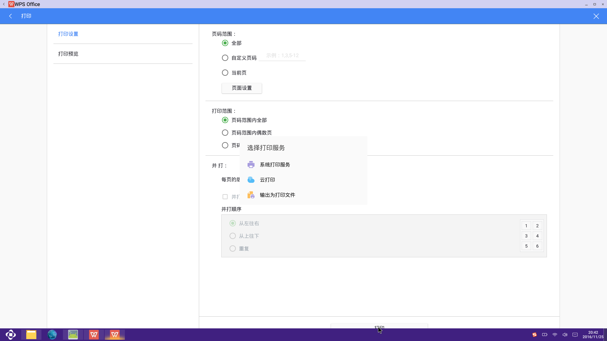

十.常用功能  
# 打印机说明书

## Note:
  - 打印属于Openthos模块之一。它的加入使阁下可以更方便的进行打印，使办工更便捷。
  - 目前可以通过三种方式连接打印机：   
    本地打印服务   
    [Mopria Print Service](##2)  
    打印机官方app   
***

## 本地打印服务   
### 功能模块

  - 打印任务管理器
  - 系统打印服务
  - 已添加设备
  - 扫描本地打印机
  - 添加网络打印机
  - 实施打印

### 功能详情

  - 打印任务管理器 --（*暂停 开始 取消*）
    - 点击打印任务管理器： 对正在进行的打印任务实施暂停 开始 取消 操作。
  - 系统打印服务 --（*开启 关闭*）
    - 点击系统打印服务： 对本地打印服务进行关闭和开启。
  - 已添加设备
    - 点击已添加设备的条目： 
      - 显示已添加设备的信息：
        - 打印测试页： 就是对打印机一种功能的测试。
        - 微调： 就是调打印的Page Size(纸张大小) Paper Tray(纸位置) Paper type(纸类型) Double-Silded Printing(双面打印)
                Color Mode(颜色模式) Draft Mode(是否拉伸) Image Enhancement(是否图片增强)
  - 扫描打印机 --(*扫描本地打印设备*)
    - 点击扫描本地打印机： 进行对本地打印机进行搜索。
  - 添加网络打印机 --(*网络打印*)
    - 点击添加网络设备：

      - 填写打印的名字：这个名字是这次打印的名称，默认时netprinter.
      - 填写打印url地址： 填写网络打印的地址，实验室打印机：socket://192.168.0.211
      - 请选择一个制造商： 选择制造商，这里默认选择Fuji
      - 请选择一个驱动： 针对不同的制造商选择不同的驱动，这里默认选择驱动Xerox
  - 分享打印机： 就是可以在其他电脑上进行网络共享网络打印机。
  - 实施打印
      - 启动WPS Office: 通过右下角的红色小圆球进行新建文件（word）, 然后添加自己需求打印的内容。

      - 点击文件： 选择打印 --> 对页码范围和打印范围和版数进行选择(通常选择默认) --> 点击打印 
          --> 选择打印服务  -- > 选择系统打印服务  --> 点击打印的图标 --> 打印完成。
  

## Mopria Print Service   

## 打印机官方app   

# 投影使用
## Note：  
  HDMI接口连接投影仪  

### 投影：  
- 用电脑的HDMI接口，链接投影仪，如果投影仪为VGA接口， 可以用HDMI-VGA转接线连接投影仪进行投影 （目前支持HDMI接口）。

### 投影方式选择：  
- 点击右侧通知栏，点击投影，弹出窗口中在仅电脑，仅投影，和扩展中选择(未完成,目前仅支持克隆模式)。  

# 通知栏使用说明书：

## Note:
  - 通知栏属于Openthos模块之一。它的加入使阁下对系统消息和应用消息的查看操作变得更加方便快捷;  
  - 了解更多请查看下方（通知栏功能详情介绍）;  
  
***
## 整体效果图
 
 
***
## 功能模块
  - 001 通知管理;
  - 002 清除所有;
  - 003 通知消息 位置：通知中心下侧;
  - 004 打印管理;
  - 005 打印消息 位置：打印信息下侧;
  - 006 截屏;
  - 007 隔离模式;
  - 008 投影;
  - 009 设置;

***

## 具体介绍  
  - 001 通知管理 --（*屏蔽和优先*）
    - 点击通知管理：显示所有发送通知的应用，然后你点击列表中的应用，进行屏蔽操作和优先操作;
  - 002 清除所有 --（*清楚通知*）
    - 点击清除所有：将所有显示的通知管理信息进行清除;
  - 003 通知消息 --（*显示应用*）
    - 点击一个通知消息，将显示该应用的界面;
  - 004 打印任务管理 --（*暂停和开始 取消打印*）
    - 点击打印任务管理： 将显示打印管理的列表，根据自己的需求进行操作;
  - 005 打印消息 --（*关闭*）
    - 点击右侧的错号：对正在进行的打印进行关闭;
  - 006 截屏 --（*截取全屏*）
    - 点击截屏：将截取整个屏幕;
  - 007 隔离模式  --（*切断连接*）
    - 点击隔离： 将切断有线网和无线网和蓝牙;
  - 008 投影 --（*模式选择*）
    - 选择投影样式;
  - 009 设置 --（*系统的设置*）
    - 点击设置： 进入设置的界面;
