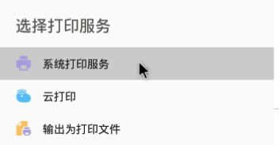
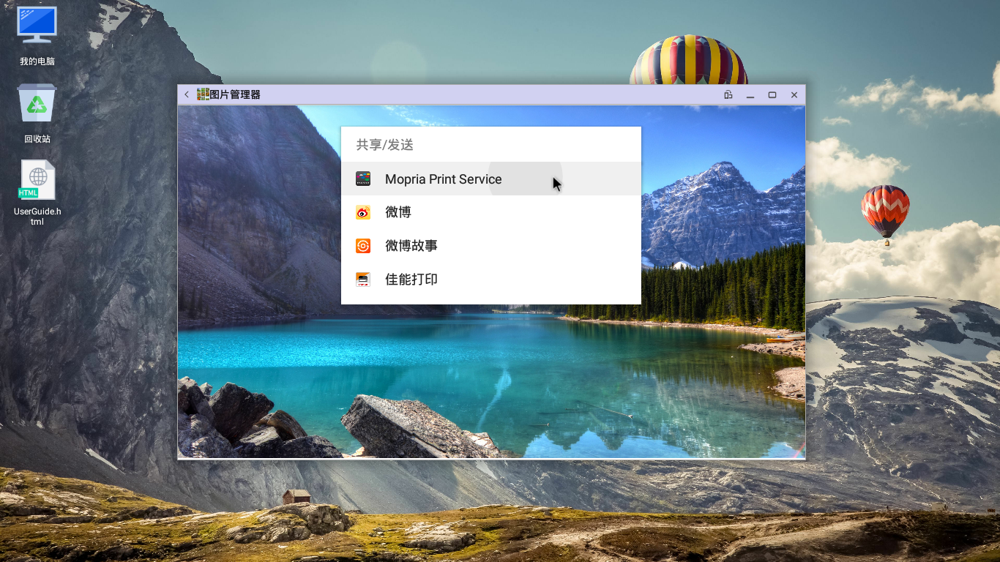

# 常用功能

- [打印](十.常用功能.md/#打印)
- [投影](https://github.com/openthos/userguide-analysis/blob/master/%E5%8D%81.%E5%B8%B8%E7%94%A8%E5%8A%9F%E8%83%BD.md/#投影)
- [压缩/解压缩](soft/压缩软件.md)
- [键盘映射](soft/键盘映射.md)
   
## 打印
打印属于Openthos模块之一。它的加入使阁下可以更方便的进行打印，使办工更便捷。

   - 目前可以通过三种方式连接打印机：   
      - [本地打印服务](十.常用功能.md/#本地打印服务)
      - [Mopria Print Service](十.常用功能.md/#mopria-print-service)
      - [打印机官方app](十.常用功能.md/#打印机官方app)
   
### 本地打印服务
   
#### 功能模块
   
   - 打印任务管理器 --（*暂停 开始 取消*）
      - 点击打印任务管理器： 对正在进行的打印任务实施暂停 开始 取消 操作。
   - 系统打印服务 --（*开启 关闭*）
      - 点击系统打印服务： 对本地打印服务进行关闭和开启。
   - 已添加设备
      - 点击已添加设备的条目： 
         - 显示已添加设备的信息：
         - 打印测试页：让打印机直接打印一张包含测试信息的页面
         - 微调：设置打印的Page Size(纸张大小) Paper Tray(纸位置) Paper type(纸类型) Double-Silded Printing(双面打印) Color Mode(颜色模式) Draft Mode(是否拉伸) Image Enhancement(是否图片增强)
   - 扫描打印机 --(*扫描本地打印设备*)
      - 点击扫描本地打印机：对本地打印机进行搜索。
   - 添加网络打印机 --(*网络打印*)
      - 点击添加网络设备：

         - 填写打印的名字：默认为netprinter.
         - 填写打印url地址：填写网络打印的地址，比如：socket://192.168.0.211
         - 请选择一个制造商：选择制造商，这里默认选择Fuji
         - 请选择一个驱动：针对不同的制造商选择不同的驱动，这里默认选择驱动Xerox
   - 实施打印
      - 打开要打印的文档或图片，比如在wps中打开一个文档
      - 进入当前应用的打印或分享功能，点击打印按钮，系统会弹出类似下图的对话框，选择系统打印服务         
 
      - 在新窗口左上角的下拉菜单中选择本地打印机，点击份数或纸张尺寸设置打印选项
，最后点击右上方的绿色打印图标开始打印。     

   
### Mopria Print Service
   - OPENTHOS 1.0 最终版预装了Mopria Print Service，如果您的打印机支持Mopria服务，可通过下面的方法连接打印机。
      - 请先确保您的电脑和打印机连在同一个局域网内
      - 进入设置－打印－系统打印服务（在打印界面右上角），进入Mopria Print Service

      - 开启服务，系统会自动搜索网络中的打印机
        如果没有搜索到，也可以点击mopria打印服务界面右上角的菜单按钮，选择添加打印机，手动输入打印机ip地址

      - 打开要打印的内容，可以在打印或分享界面看到Mopria打印服务的选项

      - 进入该选项后，点击右边绿色打印按钮即可开始打印

   
### 打印机官方app
- OPENTHOS支持Canon等主流打印机厂家的官方app，您可以在应用商店或厂家官网下载安装包进行安装，具体操作请见打印机的说明书。   
   
## 投影  
   
### HDMI接口连接投影仪
   
- 用电脑的HDMI接口，连接投影仪，如果投影仪为VGA接口， 可以用HDMI-VGA转接线连接投影仪进行投影 （目前支持HDMI接口）。
