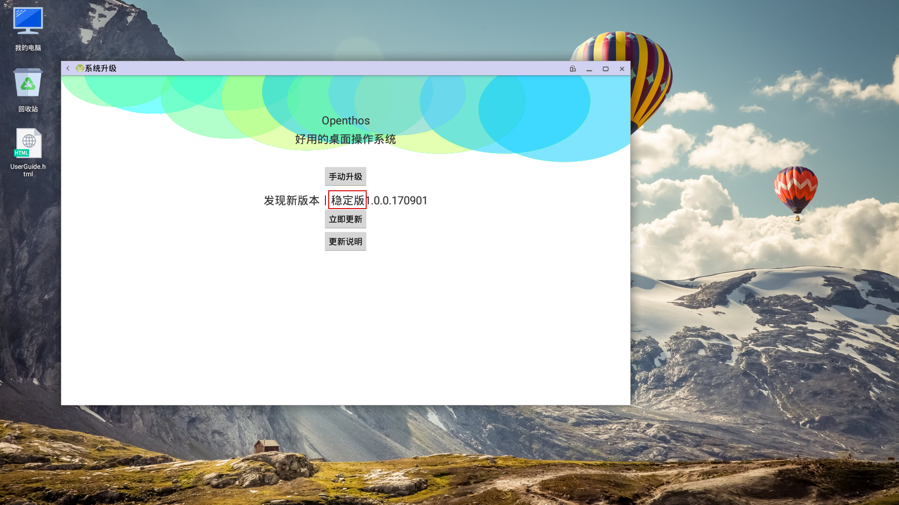
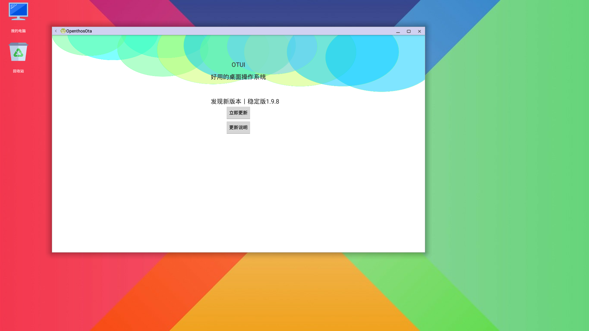
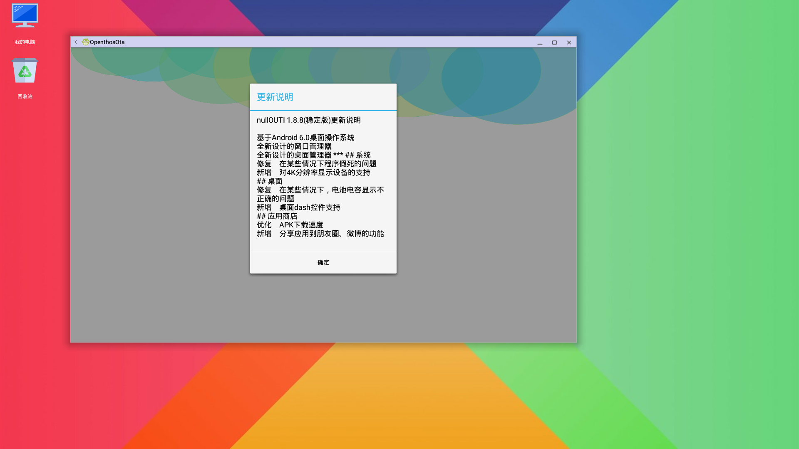
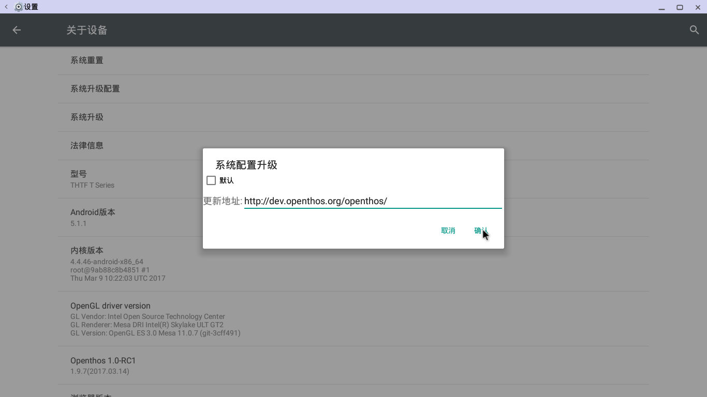
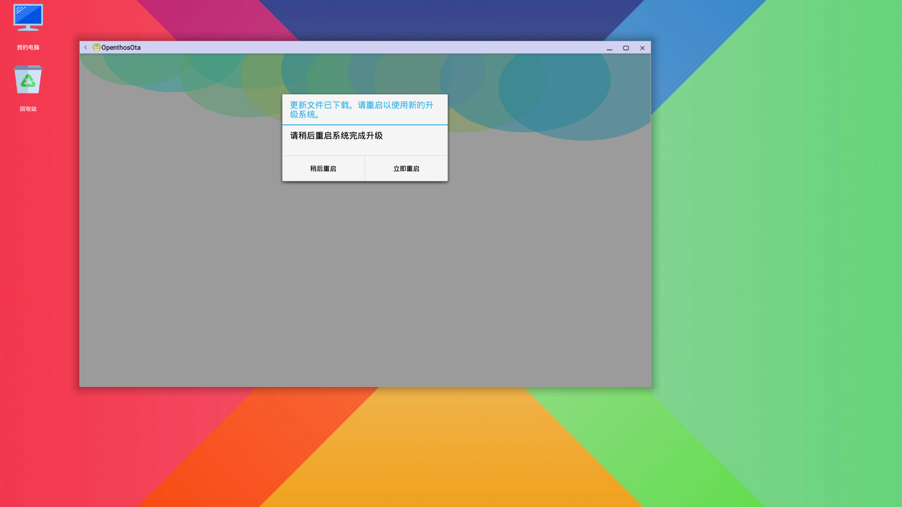

# Ota升级说明书
### 系统升级 
 * 升级两种方式
   - 应用列表里的OpenthosOta为升级应用，可直接双击打开。
   - 系统设置-关于设备-系统升级。     
</br>     
 * 升级下载地址
   - 升级地址可配置，系统设置-关于设备-系统升级配置。
   - 默认下载地址（外网地址：http://dev.openthos.org/openthos/)
   - 切换实验室内网下载地址（http://192.168.0.180/openthos/)
      
 * 无网络情况（系统显示当前版本，提示网络异常）     
 * 有网络情况（显示系统当前版本号、已是最新版本或显示发现新版本、新版本号及更新说明按钮、立即更新按钮）
   - 更新说明按钮（点击，进入更新说明详细说明）
   - 立即更新按钮（点击，进入下载新版本升级包）
      - 暂停下载（重新下载可继续上次下载进度下载）
      - 完成升级包下载（弹出提示）
        - 提示（新版本升级包已下载完成，需重启系统完成升级，用户可选择稍后重启或立即重启）
        - 稍后重启（点击，提示用户稍后重启完成升级）
        - 立即重启（点击，重启系统，系统完成升级配置，完成升级）
         
```
实验室内网升级说明：
设置-关于设备-系统升级配置-输入： http://192.168.0.180/openthos/
```
         
 * 手动升级方法
   - 点击手动升级
     
   - 进入文件管理器，选择openthos_V1.0.zip(可从百度网盘下载：网盘地址:http://pan.baidu.com/s/1kVauJ5t 提取码: y48g）
     
   - 校验升级包
     
   - 手动升级风险提示，确认是否手动升级
     
      
# 功能  
- 查看当前系统版本
- 查看当前版本是不是最新版本
  
- 检测是否有新版本
  
- 查看新版本的新功能
  
- 下载系统新版本
  
- 断点续传功能
- 切换内外网下载功能
  
  
- 手动升级
- 重新启动系统完成升级
- 升级版本，使用新版本系统
  

