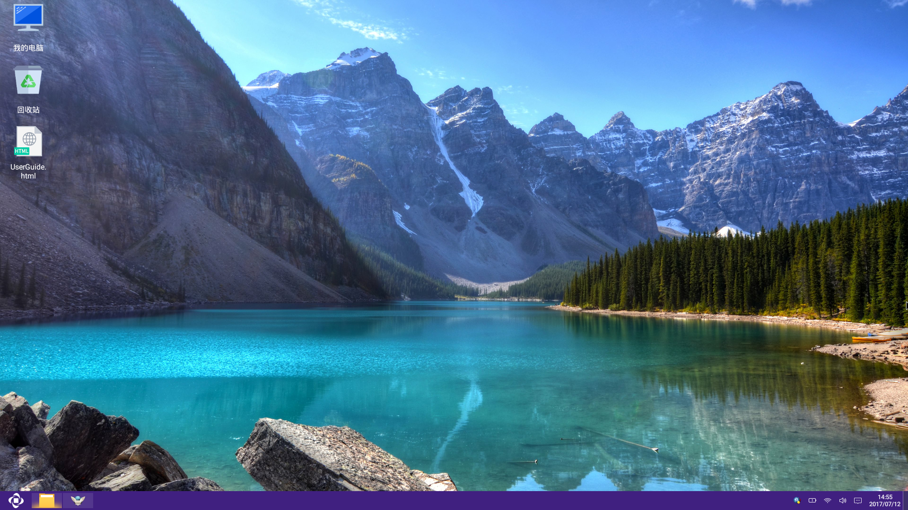
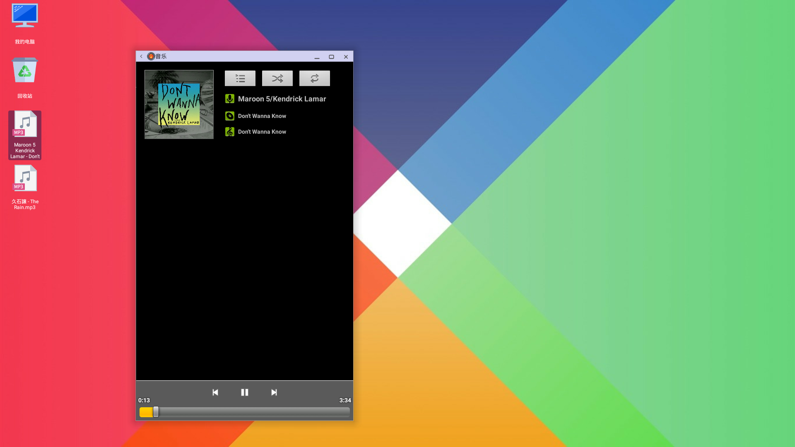
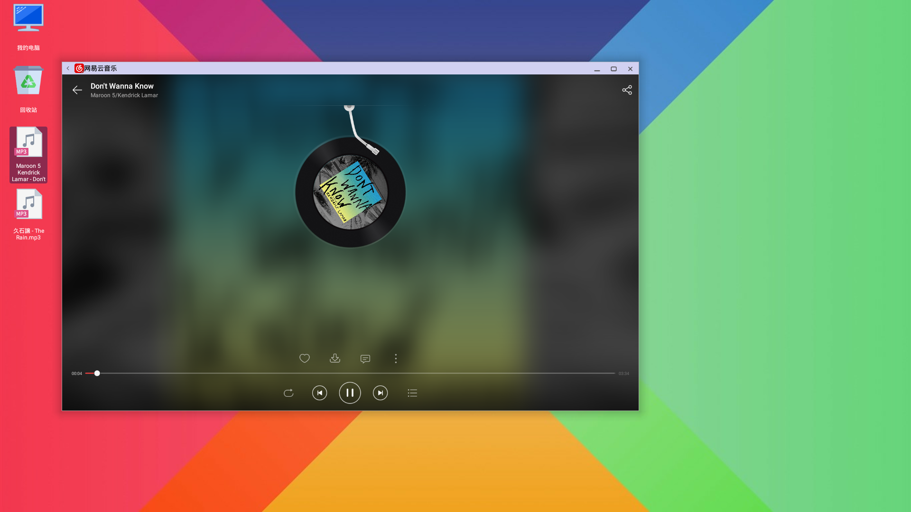
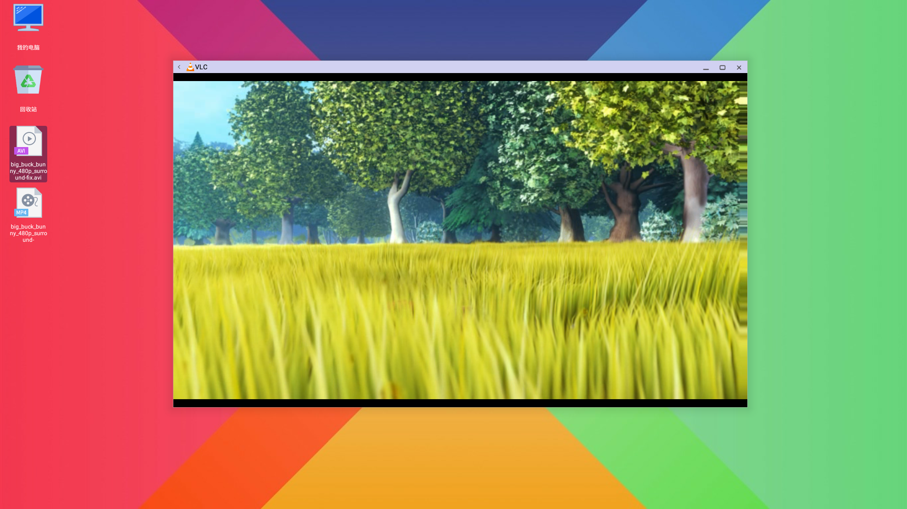
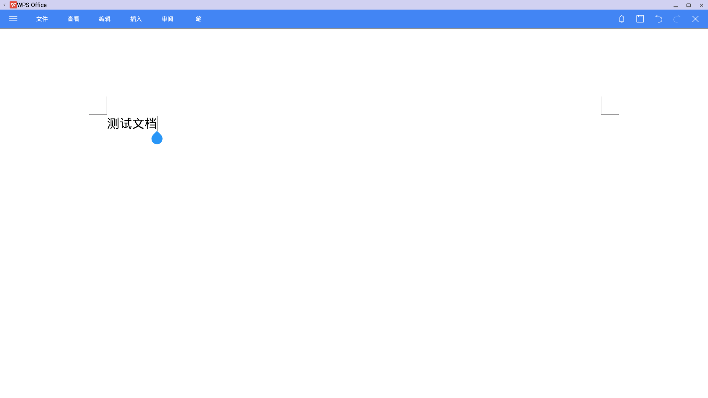
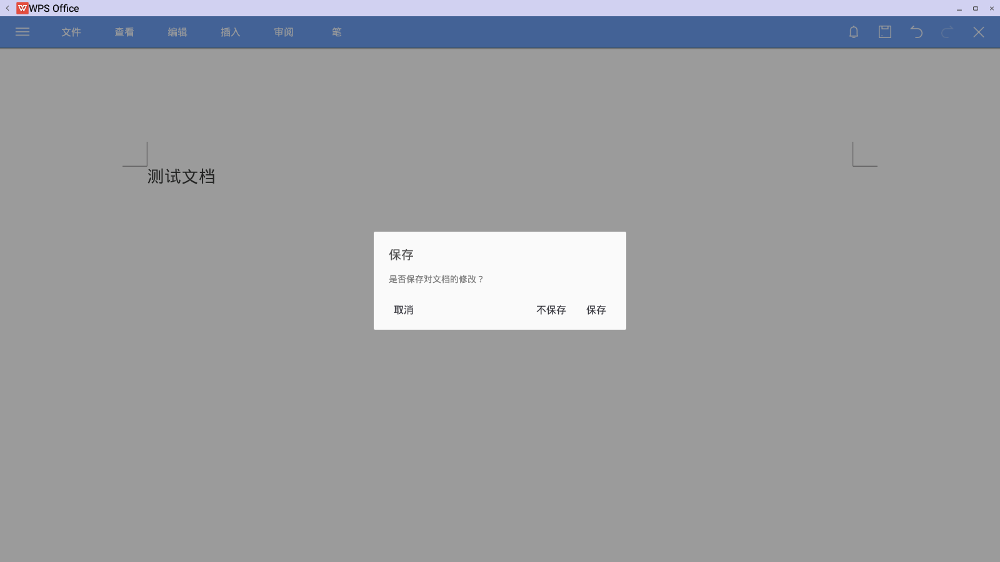
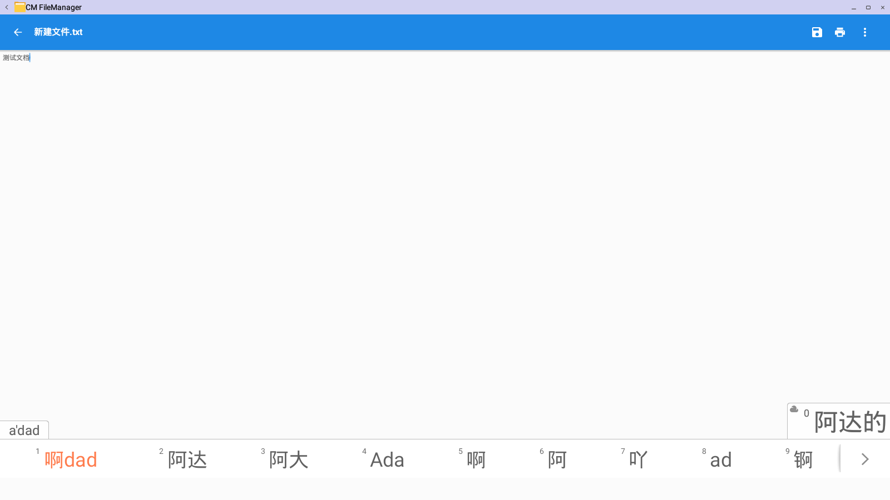

# 桌面说明书

## 预览效果图：

## 基本组成
- 桌面背景:
    - [更换壁纸](zhuomian/更换壁纸.md)
- 桌面图标
    - 图标是是具有可操作性的图形标识符号，根据不同的的项目，分为不同的类型，Openthos中主要分为五类，每一类都有独自的选项菜单（右键触发）
        - [我的电脑](zhuomian/我的电脑.md )   通过我的电脑可以快速访问文件管理系统，是一个特殊的图标
        - [回收站](zhuomian/回收站.md )    用于存放用户删除的文件或文件夹（不包括U盘），当用户删除文件或文件夹，默认不会物理删除，而是转存到回收站统一管理。
        - [文件/文件夹](zhuomian/文件文件夹.md)   个人的文件或文件夹，快捷方便。
        - [空白区域](zhuomian/空白区域.md)    没有任何图标的区域
    - 图标的基本操作
        - 移动: 长按可以进行移动，托放至其他空白区域
        - 打开: 打开对应的内容，可以双击打开，右键打开
        - 更名: 给个人文件/文件夹重命名，可以右键选择重命名，也可以选中后按F2进行重命名
        - 删除: 删除个人文件/文件夹，可以右键选择删除，也可以选中后按delete删除到回收站，或者直接按Shift + Delete键可以快速呼出直接删除
        - 排列: 将桌面乱序的图标进行排序，恢复默认的顺序。可以邮件空白位置选择排序，也可以直接按F5来进行排序  
- 任务栏和开始菜单:
    - [任务栏说明书](zhuomian/任务栏说明书.md)
    - [开始菜单说明书](zhuomian/开始菜单说明书.md)

## Desktop 功能点

- 鼠标基本操作 
     - 001 支持 鼠标左键点选 选中文件，反白；
     - 002 支持 鼠标左键点空白位置，已选中的文件背景变透明；
     - 003 支持 鼠标右键 弹出选项菜单；
     - 004 支持 鼠标左键快速双击 打开指定的文件；
     - 005 支持 鼠标点击后拖拽文件到空白位置，个人喜好排序 (由于此功能与长按菜单冲突，故暂不支持)；
     - 006 支持 快捷键"ctrl" + 鼠标左键点选 多个文件；   
     - 007 支持 按住Shift键,鼠标点击文件和文件夹,可选中第一次点击目标和最末次目标之间的所有目标;  
     - 008 支持 按住鼠标左键拖动,可框选多个文件;
     - 009 支持 在任何界面，鼠标点击右下角可快速回到桌面；  
     
- 快捷键操作
     - 001 支持 快捷键"ctrl" + "a" 选择全部文件；
     - 002 支持 快捷键"ctrl" + "c" 复制文件；
     - 003 支持 快捷键"ctrl" + "v" 粘贴文件；
     - 004 支持 快捷键"ctrl" + "x" 剪切文件；
     - 005 支持 快捷键"F2" 快速重命名功能；
     - 006 支持 快捷键"F5" 刷新桌面功能；
     - 007 支持 快捷键"delete" 删除选中的文件到回收站功能；
     - 008 支持 快捷键"shift" + "delete" 永久删除选中的文件；	
     - 009 支持 快捷键"Enter" 快速进入选中的条目；
     - 011 支持 快捷键"Alt" + "Tab" 快速切换桌面和打开的应用；
     - 012 支持 快捷键"Win" + "D" 快速切换到桌面；
  
- 右键菜单
     - 001 支持 右键菜单 打开文件；
     - 002 支持 右键菜单 选择特定的应用来打开该文件（打开方式）；
     - 003 支持 右键菜单 支持快速压缩选中的文件；
     - 004 支持 右键菜单 支持快速解压缩选中的压缩包；
     - 005 支持 右键菜单 支持复制选中的文件；
     - 006 支持 右键菜单 支持剪贴选中的文件；
     - 007 支持 右键菜单 支持删除选中的文件；
     - 008 支持 右键菜单 支持重命名选中的文件；
     - 009 支持 右键菜单 支持粘贴之前复制剪贴的文件；
     - 010 支持 右键菜单 支持排序功能；
     - 011 支持 右键菜单 支持查看选中文件的详情功能；
     - 012 支持 右键菜单 支持新建文件夹；
     - 013 支持 右键菜单 支持新建文件；  
     - 014 支持 右键菜单 支持跳转到显示设置界面；  
     - 015 支持 右键菜单 支持更改桌面壁纸；
	 
- 显示
     - 001 支持 文件复制信息弹窗显示；
     - 002 支持 文件剪贴信息弹窗显示；
     - 003 支持 文件删除信息弹窗显示；
     - 004 支持 文件压缩信息弹窗显示；
     - 005 支持 文件解压缩信息弹窗显示；
     - 006 支持 文件详情显示：文件位置，文件大小，占用空间，创建时间，修改时间，访问时间，用户权限，群组权限，其他权限；
     - 007 支持 根据不同的后缀显示不同的图标，表示不同的文件类型；
	 
## Desktop Input

- 音乐
    - 1.音乐
    
     - 播放：可正常播放
     - 显示：可正常显示
  
    - 2.网易云音乐  
     
     - 播放：可正常播放
     - 显示：可正常显示
  
- 视频
    - 1.vlc
    
     - 播放：可正常播放
  
- 图库
    - 1.图库浏览
    
     - 显示 :可正常显示
     - （**该功能暂时不支持，您可从应用商店下载快图**）多个图片快速浏览 ：支持鼠标滚轮和键盘方向键快速浏览
  
- 文档
    - 1.WPS  
    
    
     - 页面： 内容显示正常
     - 文字： 显示正常
     - 编辑: 可使用中英文正常编辑
     - 保存: 可正常保存
  
    - 2.Word  
    
     - 页面： 内容显示正常
     - 文字： 显示正常
     - 编辑: 无法编辑
      
    - 3.文本编辑器  
    
     - 页面： 内容显示正常
     - 文字： 显示字体偏小
     - 编辑: 可使用中英文正常编辑
     - 保存: 可正常保存     
 

    
    

